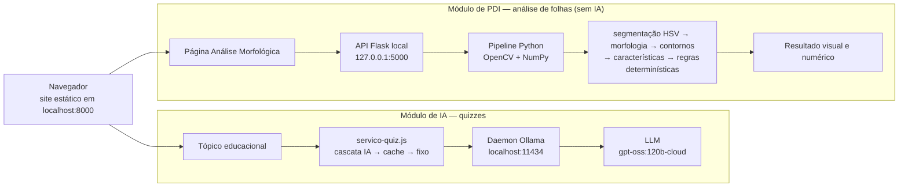

# 🌿 Nature Code

**Portal educacional de Biologia com dois módulos técnicos independentes:
quizzes gerados por IA e análise morfológica de folhas por processamento digital de
imagens.**

| | |
|---|---|
| **Instituição** | Universidade do Sagrado Coração — Bauru/SP |
| **Curso** | Ciência da Computação |
| **Repositório** | https://github.com/Cesar-Otavio/nature-code-IA-e-processamento-de-imagens |

## Integrantes

- Amanda Pazold dos Santos
- Cesar Otavio da Silva Boiani
- Giovana Giraldeli
- Giovani Nogueira Pires
- Marcus Vinicius da Silva Capeteruchi
- Guilherme Ribeiro Zangrande

---

## Sumário

1. [Descrição geral](#1-descrição-geral)
2. [Módulos](#2-módulos)
3. [Arquitetura geral](#3-arquitetura-geral)
4. [Módulo de IA — quizzes](#4-módulo-de-ia--quizzes)
5. [Módulo de PDI — análise de folhas](#5-módulo-de-pdi--análise-de-folhas)
6. [Integração entre os módulos](#6-integração-entre-os-módulos)
7. [Estrutura de diretórios](#7-estrutura-de-diretórios)
8. [Requisitos](#8-requisitos)
9. [Instalação](#9-instalação)
10. [Execução](#10-execução)
11. [Dataset](#11-dataset)
12. [Avaliação](#12-avaliação)
13. [Testes](#13-testes)
14. [Limitações](#14-limitações)
15. [Status atual](#15-status-atual)
16. [Documentação](#16-documentação)
17. [Licença](#17-licença)

---

## 1. Descrição geral

O **Nature Code** é um site educacional de Biologia, feito em HTML, CSS e JavaScript puros,
com três módulos de conteúdo — **Reino Animal**, **Plantas** e **Ecossistemas** — em 21
tópicos, cada um com um quiz.

Sobre esse site foram construídos **dois módulos técnicos independentes**:

| Módulo | O que faz | Tecnologia |
|---|---|---|
| **IA** | Gera as perguntas dos quizzes a partir do conteúdo de cada tópico | LLM via **Ollama**, no navegador |
| **PDI** | Mede a forma de uma folha fotografada e a descreve geometricamente | **Python + OpenCV + NumPy**, API local em Flask |

> **Os dois módulos são independentes.** Nenhum importa o outro, e há testes que
> verificam isso.
>
> **O módulo de PDI não usa inteligência artificial** — nenhuma rede neural, nenhum modelo
> treinado, nenhum aprendizado de máquina, nenhuma LLM. É processamento digital de imagens
> clássico, determinístico: a mesma imagem produz sempre o mesmo resultado.
>
> **O módulo de PDI não identifica espécies.** Ele descreve a geometria da folha
> (alongamento, recorte, compacidade…), não diz que planta ela é.
>
> A integração acontece **no nível do site**: o usuário acessa as duas funcionalidades pela
> mesma interface, mas cada uma fala com o seu próprio serviço local.

---

## 2. Módulos

| Módulo de conteúdo | Tópicos | Quiz |
|---|---:|---|
| 🦁 Reino Animal | 10 | Fixo ou gerado por IA |
| 🌱 Plantas | 5 | Fixo ou gerado por IA · **acesso à Análise Morfológica de Folhas** |
| 🌍 Ecossistemas | 6 | Fixo ou gerado por IA |

---

## 3. Arquitetura geral



Os dois serviços são locais e **não se comunicam**: `script/ia/` fala só com o Ollama e
`script/pdi/` fala só com a API Flask. O site continua estático — nos dois casos, o
navegador é quem chama o serviço.

---

## 4. Módulo de IA — quizzes

```
conteúdo do tópico → Prompt V4 → Ollama → LLM → parser → validador → cache → quiz
```

| Item | Valor |
|---|---|
| Modelo em produção | `gpt-oss:120b-cloud`, via daemon local do Ollama |
| Prompt | **V4** (versões V1–V4 registradas) |
| Tópicos que geram por IA | **13 de 21** — habilitados por medição, não por disponibilidade |
| Fallback | **IA → cache → quiz fixo original.** Os 21 quizzes fixos nunca foram apagados |
| Chave de API no JavaScript | **Nenhuma** — a credencial fica no daemon do Ollama |
| Piloto (Fase 5) | 230 gerações · 752 questões · 648 aprovadas pelo validador (86,2 %) |
| Testes | **256/256** asserções offline |

O texto do modelo passa por um **parser tolerante** e um **validador** com critérios
estruturais e pedagógicos antes de chegar ao aluno. Aprovação automática não é o mesmo
que qualidade: dois defeitos pedagógicos foram encontrados lendo as questões, e originaram
as regras do Prompt V3 e V4.

A Fase 6 (benchmark nuvem × local) executou **apenas duas sondagens** de um braço; a
bateria completa não foi executada.

Detalhes: [`docs/README.md`](docs/README.md) ·
[`docs/DOCUMENTACAO-FINAL-NATURE-CODE.md`](docs/DOCUMENTACAO-FINAL-NATURE-CODE.md).

---

## 5. Módulo de PDI — análise de folhas

```
entrada → validação → leitura → redimensionamento → suavização → HSV → segmentação
       → morfologia → contornos → objeto principal → características
       → regras determinísticas → resultado
```

### Parâmetros congelados (tag `fase-9-completa`)

| Etapa | Parâmetro |
|---|---|
| Redimensionamento | Lado maior ≤ **1024 px**, proporção preservada |
| Suavização | Filtro **Gaussiano, kernel 5** |
| Segmentação | **HSV**: `H ∈ [25, 95]`, `S ≥ 40`, `V ≥ 20` |
| Limpeza morfológica | Remove componentes com área < **0,1 %** da do maior componente · preenche buracos internos < **0,2 %** dela (abertura/fechamento medidos e **não** adotados) |
| Contornos | `RETR_EXTERNAL` + `CHAIN_APPROX_SIMPLE`; objeto principal = maior contorno |
| Características | Área, perímetro, elongação, circularidade, solidez, extent, extent rotacionado, razão perímetro/hull, orientação, anisotropia, cor |
| Regras | 5 atributos — alongamento, concavidade, compacidade, complexidade da borda, orientação — com limiares da Fase 8 |

A saída inclui os valores, os limiares aplicados, avisos, um resumo textual geométrico e
8 imagens intermediárias (original, cinza, matiz, suavizada, máscara, máscara limpa,
contorno, resultado anotado).

Detalhes: [`processamento-imagens/README.md`](processamento-imagens/README.md) ·
[`docs/processamento-imagens/`](docs/processamento-imagens/).

---

## 6. Integração entre os módulos

| | IA | PDI |
|---|---|---|
| Código no site | `script/ia/` | `script/pdi/` |
| Serviço local | Daemon Ollama, `localhost:11434` | API Flask, `127.0.0.1:5000` |
| Página | Os 21 tópicos | `pages/modulos/analise-folha.html`, acessada pelo módulo Plantas |
| Se o serviço estiver fora | Cai para cache e quiz fixo | Mensagem explicando como iniciar a API; o resto do site continua funcionando |

A separação é verificada por testes: o PDI não importa nenhuma biblioteca de IA, o
JavaScript do PDI não fala com o Ollama, a página de análise não carrega `script/ia/` e a
camada de IA não referencia o PDI.

---

## 7. Estrutura de diretórios

```
.
├── index.html, css/, images/, pages/     site original (conteúdo educacional)
│   └── pages/modulos/analise-folha.html  página do PDI
├── local-storage/                        21 quizzes fixos originais
├── dados/                                base de conhecimento extraída dos tópicos (IA)
├── script/
│   ├── ia/                               camada de IA (quizzes)
│   ├── pdi/                              interface do PDI (config, validação, página)
│   └── quiz-engine.js, ...               motor original do site
├── ferramentas/                          página de diagnóstico da IA
├── scripts/                              testes e ferramentas Node da IA
├── processamento-imagens/                módulo de PDI (Python)
│   ├── src/                              pipeline, CLI e API
│   ├── tests/                            testes pytest
│   ├── dataset/                          README + manifesto (imagens NÃO versionadas)
│   ├── fotos-externas/                   Fase 11 (fotos NÃO versionadas)
│   ├── avaliar_conjunto_final.py         avaliação da Fase 10
│   ├── avaliar_fotos_externas.py         avaliação da Fase 11
│   └── requirements.txt, requirements-dev.txt
├── docs/                                 documentação (IA em docs/, PDI em docs/processamento-imagens/)
└── requirements.txt                      delega a processamento-imagens/requirements.txt
```

---

## 8. Requisitos

| Requisito | Para quê | Obrigatório |
|---|---|:---:|
| **Python 3.12+** (validado em 3.14.3) | Servir o site e rodar o PDI | ✅ |
| **Ollama** instalado e autenticado | Quizzes gerados por IA | Só para a IA |
| **Internet** | O modelo de IA é `:cloud` | Só para a IA |
| **Node.js** | Testes da IA e testes de comportamento da página do PDI | Para testes |
| **Git** | Clonar | Opcional |

Dependências Python do PDI — definidas em
[`processamento-imagens/requirements.txt`](processamento-imagens/requirements.txt). O
[`requirements.txt`](requirements.txt) da raiz tem uma única linha,
`-r processamento-imagens/requirements.txt`: `pip install -r requirements.txt` funciona a
partir da raiz, sem duplicar versões.

```
numpy==2.5.3
opencv-python==5.0.0.93
Flask==3.1.3
```

Para desenvolvimento, [`requirements-dev.txt`](processamento-imagens/requirements-dev.txt)
acrescenta `pytest==9.1.1`. A camada de IA **não tem dependências**: é JavaScript puro.

---

## 9. Instalação

```cmd
git clone https://github.com/Cesar-Otavio/nature-code-IA-e-processamento-de-imagens.git
cd nature-code-IA-e-processamento-de-imagens\processamento-imagens

python -m venv .venv
.venv\Scripts\activate
pip install -r requirements.txt
```

Para desenvolvimento e testes:

```cmd
pip install -r requirements-dev.txt
```

A partir da **raiz** do repositório, com o ambiente virtual ativado, também funciona:

```cmd
pip install -r requirements.txt
```

O arquivo da raiz delega a `processamento-imagens/requirements.txt`.

Linux/macOS: `source .venv/bin/activate`. Passo a passo detalhado em
[`processamento-imagens/README.md`](processamento-imagens/README.md).

---

## 10. Execução

> **Nunca abra o site por duplo clique (`file://`).** O navegador trata essa origem como
> `null`: o Ollama a recusa e a API do PDI também. Sempre sirva por HTTP.

### 10.1 Site

Na **raiz** do repositório:

```cmd
python -m http.server 8000
```

Acesse **http://localhost:8000/index.html**.

### 10.2 API do PDI

Em outro terminal:

```cmd
cd processamento-imagens
.venv\Scripts\python.exe -m src.api
```

Escuta em `http://127.0.0.1:5000` (só na própria máquina). Verificação:
`curl http://127.0.0.1:5000/health`. No site: **Módulos → Plantas → Análise Morfológica
de Folhas**.

### 10.3 CLI do PDI

```cmd
cd processamento-imagens
.venv\Scripts\python.exe -m src.cli <imagem>
```

Opções: `--json-apenas`, `--sem-imagens`, `--saida DIR`, `--verboso`. Códigos de saída:
`0` sucesso · `1` nenhuma folha · `2` erro de entrada · `3` erro interno.

### 10.4 IA / Ollama

Conforme [`docs/DOCUMENTACAO-FINAL-NATURE-CODE.md`](docs/DOCUMENTACAO-FINAL-NATURE-CODE.md) §31:

1. Abra o Ollama pela **bandeja do sistema** e confirme a autenticação:
   ```cmd
   ollama signin
   ollama pull gpt-oss:120b-cloud
   ollama list
   ```
   (`ollama signin` só se ainda não estiver autenticado.)
2. Sirva o site (§10.1).
3. Tópico que gera por IA: `http://localhost:8000/pages/modulos/topicos/topicos-animais/filo-cordados.html`
4. Diagnóstico: `http://localhost:8000/ferramentas/diagnostico.html`

Se aparecer erro de CORS em outra máquina: `setx OLLAMA_ORIGINS "*"` e reiniciar o Ollama
pela bandeja. **Botão de pânico:** `CONFIG_IA.habilitada = false` em
[`script/ia/config-ia.js`](script/ia/config-ia.js) devolve o site ao comportamento original.

---

## 11. Dataset

**Flavia Leaf Dataset** — usado pelo módulo de PDI.

| | |
|---|---|
| Imagens | **1.907** |
| Espécies | **32** |
| Formato | **JPEG 1600×1200**, fundo **branco** uniforme |
| Fonte oficial | http://flavia.sourceforge.net/ |
| Projeto | https://sourceforge.net/projects/flavia/ |
| Download | https://sourceforge.net/projects/flavia/files/Leaf%20Image%20Dataset/1.0/Leaves.tar.bz2/download |
| Artigo | Stephen Gang Wu et al., *A Leaf Recognition Algorithm for Plant Classification Using Probabilistic Neural Network*, IEEE ISSPIT, 2007 |

**O dataset não está no repositório.** Instruções de download e o manifesto dos
subconjuntos usados (64 de desenvolvimento, 96 de avaliação, semente `20260919`):
[`processamento-imagens/dataset/README.md`](processamento-imagens/dataset/README.md).

> **Ressalva sobre a licença** (de [`02-DATASET.md`](docs/processamento-imagens/02-DATASET.md)):
> o SourceForge declara o **projeto** Flavia como GPLv2, o que inclui o software de
> reconhecimento. Não foi localizada declaração de licença específica para o conjunto de
> imagens. O uso aqui é estritamente acadêmico, sem redistribuição.

---

## 12. Avaliação

### PDI — Fase 10: avaliação final congelada

Pipeline congelado em `fase-9-completa`, executado **uma única vez** sobre as imagens
reservadas, nunca usadas no desenvolvimento.

| Item | Resultado |
|---|---|
| Imagens | **96** — 32 espécies × 3, disjuntas das 64 de desenvolvimento |
| Processadas | **96/96** |
| Erros | **0** |
| **Taxa de processamento válido no conjunto reservado** | **100 %** |
| Com aviso técnico / sem | 65 / 31 |
| Com pelo menos um atributo limítrofe | 62 |
| Tempo mediano por imagem | **~285 ms** |
| Determinismo | Confirmado (5 imagens reprocessadas + 12 com visualização, idênticas) |
| Pipeline intacto | 9 hashes **SHA-256** idênticos antes e depois |

> **Isto não é acurácia.** Não existe referência de verdade para as categorias
> geométricas. "Processamento válido" significa que o pipeline chegou ao fim com um objeto
> medido; se a segmentação está visualmente correta depende da **inspeção humana, ainda
> pendente**. Detalhes: [`10-AVALIACAO-FINAL.md`](docs/processamento-imagens/10-AVALIACAO-FINAL.md).

### PDI — Fase 11: robustez com fotos externas

**Infraestrutura pronta; avaliação externa aguardando fotos reais da equipe.** O protocolo
prevê 10 a 15 fotografias reais (preferência 12), variando fundo, iluminação, posição e
distância, com inspeção humana de todas. Nenhum resultado existe ainda. Ver
[`11-ROBUSTEZ-FOTOS-EXTERNAS.md`](docs/processamento-imagens/11-ROBUSTEZ-FOTOS-EXTERNAS.md).

### IA

Piloto da Fase 5 e revalidação do Prompt V4:
[`05-AVALIACAO-PILOTO.md`](docs/05-AVALIACAO-PILOTO.md) ·
[`05b-REVALIDACAO-V4.md`](docs/05b-REVALIDACAO-V4.md).

---

## 13. Testes

| Suíte | Comando | Resultado |
|---|---|---|
| PDI | `cd processamento-imagens` → `.venv\Scripts\python.exe -m pytest` | **881 passam, 1 pulado** (link simbólico, sem permissão no Windows) |
| IA — camada | `node scripts\testar-camada-ia.js` | 67/67 |
| IA — integração | `node scripts\testar-integracao.js` | 46/46 |
| IA — diagnóstico | `node scripts\testar-diagnostico.js` | 82/82 |
| IA — benchmark | `node scripts\testar-benchmark.js` | 61/61 |

Nenhum teste precisa de internet, do Ollama em execução ou do dataset baixado. Os testes
do PDI que executam o JavaScript da página usam Node.js; sem ele, são pulados.

---

## 14. Limitações

**PDI**

- Calibrado no **Flavia**: fundo branco e iluminação controlada. A avaliação da Fase 10
  vem do **mesmo domínio visual**.
- **Não há ground truth** para as categorias geométricas, e **não há reconhecimento de
  espécie**.
- Medidas em **pixels**, sem calibração física.
- O **perímetro digital** tem viés conhecido (~+5 % em bordas curvas), que afeta
  circularidade e razão perímetro/hull.
- A caixa de área mínima (`minAreaRect`) pode **divergir do eixo principal** em folhas
  pouco alongadas.
- `proporcao_verde` tem **viés circular**: é medida sobre a máscara definida pela própria
  faixa verde.
- Segmentação por cor: folhas não verdes e fundos verdes são pontos fracos conhecidos.
- **Avaliação externa com fotos reais ainda pendente** (Fase 11).
- Servidor de desenvolvimento do Flask: adequado a uso local, não a publicação.

**IA**

- Só funciona em máquina com Ollama instalado e autenticado; não é publicável em
  hospedagem nesta arquitetura.
- O JSON Schema não é respeitado por modelos `:cloud`; é compensado por prompt, parser e
  validador.
- A validação roda no cliente.
- A leitura manual cobriu ~12 % das questões geradas.

Listas completas: [`docs/README.md`](docs/README.md) §6 e
[`10-AVALIACAO-FINAL.md`](docs/processamento-imagens/10-AVALIACAO-FINAL.md) §18–19.

---

## 15. Status atual

| Item | Estado |
|---|---|
| Site educacional | ✅ Concluído |
| IA: quizzes, cascata, diagnóstico | ✅ Concluído — 13/21 tópicos |
| IA: benchmark local (Fase 6) | ⚠️ Parcial — duas sondagens, bateria completa não executada |
| PDI: pipeline, CLI, API, interface | ✅ Concluído e congelado (`fase-9-completa`) |
| PDI: avaliação final nas 96 reservadas | ✅ Executada — 96/96 processadas, 0 erros |
| PDI: inspeção humana da Fase 10 | ⏳ Pendente |
| PDI: fotos externas (Fase 11) | ⏳ Infraestrutura pronta, aguardando fotos |
| Interface do PDI testada no navegador por pessoa | ⏳ Pendente |

O que falta conferir manualmente: [`docs/CHECKLIST-ENTREGA-FINAL.md`](docs/CHECKLIST-ENTREGA-FINAL.md)
e [`docs/TESTES-MANUAIS-FINAIS.md`](docs/TESTES-MANUAIS-FINAIS.md).

---

## 16. Documentação

| Documento | Conteúdo |
|---|---|
| [`docs/DOCUMENTACAO-FINAL-IA-PDI.md`](docs/DOCUMENTACAO-FINAL-IA-PDI.md) | **Documento técnico principal do projeto inteiro** |
| [`docs/DOCUMENTACAO-FINAL-NATURE-CODE.md`](docs/DOCUMENTACAO-FINAL-NATURE-CODE.md) | Documentação final detalhada do módulo de IA |
| [`docs/README.md`](docs/README.md) | Resumo e índice da documentação de IA |
| [`docs/processamento-imagens/`](docs/processamento-imagens/) | Fases 0–11 do PDI, uma por documento |
| [`processamento-imagens/README.md`](processamento-imagens/README.md) | Instalação e uso do módulo de PDI |
| [`docs/REQUISITOS-PROFESSOR.md`](docs/REQUISITOS-PROFESSOR.md) | Onde cada exigência da entrega é atendida |
| [`docs/CHECKLIST-ENTREGA-FINAL.md`](docs/CHECKLIST-ENTREGA-FINAL.md) | O que está pronto e o que depende de verificação manual |
| [`docs/TESTES-MANUAIS-FINAIS.md`](docs/TESTES-MANUAIS-FINAIS.md) | Roteiro de testes manuais |
| [`docs/ROTEIRO-DEMO.md`](docs/ROTEIRO-DEMO.md) | Roteiro da demonstração, com plano B |

---

## 17. Licença

O repositório **não define licença** para o código. O dataset Flavia não é redistribuído;
ver a ressalva da §11.
