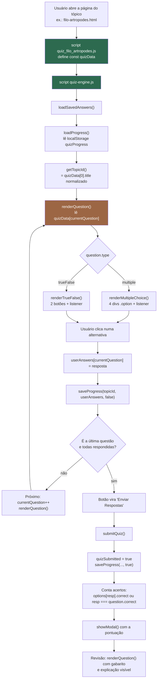

# Fase 0 — Mapeamento do projeto existente

> Documento de leitura. **Nenhum arquivo do site foi alterado nesta fase.**
> Gerado em 19/08/2026 a partir da leitura integral do repositório.
> Todas as contagens (caracteres, linhas, nº de questões) foram **medidas por script**, não estimadas.

---

## 1. Visão geral

| Item | Valor medido |
|---|---|
| Arquivos no repositório | 179 |
| Módulos | 3 |
| Tópicos (páginas de conteúdo) | 21 |
| Arquivos de quiz | 21 (1 por tópico) |
| **Total de questões fixas** | **27** |
| Chaves de LocalStorage em uso | **1** (`quizProgress`) |
| Motor de quiz | 1 arquivo, 358 linhas, compartilhado pelos 21 tópicos |
| Texto teórico total (sem tags) | **28.688 caracteres** |
| Dependências externas já presentes | Bootstrap 5.3.2 (CDN) e Google Fonts |

---

## 2. Árvore de diretórios comentada

```
Site-Nature-Code-main/
├── index.html                      Capa: vídeo de fundo + modal de informações + botão COMEÇAR
├── README.md                       Descrição acadêmica do site (lista os 21 tópicos)
├── Markdown-Nature-Code.md         Anotações de conteúdo do trabalho
├── PROMPT_CLAUDE_CODE_QUIZ_IA.md   Este roteiro de integração com IA
├── .hintrc                         Config do webhint (lint de HTML)
│
├── css/
│   ├── style.css                   Capa (index.html)
│   ├── modulo.css                  Página de módulos e listagem de tópicos
│   ├── topics.css                  Cards de tópico
│   ├── topicsConteude.css          ★ Layout da página de tópico: coluna de conteúdo + coluna do quiz
│   ├── footer.css
│   └── reutilizaveis/
│       ├── root.css                Variáveis CSS (paleta)
│       ├── buttons.css
│       ├── animations.css
│       └── modal.css               ★ Estilos do modal customizado usado pelo quiz
│
├── images/                         138 arquivos: fundos, capas de módulo/tópico, ilustrações
│   ├── bg/, capas-modulos/, capas-topicos/, icons/
│   └── conteudos/                  ★ Ilustrações didáticas — parte relevante do conteúdo está AQUI,
│                                     como imagem, não como texto (ver §8, Risco R1)
│
├── pages/
│   ├── modulos.html                Escolha entre os 3 módulos
│   └── modulos/
│       ├── animais.html            Listagem dos 10 tópicos de Animais (cards com flip)
│       ├── plantas.html            Listagem dos 5 tópicos de Plantas
│       ├── ecossistemas.html       Listagem dos 6 tópicos de Ecossistemas
│       └── topicos/
│           ├── topicos-animais/         10 páginas de tópico
│           ├── topicos-plantas/          5 páginas de tópico
│           └── topicos-ecossistemas/     6 páginas de tópico
│                                    ★ Cada página = conteúdo teórico (div1) + quiz (div2)
│
├── local-storage/                  ★ Nome enganoso: NÃO acessa LocalStorage.
│   │                                 São apenas os bancos de questões fixas (const quizData).
│   ├── quiz_animais/               10 arquivos
│   ├── quiz_plantas/                5 arquivos
│   └── quiz_ecossistemas/           6 arquivos
│
└── script/
    ├── quiz-engine.js              ★★★ Motor do quiz — 358 linhas. É o alvo da integração.
    ├── particles-content.js        Canvas de partículas nas páginas de tópico
    ├── particles.js                Canvas de partículas (não referenciado por nenhuma página)
    ├── waves.js                    Animação de ondas (não referenciado por nenhuma página)
    ├── modal.js                    Modal de informações da capa (só index.html)
    ├── script.js                   Carrossel da página de módulos
    └── dist/script.dev.js          Versão transpilada de script.js — código morto, ninguém importa
```

★ = arquivo/pasta que a integração com IA precisa conhecer.

---

## 3. Módulos, tópicos e assuntos

### 3.1 Tabela mestra

Ordem = ordem de exibição no site. "Linhas" = bloco `<div class="content">` (conteúdo teórico) dentro do HTML do tópico.

| Módulo | Tópico | Arquivo | Linhas (conteúdo) | Nº de questões fixas | Formato do objeto |
|---|---|---|---|---|---|
| Reino Animal | Reino Animalia | `pages/modulos/topicos/topicos-animais/reino-animalia.html` | 47–99 (773 car., 2 img) | 2 (1 múltipla / 1 V-F) | `quizData[]` (§4.2) |
| Reino Animal | Filo dos Poríferos | `pages/modulos/topicos/topicos-animais/filo-poriferos.html` | 48–105 (1.002 car., 3 img) | 1 (1 M) | `quizData[]` |
| Reino Animal | Filo dos Cnidários | `pages/modulos/topicos/topicos-animais/filo-cnidarios.html` | 47–110 (832 car., 4 img) | 1 (1 M) | `quizData[]` |
| Reino Animal | Filo dos Platelmintos | `pages/modulos/topicos/topicos-animais/filo-platelmintos.html` | 48–95 (659 car., 3 img) | 1 (1 M) | `quizData[]` |
| Reino Animal | Filo dos Nematelmintos | `pages/modulos/topicos/topicos-animais/filo-nematelmintos.html` | 48–94 (726 car., 3 img) | 1 (1 M) | `quizData[]` |
| Reino Animal | Filo dos Moluscos | `pages/modulos/topicos/topicos-animais/filo-moluscos.html` | 48–98 (785 car., 3 img) | 1 (1 M) | `quizData[]` |
| Reino Animal | Filo dos Anelídeos | `pages/modulos/topicos/topicos-animais/filo-anelideos.html` | 47–88 (655 car., 2 img) | 1 (1 V-F) | `quizData[]` |
| Reino Animal | Filo dos Artrópodes | `pages/modulos/topicos/topicos-animais/filo-artropodes.html` | 47–125 (1.167 car., 6 img) | 1 (1 M) | `quizData[]` |
| Reino Animal | Filo dos Equinodermos | `pages/modulos/topicos/topicos-animais/filo-equinodermos.html` | 47–111 (860 car., 4 img) | 1 (1 M) | `quizData[]` |
| Reino Animal | Filo dos Cordados | `pages/modulos/topicos/topicos-animais/filo-cordados.html` | 47–287 (**5.120 car.**, 11 img) | 2 (1 M / 1 V-F) | `quizData[]` |
| Plantas | Reino Plantae | `pages/modulos/topicos/topicos-plantas/reino-plantae.html` | 47–84 (869 car., 2 img) | 1 (1 M) | `quizData[]` |
| Plantas | Briófitas | `pages/modulos/topicos/topicos-plantas/briofitas.html` | 47–88 (866 car., 2 img) | 2 (1 M / 1 V-F) | `quizData[]` |
| Plantas | Pteridófitas | `pages/modulos/topicos/topicos-plantas/pteridofitas.html` | 47–93 (999 car., 2 img) | 1 (1 M) | `quizData[]` |
| Plantas | Gimnospermas | `pages/modulos/topicos/topicos-plantas/gimnospermas.html` | 46–73 (**474 car.**, 2 img) | 2 (2 M) | `quizData[]` |
| Plantas | Angiospermas | `pages/modulos/topicos/topicos-plantas/angiospermas.html` | 47–99 (**415 car.**, 6 img) | 1 (1 M) | `quizData[]` |
| Ecossistemas | Definição e Componentes | `pages/modulos/topicos/topicos-ecossistemas/definicao-e-componentes.html` | 47–100 (1.087 car., 1 img) | 2 (1 M / 1 V-F) | `quizData[]` |
| Ecossistemas | Ecossistemas da Terra | `pages/modulos/topicos/topicos-ecossistemas/ecossistemas-da-terra.html` | 48–138 (2.124 car., 0 img) | 2 (2 M) | `quizData[]` |
| Ecossistemas | Mundo Vivo e Ecologia | `pages/modulos/topicos/topicos-ecossistemas/mundo-vivo-ecologia.html` | 38–91 (1.085 car., 1 img) | 1 (1 M) | `quizData[]` |
| Ecossistemas | Fluxo de Energia e Produtividade | `pages/modulos/topicos/topicos-ecossistemas/fluxo-de-energia.html` | 38–149 (3.229 car., 1 img) | 1 (1 M) | `quizData[]` |
| Ecossistemas | Sucessão Ecológica | `pages/modulos/topicos/topicos-ecossistemas/sucessao-ecologica.html` | 48–133 (2.141 car., 2 img) | 1 (1 M) | `quizData[]` |
| Ecossistemas | Pirâmides Ecológicas | `pages/modulos/topicos/topicos-ecossistemas/piramides-ecologicas.html` | 38–173 (2.820 car., 7 img) | 1 (1 M) | `quizData[]` |

**Total: 21 tópicos, 27 questões fixas (22 de múltipla escolha + 5 de verdadeiro/falso).**

### 3.2 Arquivo de quiz e identificador de progresso por tópico

O identificador usado no LocalStorage **não** vem do arquivo nem da URL: é derivado de
`quizData[0].title` (ver §5.2). A coluna da direita mostra o valor real que está sendo gravado hoje.

| Tópico | Arquivo de quiz | `topicId` gravado no LocalStorage |
|---|---|---|
| Reino Animalia | `local-storage/quiz_animais/quiz_reino_animalia.js` | `reino_animalia` |
| Filo dos Poríferos | `local-storage/quiz_animais/quiz_filo_poriferos.js` | `poríferos` |
| Filo dos Cnidários | `local-storage/quiz_animais/quiz_filo_cnidarios.js` | `cnidários` |
| Filo dos Platelmintos | `local-storage/quiz_animais/quiz_filo_platelmintos.js` | `platelmintos` |
| Filo dos Nematelmintos | `local-storage/quiz_animais/quiz_filo_nematelmintos.js` | `nematelmintos` |
| Filo dos Moluscos | `local-storage/quiz_animais/quiz_filo_moluscos.js` | `moluscos` |
| Filo dos Anelídeos | `local-storage/quiz_animais/quiz_filo_anelideos.js` | `anelídeos` |
| Filo dos Artrópodes | `local-storage/quiz_animais/quiz_filo_artropodes.js` | `artrópodes` |
| Filo dos Equinodermos | `local-storage/quiz_animais/quiz_filo_equinodermos.js` | `equinodermos` |
| Filo dos Cordados | `local-storage/quiz_animais/quiz_filo_cordados.js` | `cordados` |
| Reino Plantae | `local-storage/quiz_plantas/quiz_reino_plantae.js` | `reino_plantae` |
| Briófitas | `local-storage/quiz_plantas/quiz_briofitas.js` | `briófitas` |
| Pteridófitas | `local-storage/quiz_plantas/quiz_pteridofitas.js` | `pteridófitas` |
| Gimnospermas | `local-storage/quiz_plantas/quiz_gimnospermas.js` | `gimnospermas` |
| Angiospermas | `local-storage/quiz_plantas/quiz_angiospermas.js` | `angiospermas` |
| Definição e Componentes | `local-storage/quiz_ecossistemas/quiz_definicao_componentes.js` | `componentes_dos_ecossistemas` |
| Ecossistemas da Terra | `local-storage/quiz_ecossistemas/quiz_ecossitemas_terra.js` ⚠️ *(nome do arquivo com erro de digitação: "ecossitemas")* | `biociclos_marinhos` ⚠️ |
| Mundo Vivo e Ecologia | `local-storage/quiz_ecossistemas/quiz_mundo_vivo.js` | `mundo_vivo` |
| Fluxo de Energia | `local-storage/quiz_ecossistemas/quiz_fluxo_de_energia.js` | `fluxo_de_energia_nos_ecossistemas` |
| Sucessão Ecológica | `local-storage/quiz_ecossistemas/quiz_sucessao_ecologica.js` | `sucessão_ecológica` |
| Pirâmides Ecológicas | `local-storage/quiz_ecossistemas/quiz_piramides_ecologicas.js` | `pirâmides_ecológicas` |

Os 21 identificadores são **únicos** — não há colisão de progresso hoje. Mas são frágeis
(acentos, minúsculas, dependentes do texto do título). Ver Risco R4.

### 3.3 Assuntos por tópico (seções `<h2 class="section-title">`)

São os "assuntos" na hierarquia Módulo → Tópico → Assunto, e servirão de eixo temático
para a geração das questões na Fase 1.

**Reino Animal**

- Reino Animalia — Características gerais dos animais; Evolução ou Filogenia; Simetria
- Poríferos — Características Gerais; Morfologia; Tipos Celulares; Reprodução Sexuada; Reprodução Assexuada
- Cnidários — Características Gerais; Morfologia; Principais Classes; Reprodução Assexuada; Reprodução Sexuada *(o `<h2>` "Reprodução Sexuada" aparece duplicado)*
- Platelmintos — Características Gerais; Morfologia; Reprodução Assexuada; Reprodução Sexuada
- Nematelmintos — Características Gerais; Morfologia; Anatomia de uma Lombriga; Pseudocelomados; Dimorfismo Sexual
- Moluscos — Características Gerais; Morfologia; Classe Cephalopoda; Classe Bivalves; Classe Gastrópodes
- Anelídeos — Características Gerais; Morfologia
- Artrópodes — Características Gerais; Morfologia; Classe Insecta; Classe Crustacea; Classe Arachnida
- Equinodermos — Características Gerais; Morfologia; Sistema Hidrovascular; Sistema Digestório
- Cordados — Filo dos Cordados; Características Gerais; Características exclusivas; Notocorda; Fendas Faríngeas; Vertebrados; Ciclóstomas; Condrictes; Osteíctes; Anfíbios; Répteis; Aves; Mamíferos; Diferença entre Cornos e Chifres

**Plantas**

- Reino Plantae — Características; Ciclo Haplonte-Diplonte ou Haplodiplobionte
- Briófitas — Características; Ciclo Reprodutivo; Classificação
- Pteridófitas — Características; Ciclo Reprodutivo; Classificação
- Gimnospermas — Características; Ciclo de Vida
- Angiospermas — Características; Estrutura da Flor; Ciclo Reprodutivo; Tipos de Corola; Tipos de Inflorescência; Classificação dos Frutos Simples

**Ecossistemas**

- Definição e Componentes — O que é um Ecossistema?; Componentes do Ecossistema; Tipos de Ecossistemas; Écotone
- Ecossistemas da Terra — Epinociclo; Talassociclo; Distribuição dos seres vivos no ambiente aquático; Limnociclo; Eutrofização
- Mundo Vivo e Ecologia — O que é Ecologia?; Biosfera; Habitat e Nicho Ecológico; Espécies e Populações
- Fluxo de Energia — Fluxo de energia nos ecossistemas; PPB; PPL; Produtividade Secundária; Magnificação Trófica
- Sucessão Ecológica — Sucessão Ecológica; Características Estruturais de uma Comunidade; Dinâmica da Comunidade; Sucessão Primária; Sucessão Secundária
- Pirâmides Ecológicas — Pirâmides Ecológicas; Pirâmide de Números; Pirâmide de Biomassa; Pirâmide de Biomassa Invertida; Pirâmide de Energia

---

## 4. Onde está o conteúdo e onde está o quiz

### 4.1 Conteúdo teórico — **HTML inline**, não há array de dados

Toda a teoria está escrita diretamente no HTML de cada tópico, dentro de:

```
<div class="parent">
  <div class="div1">                     ← coluna esquerda, rolável
    <div class="container-div">
      <div class="conteudo-header"> … título e "Módulo: X" …
      <div class="content">              ← ★ BLOCO DO CONTEÚDO TEÓRICO
         <h2 class="section-title">…</h2>   assunto
         <p class="text">…</p>              parágrafo (usa <br> e <strong> em vez de listas)
               ilustração
         …
         <div class="bottom-spacing">    ← ★ marcador de fim do conteúdo
```

O bloco `.content` até `.bottom-spacing` é o recorte exato de extração para a Fase 1 — é
estável nos 21 arquivos e foi o critério usado para medir os números da tabela acima.

Particularidades que o extrator vai ter que tratar:

- o texto usa `<br />` e `<strong>` como separadores lógicos (é praticamente uma lista formatada à mão) — remover a tag sem inserir separador gruda as frases;
- o `<strong>` marca o rótulo do item ("**Sistema circulatório:** aberto…"), então preservar essa marcação como `- Rótulo: valor` melhora muito a legibilidade para a LLM;
- o `alt` das imagens tem conteúdo semântico às vezes (ex.: "Classe Insecta") e pode ser aproveitado.

### 4.2 Quiz fixo — **array global `quizData`** em arquivo `.js` dedicado

Formato exato do objeto de questão (nomes de campo **case-sensitive**), com os dois tipos:

```js
const quizData = [
  {
    title: "Artrópodes",          // string — usada no cabeçalho do quiz E como chave de progresso
    type: "multiple",             // "multiple" | "trueFalse"  (atenção ao camelCase de trueFalse)
    question: "Sobre o sistema circulatório dos artrópodes, qual…?",
    explanation: "Os insetos não dependem do sistema circulatório…",
    options: [                    // SÓ existe quando type === "multiple"
      { text: "…", correct: false },
      { text: "…", correct: false },
      { text: "…", correct: false },
      { text: "…", correct: true }   // exatamente uma com correct: true
    ]
  },
  {
    title: "Cordados",
    type: "trueFalse",
    question: "Todos os mamíferos são vivíparos…",
    explanation: "Falso. Existem mamíferos (como o ornitorrinco)…",
    correct: false                // SÓ existe quando type === "trueFalse" — booleano na raiz
  }
];
```

Observações que impactam a camada de IA:

| Fato | Consequência |
|---|---|
| A resposta correta em `multiple` é uma **flag por alternativa** (`correct: true`), não um índice nem um id | O adaptador precisa converter o formato `respostaCorreta: "b"` do schema da LLM para essa flag |
| Não existe `id` de alternativa | A letra (A, B, C, D) é gerada na renderização por `String.fromCharCode(65 + índice)` — a ordem do array **é** a ordem na tela |
| Não existe campo de conceito, dificuldade ou origem | Campos novos (`origem`, `modelo`, `conceitoAvaliado`) podem ser acrescentados sem quebrar nada: o motor lê só os campos que conhece |
| O nº de alternativas não é validado em lugar nenhum | Um quiz com 3 ou 5 alternativas renderizaria normalmente — garantir as 4 alternativas é responsabilidade exclusiva da nova camada |
| `title` se repete em toda questão do arquivo | Redundante; só o `[0]` é lido (§5.2) |

### 4.3 Carregamento na página

Fim do `<body>` de todo tópico, nesta ordem:

```html
<script src="../../../../script/particles-content.js"></script>
<script src="../.../../../../../script/../local-storage/quiz_animais/quiz_filo_artropodes.js"></script>
<script src="../../../../script/quiz-engine.js"></script>
<script src="https://cdn.jsdelivr.net/npm/bootstrap@5.3.2/dist/js/bootstrap.bundle.min.js"></script>
```

São scripts **clássicos** (sem `type="module"`, sem `defer`), executados em ordem, no fim do body —
por isso `quiz-engine.js` acessa o DOM direto, sem esperar `DOMContentLoaded`.
**A camada de IA deve seguir esse mesmo padrão** (scripts clássicos, variáveis globais), sob pena
de `CONFIG_IA` e afins não existirem quando o motor rodar.

⚠️ O caminho do quiz é uma aberração que funciona por acidente: `../.../../../../../script/../local-storage/…`.
O segmento `...` não é um diretório especial — é tratado como pasta comum, e os `..` seguintes o
desfazem. A URL resolvida acaba certa (`/local-storage/…`) **quando o site é servido a partir da raiz
do projeto**. Está presente e idêntico nos 21 arquivos (ver Risco R3).

*(Exceção cosmética: em `briofitas.html` o `particles-content.js` vem depois do motor, e não antes.
Não afeta o quiz.)*

---

## 5. LocalStorage

### 5.1 Chaves em uso

Há exatamente **uma** chave em todo o projeto. Verificado por varredura (`grep -rn localStorage`):
três ocorrências, todas em `script/quiz-engine.js` (linhas 51, 69 e 346).

| Chave | Onde é lida/escrita | O que guarda |
|---|---|---|
| `quizProgress` | `quiz-engine.js:51` (ler), `:69` (gravar), `:346` (apagar) | Progresso de **todos** os tópicos, num único objeto |

### 5.2 Estrutura gravada

```jsonc
{
  "topics": {
    "artrópodes": {                       // chave = quizData[0].title.toLowerCase().replace(/\s+/g, "_")
      "topicName": "Artrópodes",          // quizData[0].title
      "totalQuestions": 1,                // quizData.length
      "answers": {                        // ÍNDICE da questão → resposta
        "0": 3,                           //   multiple  → índice da alternativa escolhida (número)
        "1": false                        //   trueFalse → booleano
      },
      "submitted": true,
      "completedAt": "2026-08-19T21:00:00.000Z",  // null enquanto não enviado
      "progress": 100                     // (nº de respostas / total) * 100
    }
  }
}
```

**Este é o formato que a Fase 3 tem obrigação de preservar** (regra 4 do roteiro).

Dois pontos críticos para a integração:

1. **`answers` é indexado por posição da questão.** Se a IA gerar um conjunto diferente de perguntas,
   o índice `0` deixa de significar a mesma coisa. Um progresso antigo aplicado a um quiz novo produz
   respostas que *parecem* coerentes e estão erradas. A Fase 3 precisa decidir isso explicitamente
   (proposta: só reaproveitar respostas salvas quando o quiz vier do fallback fixo, e tratar quiz
   gerado como tentativa nova, sem destruir o registro antigo).
2. **`totalQuestions` é regravado a cada resposta.** Se o quiz de IA tiver 5 questões e o fixo tinha 1,
   o registro do tópico muda de tamanho — mais uma razão para separar as duas situações.

---

## 6. Fluxo atual do quiz — do carregamento ao resultado

### 6.1 Funções, arquivo e ordem

Tudo em `script/quiz-engine.js`. Estado global do módulo: `currentQuestion` (0), `userAnswers` (`{}`),
`quizSubmitted` (false), mais o `quizData` que veio do arquivo anterior.

| # | Momento | Função | Linhas | O que faz |
|---|---|---|---|---|
| 1 | Carga da página | *(fim do arquivo, chamada direta)* | 357–358 | `loadSavedAnswers()` e depois `renderQuestion()` — **sem `DOMContentLoaded`, sem `async`** |
| 2 | | `loadSavedAnswers()` | 76–87 | Lê `quizProgress`, restaura `userAnswers` e `quizSubmitted` |
| 3 | | `loadProgress()` | 49–56 | `JSON.parse` do LocalStorage com `try/catch` → `{topics:{}}` se falhar |
| 4 | | `getTopicId()` | 89–91 | Deriva o id a partir de `quizData[0].title` |
| 5 | | `renderQuestion()` | 98–155 | Preenche 12 elementos do DOM por `getElementById`; escolhe múltipla × V-F |
| 6 | | `renderMultipleChoice()` / `renderTrueFalse()` | 157–213 / 215–288 | Recriam as opções com `innerHTML` e **religam os listeners de clique a cada render** |
| 7 | Clique numa alternativa | *(listener anônimo)* | 191–202 / 262–286 | Grava em `userAnswers[currentQuestion]` e chama `saveProgress(...)` |
| 8 | | `saveProgress()` | 58–74 | Regrava o objeto inteiro de `quizProgress` |
| 9 | Botões ← / → / Próximo | listeners no fim | 292–325 | Alteram `currentQuestion`, chamam `renderQuestion()` + `scrollQuizToTop()` |
| 10 | Última questão + "Enviar Respostas" | `submitQuiz()` | 290–312 | Marca `quizSubmitted`, salva, conta acertos, abre o modal de resultado |
| 11 | | `showModal()` | 7–43 | Cria o overlay via `innerHTML` e injeta no `body` |
| 12 | Botão ↺ Resetar | listener | 344–357 | Confirma e **apaga a chave `quizProgress` inteira** (Risco R2) |
| 13 | Botão `.quiz-back-btn` | listener | 340–342 | `alert("Voltar ao tópico")` — placeholder que ficou em produção (Risco R6) |

### 6.2 Diagrama



### 6.3 Onde a IA entra neste diagrama

O único ponto em que a origem das questões é decidida é a **aresta B → C**: o array `quizData` já
existe, pronto, quando o motor começa. Tudo depois disso é renderização e persistência, e não precisa
saber de onde as questões vieram.

---

## 7. Riscos e dívidas técnicas encontradas

Catalogadas por leitura do código. **Nenhuma foi corrigida** — a Fase 0 é só de leitura, e a regra 1
do roteiro proíbe reescrever o site. As que atrapalham a integração estão marcadas com 🔴.

| # | Risco | Onde | Impacto na integração |
|---|---|---|---|
| **R1** 🔴 | **Conteúdo teórico curto e muito apoiado em imagens.** 28.688 caracteres para 21 tópicos; média de 1.366; **7 tópicos abaixo de 800 caracteres**; o menor (Angiospermas) tem 415 caracteres com 6 imagens fazendo o trabalho pedagógico | todos os `.content` | Alto. É a maior ameaça ao projeto: pouco texto ⇒ a LLM extrapola ⇒ questão inventada. Detalhado em §8 |
| **R2** 🔴 | **Resetar apaga o progresso dos 21 tópicos**, não só o do tópico atual: `localStorage.removeItem("quizProgress")` | `quiz-engine.js:346` | Médio. Vai atrapalhar os testes das próximas fases (perde-se a massa de teste a cada reset). É o defeito já catalogado como **A2**, o único cuja correção foi autorizada |
| **R3** | **Caminho de script deformado** (`../.../../../../../script/../local-storage/…`) replicado nos 21 arquivos | fim do `<body>` de todos os tópicos | Médio. Funciona por acaso e só quando o site é servido da raiz. Os `<script>` novos da Fase 3 devem usar caminho limpo `../../../../` e **não** copiar esse padrão |
| **R4** | **Chave de progresso derivada de texto de interface**, com acentos e maiúsculas (`poríferos`, `sucessão_ecológica`) | `getTopicId()`, `quiz-engine.js:89` | Médio. Um identificador estável (nome do arquivo) é necessário para casar tópico ↔ base de conhecimento; ver §9 |
| **R5** | **Id de progresso divergente do tópico:** "Ecossistemas da Terra" grava em `biociclos_marinhos`, porque o `title` da 1ª questão é o assunto e não o tópico | `quiz_ecossitemas_terra.js` + `getTopicId()` | Baixo hoje (não colide), mas quebra qualquer mapeamento automático por título |
| **R6** | `.quiz-back-btn` executa `alert("Voltar ao tópico")` | `quiz-engine.js:340` | Baixo. Placeholder visível ao professor. É o defeito **A3**, que segue intencionalmente sem correção |
| **R7** | **Estado global sem encapsulamento:** `currentQuestion`, `userAnswers`, `quizSubmitted`, `quizData` e `showModal` são todos globais | `quiz-engine.js` | Médio. `quizData` é `const` no escopo global — **um segundo `let`/`const quizData` em outro script derruba a página com `SyntaxError`**. Determina o desenho da Fase 3 (§9) |
| **R8** | **Lógica e renderização misturadas:** `renderMultipleChoice` decide o gabarito, monta HTML e registra listeners na mesma função | `quiz-engine.js:157–213` | Baixo, desde que a integração fique acima dessa camada — que é o plano |
| **R9** | **Inicialização síncrona no fim do arquivo** (`loadSavedAnswers(); renderQuestion();`) | `quiz-engine.js:357–358` | Alto para o desenho: `obterQuiz()` é assíncrono. Essas duas linhas precisam virar um bootstrap `async`, e a tela precisa de um estado de carregamento (que o roteiro já exige) |
| **R10** | Nenhuma validação do formato de `quizData` em lugar nenhum | `quiz-engine.js` inteiro | Confirma a necessidade do `validador-quiz.js`: hoje um objeto malformado quebra a tela sem mensagem |
| **R11** | `innerHTML` com interpolação em `showModal` e nas alternativas | `quiz-engine.js:19, 168, 176` | Texto vindo da LLM será injetado como HTML. Risco de segurança baixo neste contexto (uso local, sem terceiros), mas um `<` na explicação pode quebrar o layout — a Fase 2 deve sanitizar ou usar `textContent` |
| **R12** | Código morto: `script/particles.js`, `script/waves.js` e `script/dist/script.dev.js` não são referenciados por nenhum HTML | `script/` | Nulo. Registrado só para não perder tempo depois procurando quem os usa |
| **R13** | Dependências externas já existentes: Bootstrap 5.3.2 e Google Fonts por CDN | todas as páginas | Nulo para a IA, mas relevante para a apresentação: **sem internet, o site perde as fontes e o CSS do Bootstrap**. A regra "zero dependências novas" continua respeitada; nada novo será acrescentado |
| **R14** | `<title>` de `filo-nematelmintos.html` diz "Filo dos Equinodermos" (copiar-colar) | `filo-nematelmintos.html:6` | Nulo. Só cosmético; a extração usa o `header-title`, que está correto |

---

## 8. Alerta principal: volume de conteúdo por tópico

Este é o achado que mais afeta o resto do trabalho, então fica destacado.

| Faixa | Tópicos | Situação |
|---|---|---|
| < 800 caracteres | **7** — Angiospermas (415), Gimnospermas (474), Anelídeos (655), Platelmintos (659), Nematelmintos (726), Reino Animalia (773), Moluscos (785) | Insuficiente. Pedir 5 questões daqui força a LLM a inventar |
| 800 – 1.500 | 9 — Cnidários (832), Equinodermos (860), Briófitas (866), Reino Plantae (869), Pteridófitas (999), Poríferos (1.002), Mundo Vivo (1.085), Definição e Componentes (1.087), Artrópodes (1.167) | Limítrofe. Dá 2 a 3 questões honestas |
| > 2.000 | 5 — Ecossistemas da Terra (2.124), Sucessão (2.141), Pirâmides (2.820), Fluxo de Energia (3.229), **Cordados (5.120)** | Confortável |

**Correção a um pressuposto do roteiro:** a seção 9 do `PROMPT_CLAUDE_CODE_QUIZ_IA.md` sugere o Filo
Artrópodes para o piloto por ser "o conteúdo mais extenso". Medido, ele tem **1.167 caracteres** —
o mais extenso é **Filo dos Cordados, com 5.120**, seguido de Fluxo de Energia (3.229). Se o critério
é ter a maior base textual, o piloto deveria ser Cordados; se o critério é observar o comportamento da
LLM no caso limítrofe, Artrópodes serve — mas a decisão precisa ser consciente.

Consequência para a Fase 1: o número de questões geradas terá de ser **função do volume de texto**
(algo como 1 questão a cada ~350 caracteres, com teto de 5), e não fixo em 5. Caso contrário, o
`validador-quiz.js` vai rejeitar em massa nos tópicos curtos — o que, aliás, dá uma métrica
interessante para o relatório.

---

## 9. Ponto de extensão ideal

**Resposta curta:** as duas últimas linhas de `script/quiz-engine.js` (357–358), e nada além disso.

Hoje:

```js
// Iniciar
loadSavedAnswers();
renderQuestion();
```

O motor lê o array global `quizData` em 24 pontos. A menor mudança que troca a origem das questões
sem tocar em renderização, persistência ou nos 21 arquivos de quiz é:

1. Introduzir **uma** variável interna no motor, alimentada pelo array fixo, e apontar as leituras
   para ela — substituição mecânica de identificador dentro de um único arquivo:

   ```js
   // no topo do quiz-engine.js
   let questoes = typeof quizData !== "undefined" ? quizData : [];
   ```

   (Não é possível simplesmente reatribuir `quizData`: ele é `const` no escopo global — Risco R7.
   Renomear a leitura dentro do motor é o caminho de menor atrito, e nenhum dos 21 arquivos de quiz
   precisa mudar.)

2. Trocar o bootstrap por um bootstrap assíncrono:

   ```js
   (async () => {
     const quiz = await obterQuiz(moduloId, topicoId);   // servico-quiz.js
     questoes = quiz.questoes;                            // já convertidas ao formato do site
     loadSavedAnswers();
     renderQuestion();
   })();
   ```

3. Nos 21 HTMLs, acrescentar apenas os `<script>` da pasta `js/ia/` **antes** de `quiz-engine.js`
   (com caminho limpo, sem repetir o R3).

**Identificação do tópico sem tocar no HTML:** `moduloId` e `topicoId` podem ser derivados de
`location.pathname` — a estrutura de pastas já é um identificador estável e sem acentos:

```
/pages/modulos/topicos/topicos-animais/filo-artropodes.html
                       └── módulo: animais    └── tópico: filo-artropodes
```

Isso evita acrescentar atributos `data-*` em 21 arquivos e resolve de saída os riscos R4 e R5.
Como o roteiro já exige servir o site por HTTP (§6.3 dele), depender de `location.pathname` não
introduz limitação nova. Exige, em compensação, um fallback explícito para o quiz fixo quando o par
módulo/tópico não for reconhecido — que é o comportamento seguro por padrão.

**Escopo total da Fase 3, portanto:** 1 arquivo JS alterado (`quiz-engine.js`: ~5 linhas de lógica
nova mais a renomeação do identificador) e 21 HTMLs com linhas de `<script>` acrescentadas. Nenhum
arquivo de quiz fixo é tocado — eles continuam sendo o último nível de fallback, como manda a regra 4.

---

## 10. Critério de aceite da Fase 0

> "Lendo só esse arquivo eu sei exatamente onde fica cada quiz e cada texto."

- Cada texto teórico: §3.1 (arquivo + faixa de linhas) e §4.1 (recorte exato `.content` → `.bottom-spacing`).
- Cada quiz: §3.2 (arquivo por tópico) e §4.2 (formato do objeto, campo a campo, nos dois tipos).
- Progresso: §5, com a estrutura JSON real e a chave gravada por tópico.
- Fluxo: §6, funções com número de linha e diagrama.
- Riscos: §7. Ponto de extensão: §9.

**Estado do repositório ao fim da Fase 0:** nenhum arquivo do site foi criado, alterado ou removido.
Único acréscimo: este documento, em `docs/`.
