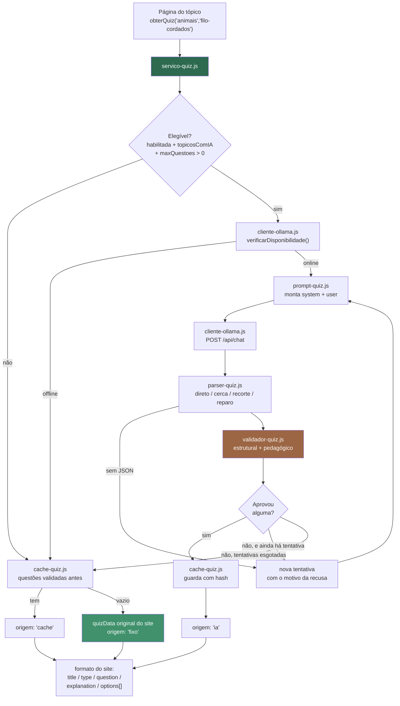

# Fase 2 — Camada de IA em JavaScript

> Entregáveis: 7 arquivos em `script/ia/`, uma bateria de testes em `scripts/testar-camada-ia.js`
> e este documento.
>
> **Nenhum arquivo do site foi alterado.** A camada existe, é testável e ainda não está ligada em
> página nenhuma — isso é a Fase 3. Verificado com `git diff main` ao fim da fase.

---

## 1. Arquivos criados

| Arquivo | Linhas | Responsabilidade |
|---|---:|---|
| `script/ia/config-ia.js` | 127 | Configuração central. Único lugar com nome de modelo e URL |
| `script/ia/metricas-ia.js` | 154 | Contadores no LocalStorage (`quiz_ia_metricas`) |
| `script/ia/cliente-ollama.js` | 171 | HTTP com o daemon: timeout, erros classificados, disponibilidade |
| `script/ia/prompt-quiz.js` | 181 | Prompts versionados (`_V1`) e o JSON Schema |
| `script/ia/parser-quiz.js` | 214 | Extração tolerante do JSON, inclusive truncado |
| `script/ia/validador-quiz.js` | 303 | Validação estrutural e pedagógica. Nada passa sem aprovação |
| `script/ia/cache-quiz.js` | 235 | Banco de questões no LocalStorage (`quiz_ia_banco`) |
| `script/ia/servico-quiz.js` | 357 | Orquestrador. `obterQuiz()` é a única porta de entrada |
| `scripts/testar-camada-ia.js` | 652 | 72 testes: 67 offline e 5 com chamada real ao Ollama |

**Duas diferenças em relação ao roteiro, ambas deliberadas:**

1. **A pasta é `script/ia/` e não `site/js/ia/`.** Não existe pasta `site/` neste repositório;
   `script/` é onde o site já guarda seu JavaScript. Manter a convenção existente vale mais que
   seguir o caminho do roteiro ao pé da letra.
2. **Dois arquivos a mais: `parser-quiz.js` e `metricas-ia.js`.** O parser existe porque os modelos
   cloud ignoram o JSON Schema (§5) — o roteiro assumia que isso não seria necessário. As métricas
   saíram de dentro do validador para não misturar "julgar uma questão" com "escrever no
   LocalStorage": o serviço também precisa registrar latência e falhas de rede.

---

## 2. Arquitetura



Cada arquivo depende só dos anteriores, então a ordem dos `<script>` é a ordem da lista da §1.
Nenhum deles conhece o DOM: a camada inteira é testável fora do navegador, e é isso que a bateria
de testes faz.

---

## 3. Como trocar de nuvem para local

**Uma linha em `script/ia/config-ia.js`:**

```js
provedor: "cloud",   →   provedor: "local",
```

O resto já está descrito na própria configuração:

```js
provedores: {
  cloud: { modelo: "gpt-oss:120b-cloud", host: "http://localhost:11434",
           suportaSchema: false, timeoutMs: 120000 },
  local: { modelo: "qwen3:4b",           host: "http://localhost:11434",
           suportaSchema: true,  timeoutMs: 300000 },
}
```

Trocar o provedor muda três comportamentos automaticamente, sem editar mais nada:

| | `cloud` | `local` |
|---|---|---|
| Modelo | `gpt-oss:120b-cloud` | a definir por benchmark na Fase 6 |
| JSON Schema no parâmetro `format` | **não enviado** (seria ignorado) | **enviado** |
| Instrução de formato JSON dentro do prompt | **incluída** (é o que segura o formato) | **omitida** (o schema já garante) |
| Timeout | 120 s | 300 s — inferência em CPU é bem mais lenta |

Trocar só o modelo, mantendo a nuvem, é mudar a string `modelo` do bloco `cloud`. Nenhum outro
arquivo da camada contém nome de modelo ou URL — isso é verificável:

```bash
grep -rn "gpt-oss\|11434" script/ia/     # só aparece em config-ia.js
```

Dois testes automatizados protegem esse desacoplamento: um confere que trocar a string muda modelo,
timeout e uso de schema; o outro confere que o prompt inclui a instrução de formato na nuvem e a
omite no local.

---

## 4. Testes realizados

```bash
node scripts/testar-camada-ia.js          # 67 testes offline, sem rede
node scripts/testar-camada-ia.js --rede   # + 5 testes com chamada real ao Ollama
```

**Resultado: 72 passaram, 0 falharam.**

Os arquivos de `script/ia/` são scripts clássicos que declaram globais, do jeito que o navegador
os carrega. O teste os carrega num contexto `vm` do Node com `localStorage` e `fetch` dublados —
então o que roda no teste é exatamente o mesmo código que roda no navegador, sem adaptação e sem
dependência nova.

| Grupo | Testes | O que cobre |
|---|---:|---|
| Parser | 8 | JSON limpo, dentro de ``` ```, cercado de prosa, truncado, array solto, chave com outro nome, texto sem JSON, resposta vazia |
| Validador | 19 | Cada regra estrutural e pedagógica, com o motivo esperado; um lote misto de 2 boas e 2 ruins; um falso positivo que o padrão precisa evitar |
| Cache | 7 | Guardar/recuperar, deduplicação por hash, `conceitosExcluir`, estatísticas, limpeza |
| Serviço | 16 | A cascata inteira, formato de saída, preservação da chave de progresso, retentativa, erro de assinatura, limite de `maxQuestoes` |
| Métricas | 5 | Contagem de gerações, aprovações, motivos de recusa, falhas por tipo, latência |
| Configuração | 12 | Troca cloud ↔ local, schema por provedor, prompt por provedor, identificação por URL |
| Integração real | 5 | Daemon online, modelo registrado, geração de verdade, uma correta por questão, gravação no cache |

### 4.1 Números medidos — 8 quizzes seguidos, tópico `filo-cordados`

| Métrica | Valor |
|---|---|
| Origem servida | **8 de 8 pela IA** |
| Questões recebidas do modelo | 45 |
| Questões aprovadas | 40 |
| **Taxa de aprovação** | **88,9%** |
| Taxa de rejeição | 11,1% |
| Motivos de rejeição | `vazamento_por_comprimento`: 5 (100% das recusas) |
| Estratégias do parser | `direto`: 12 de 12 |
| Latência por chamada | mediana **7,7 s** · média 7,0 s · p95 9,4 s |
| Latência por quiz completo | média **10,5 s** |

Nesta rodada os 8 quizzes saíram completos, com 5 questões cada (40 aprovadas ÷ 8). Na rodada
anterior, com o teto de tokens mais baixo, dois quizzes saíram com 4 e com 3 questões — e isso é o
comportamento desejado, não uma falha: o modelo entregou menos do que foi pedido, o serviço viu que
nada tinha sido recusado e parou em vez de insistir. Insistir produziria repetição ou invenção.

### 4.2 Um número que mudou depois de ser medido

A primeira rodada de 8 quizzes deu **36% de respostas truncadas** (`reparo`: 4 de 11 chamadas), com
o teto de `num_predict` em 3000. Cinco questões com explicação de 2 a 4 frases não cabem em 3000
tokens. Subindo para 4500:

| `num_predict` | Respostas íntegras | Respostas truncadas | Taxa de aprovação |
|---|---|---|---|
| 3000 | 7 de 11 (64%) | 4 de 11 (36%) | 86,0% |
| **4500** | **12 de 12 (100%)** | **0** | **88,9%** |

O parser de reparo continua no código: ele é a rede de proteção para quando um tópico maior ou um
modelo local com contexto menor voltar a estourar o teto.

---

## 5. Limitação técnica: o JSON Schema não funciona na nuvem

**Isto não é um detalhe de implementação, é uma limitação medida do ambiente, e está tratada como tal.**

O roteiro (§6.2) manda usar o parâmetro `format` com um JSON Schema e diz explicitamente:
*"Não peça JSON só no texto do prompt."* Foi o que se tentou primeiro. Não funciona.

### O que foi testado

| Variação | Resultado |
|---|---|
| `format` com JSON Schema em `/api/chat` | ignorado, devolveu Markdown |
| `format: "json"` (modo simples) | ignorado, devolveu Markdown |
| `format` com schema + `think: false` | ignorado |
| `format` com schema + `think: "low"` | ignorado |
| `format` com schema em `/api/generate` | ignorado |
| Nos três modelos cloud gratuitos (`gpt-oss:20b`, `gpt-oss:120b`, `gemma4`) | ignorado em todos |

**Causa:** a restrição por gramática que implementa o `format` é aplicada pelo *runner* do Ollama na
máquina local. Modelos com sufixo `:cloud` são repassados pelo daemon para `ollama.com`, e a
restrição não acompanha a requisição.

### O contorno, e por que ele é aceitável

Três camadas em vez de uma:

1. **Prompt de sistema** que proíbe qualquer texto fora do JSON, mais um bloco com o formato exato.
   Esse bloco **só entra no prompt quando o provedor não suporta schema** — no provedor local ele
   some sozinho, porque lá o mecanismo correto volta a funcionar.
2. **Parser tolerante** (§6), que acha o JSON mesmo dentro de Markdown ou prosa.
3. **Validador rigoroso** (§7), que recusa o que estiver errado, com motivo registrado.

Medido: **12 de 12 respostas com JSON aproveitável** no arranjo atual. Mas a honestidade sobre o
mecanismo continua valendo: **o schema não está sendo respeitado, ele está sendo compensado.** A
configuração registra isso em `suportaSchema: false`, e a página de diagnóstico da Fase 4 vai
mostrar essa flag na tela.

---

## 6. Como funciona o parser

Quatro estratégias, da mais limpa para a mais defensiva. A que funcionou vira métrica — saber
quantas respostas precisaram de reparo diz mais sobre o modelo do que qualquer impressão.

| Estratégia | Quando entra | Como funciona |
|---|---|---|
| `direto` | o modelo obedeceu | `JSON.parse` no texto inteiro |
| `cerca` | veio em bloco de código | remove ` ```json ` e ` ``` ` |
| `recorte` | JSON inteiro cercado de prosa | acha a primeira chave e o fechamento correspondente, com um scanner que sabe distinguir chave dentro e fora de string |
| `reparo` | resposta **truncada** | recolhe do array só os objetos `{...}` que fecharam, e **descarta a questão cortada** |

O tratamento de truncamento merece destaque porque é contraintuitivo: **não se tenta remendar** o
texto cortado. Remendar produz um objeto pela metade que passa no `JSON.parse` e explode na tela.
Descartar a questão incompleta e aproveitar as inteiras é a escolha coerente com a regra do projeto
de entregar menos em vez de entregar errado.

O parser também aceita formatos que o modelo inventa — array solto, `{"perguntas": [...]}`, uma
questão única sem envelope — e normaliza tudo para `{questoes: [...]}`.

**Tolerante para achar, rigoroso para aceitar:** o parser só tenta localizar o JSON. Julgar se o
conteúdo presta é trabalho do validador, que roda em seguida.

---

## 7. Como funciona o validador

Nada chega à tela sem passar aqui, e **nenhuma resposta inválida é aceita em silêncio**. A validação
é por questão, não por lote: se vierem 5 e 2 forem ruins, aproveitam-se as 3 boas e pedem-se as
outras 2 numa nova tentativa, reenviando ao modelo o motivo exato da recusa.

### Regras estruturais

| Motivo registrado | O que verifica |
|---|---|
| `campo_faltando` | `enunciado`, `explicacao`, `conceitoAvaliado` e `respostaCorreta` presentes e não vazios |
| `numero_de_alternativas` | exatamente 4 |
| `alternativa_malformada` / `alternativa_vazia` | cada alternativa tem `id` e `texto` úteis |
| `ids_duplicados` | os 4 ids são distintos |
| `alternativas_duplicadas` | não há duas alternativas dizendo a mesma coisa |
| `resposta_correta_inexistente` | `respostaCorreta` é um dos ids |

### Regras pedagógicas

| Motivo registrado | Limiar | Justificativa |
|---|---|---|
| `enunciado_curto` | < 25 caracteres | Enunciado menor que isso não formula pergunta |
| `explicacao_trivial` | < 60 caracteres | "de 2 a 4 frases" não cabe em menos |
| `expressao_proibida` | "todas/nenhuma das anteriores" e variantes | Regra do roteiro; são alternativas que testam leitura, não conhecimento |
| `vazamento_por_comprimento` | correta > 1,7× a média das outras **e** > 25 caracteres de diferença | Vazamento clássico: a correta ser sempre a mais longa é aprendível sem estudar. Os dois critérios juntos evitam punir uma correta legitimamente mais descritiva |
| `explicacao_cita_letra` | ver §9 | As alternativas são embaralhadas antes de exibir |

### Anti-alucinação

`conceitoAvaliado`, o enunciado e a **alternativa correta** são conferidos contra o texto do tópico:
as palavras de conteúdo (mais de 3 letras, fora as vazias) são procuradas no material, comparando
por radical para absorver plural e flexão.

| Motivo | Limiar |
|---|---|
| `conceito_fora_do_material` | menos de 50% dos termos do conceito aparecem no conteúdo |
| `enunciado_fora_do_material` | menos de 35% dos termos do enunciado + resposta correta aparecem no conteúdo |

**Os distratores ficam fora dessa checagem de propósito.** Um bom distrator é uma afirmação errada
— por definição ele pode dizer coisa que não está no texto. Conferir distrator contra o material
recusaria justamente as questões bem feitas.

---

## 8. Preservação do progresso do aluno

Uma decisão que não é óbvia e que estava perto de virar defeito.

O motor do site deriva a chave de progresso do LocalStorage de `quizData[0].title`
(`quiz-engine.js:89`). Se o quiz gerado usasse o título da base de conhecimento — "Filo dos
Cordados" — a chave viraria `filo_dos_cordados` em vez de `cordados`, e **o aluno perderia o
histórico do tópico**.

Por isso `servico-quiz.js` copia o `title` do **quiz fixo**, não da base de conhecimento. Há um
teste automatizado só para isso:

```
ok    title copiado do quiz fixo, preservando a chave do LocalStorage
```

A camada usa duas chaves próprias, `quiz_ia_banco` e `quiz_ia_metricas`, e **nunca escreve em
`quizProgress`**.

---

## 9. Defeito encontrado lendo a saída (e corrigido)

O teste de integração passava, o validador aprovava, e mesmo assim a saída estava errada. Só
apareceu porque as questões geradas foram **lidas**, não só contadas:

> **Qual das características abaixo NÃO corresponde aos Condrictes?**
> A) Possuem esqueleto cartilaginoso.
> **B) Possuem escamas cicloides.** ← correta
> C) Geralmente apresentam 5 pares de fendas branquiais.
> D) Não possuem bexiga natatória.
>
> *"Condrictes têm escamas placóides, conforme o texto (…) tornando **a opção c** a única incorreta."*

A explicação aponta para a alternativa C, e a correta é a B.

**Causa — e a culpa é da minha implementação, não do modelo:** o serviço embaralha as alternativas
antes de exibir, porque modelos de linguagem tendem a pôr a resposta certa sempre na mesma posição.
Só que o modelo escreve a explicação citando as letras da ordem *original*. Depois do sorteio,
toda referência por letra passa a apontar para outra opção.

**Correção, em duas frentes:**

1. O prompt passou a proibir citar alternativa por letra, exigindo que a explicação se refira ao
   que a alternativa **diz** — o que também é uma explicação melhor.
2. O validador ganhou a regra `explicacao_cita_letra`, que recusa quem desobedecer. A letra "a"
   sozinha é artigo em português, então o padrão só a considera citação quando vem entre aspas,
   colada em pontuação ou seguida de verbo — e há um teste para o falso positivo
   ("as alternativas **a** seguir").

Depois da correção, na geração seguinte: *"A alternativa que menciona tubo nervoso ventral está
errada porque nos cordados o tubo nervoso está na região dorsal"* — sem letra nenhuma, correta
depois do embaralhamento.

---

## 10. Limitações conhecidas desta fase

1. **O JSON Schema não é respeitado na nuvem** (§5). Compensado, não resolvido.
2. **Só gera questões de múltipla escolha.** O site também suporta `type: "trueFalse"`, e o quiz
   fixo tem 5 questões desse tipo. Ficou de fora porque o formato de 4 alternativas é o que sustenta
   as regras de distrator plausível e vazamento por comprimento.
3. **A checagem anti-alucinação é mais fraca em questões negativas** ("assinale a que NÃO..."), onde
   a alternativa correta é justamente uma afirmação falsa sobre o assunto. Numa geração observada
   ela passou porque o termo estava no texto (em outra seção), mas isso foi sorte, não garantia.
4. **A validação roda no cliente.** Num cenário real com usuários, poderia ser contornada abrindo o
   console. Para este trabalho, uso local e monousuário, é aceitável — mas precisa constar nas
   limitações do relatório final.
5. **O `vazamento_por_comprimento` responde por 100% das recusas** e custa uma chamada extra em
   metade dos quizzes. O limiar de 1,7× pode estar apertado; só uma amostra maior (Fase 5) diz se
   vale afrouxar.
6. **Nada disso está ligado no site ainda.** É a Fase 3.

---

## 11. Modelos testados e suas limitações

| Modelo | Plano gratuito | Latência | Respeita `format` | Observação |
|---|---|---|---|---|
| **`gpt-oss:120b-cloud`** | ✅ | ~3–8 s | ❌ | **Em uso.** Melhor relação entre velocidade e qualidade do português |
| `gpt-oss:20b-cloud` | ✅ | ~8 s | ❌ | Funciona, mas mais lento que o 120b |
| `gemma4:cloud` | ✅ | ~2 s | ❌ | Descartado: ignora a instrução de formato e responde conversando ("Olá! Como seu prof…") |
| `deepseek-v4-flash:cloud` | ❌ pago | — | — | `{"error":"this model requires a subscription"}` em ~150 ms |
| `qwen3.5:cloud` | ❌ pago | — | — | idem |
| `glm-5.1:cloud` | ❌ pago | — | — | idem |
| `minimax-m2.7:cloud` | ❌ pago | — | — | idem |

Tags que não existem e falham no `ollama pull`: `qwen3.5:9b-cloud`, `nemotron-3-nano:4b-cloud`,
`mistral-large-3:cloud`.

O cliente trata o erro de assinatura como um tipo próprio e **não gera retentativa**: insistir num
modelo pago não muda o resultado e só gasta tempo na apresentação. Há teste para isso.

---

## 12. Estado do repositório

Nenhum arquivo do site foi criado, alterado ou removido. Acréscimos desta fase: `script/ia/`
(7 arquivos), `scripts/testar-camada-ia.js` e este documento.
