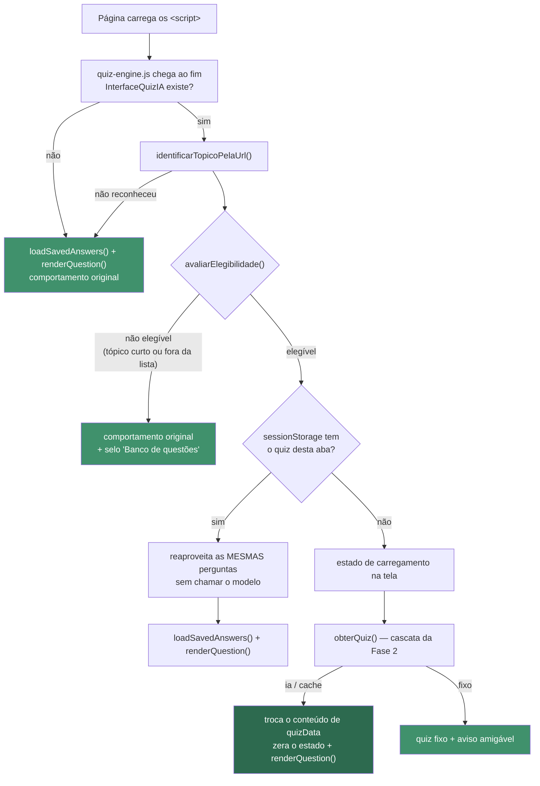

# Fase 3 — Integração na interface

> A IA está ligada ao quiz. `filo-cordados` gera perguntas; os outros 20 tópicos seguem no
> quiz fixo até a expansão da Fase 5.
>
> **Duas linhas do site foram substituídas, em um único arquivo.** Nos 21 HTMLs, nenhuma
> linha existente foi alterada — só houve inserção.

---

## 1. O que mudou no site

| Arquivo | Diff | O que mudou |
|---|---|---|
| `script/quiz-engine.js` | **+10 / −2** | Só a chamada de partida no fim do arquivo |
| 21 HTMLs de tópico | **+12 / −0** cada | Só inserção de `<script>`; nenhuma linha original tocada |
| **Total no site** | **+262 / −2** | — |

Arquivos novos, que não são "o site" e sim a camada acrescentada:

| Arquivo | Papel |
|---|---|
| `script/ia/interface-quiz.js` | Ponte entre a camada de IA e o motor. Todo o DOM e o CSS novos nascem aqui |
| `scripts/integrar-paginas.js` | Insere/remove os `<script>` nos 21 HTMLs. Idempotente e reversível |
| `scripts/testar-integracao.js` | 50 testes de regressão que rodam o motor de verdade |

### 1.1 Antes e depois — `script/quiz-engine.js`

O arquivo tem 358 linhas. Estas são as únicas que mudaram, no fim do arquivo:

```diff
 // Iniciar
-loadSavedAnswers();
-renderQuestion();
+// Única alteração feita neste arquivo pela integração com IA (Fase 3).
+// Se a camada de IA estiver carregada, ela decide de onde vêm as questões e chama
+// loadSavedAnswers() e renderQuestion() no momento certo. Se não estiver, o quiz roda
+// exatamente como antes — o site continua funcionando com a IA desligada.
+if (typeof InterfaceQuizIA !== "undefined") {
+  InterfaceQuizIA.iniciar();
+} else {
+  loadSavedAnswers();
+  renderQuestion();
+}
```

O `else` não é decoração: é o que garante que o motor continua funcionando sozinho. Apagar a
pasta `script/ia/` inteira devolve o site ao comportamento original sem tocar em mais nada.

**Nenhuma das 24 leituras de `quizData` no motor foi alterada.** Isso foi possível porque
`interface-quiz.js` troca o *conteúdo* do array no lugar:

```js
quizData.length = 0;
Array.prototype.push.apply(quizData, questoes);
```

`quizData` é declarado com `const` nos arquivos de `local-storage/`, e `const` impede reatribuir —
mas não impede mutar. A alternativa seria renomear o identificador dentro do motor, mexendo em 24
linhas originais em vez de nenhuma.

### 1.2 Antes e depois — os 21 HTMLs

Inserção idêntica nos 21, imediatamente antes do `<script>` do motor:

```diff
     <script src="../.../../../../../script/../local-storage/quiz_animais/quiz_filo_cordados.js"></script>
+    <!-- Camada de IA (Fase 3) — ordem de dependência obrigatória -->
+    <script src="../../../../dados/base-conhecimento.js"></script>
+    <script src="../../../../script/ia/config-ia.js"></script>
+    <script src="../../../../script/ia/metricas-ia.js"></script>
+    <script src="../../../../script/ia/cliente-ollama.js"></script>
+    <script src="../../../../script/ia/prompt-quiz.js"></script>
+    <script src="../../../../script/ia/parser-quiz.js"></script>
+    <script src="../../../../script/ia/validador-quiz.js"></script>
+    <script src="../../../../script/ia/cache-quiz.js"></script>
+    <script src="../../../../script/ia/servico-quiz.js"></script>
+    <script src="../../../../script/ia/interface-quiz.js"></script>
+    <!-- fim da camada de IA -->
     <script src="../../../../script/quiz-engine.js"></script>
```

A ordem é obrigatória: cada arquivo só usa globais declarados pelos anteriores, e
`interface-quiz.js` precisa existir antes do motor dar a partida.

**Nenhum elemento HTML novo foi acrescentado**, nem nenhum `<link>` de CSS. O selo de origem, o
botão de gerar novas perguntas, o aviso de fallback e o estado de carregamento são criados em
tempo de execução por `interface-quiz.js`, que também injeta seu próprio `<style>`. Foi assim para
que os 21 arquivos recebessem só `<script>`, e nenhum CSS do site fosse tocado.

A alteração foi feita por script, não à mão:

```bash
node scripts/integrar-paginas.js              # insere
node scripts/integrar-paginas.js --verificar  # só relata
node scripts/integrar-paginas.js --reverter   # desfaz
```

Rodar duas vezes não duplica nada — verificado.

---

## 2. Como a integração funciona



### 2.1 Estado de carregamento

A geração leva de 2 a 10 segundos, então a tela nunca fica parada. O carregamento reaproveita os
elementos que já existem — sem HTML novo:

| Elemento existente | Durante a geração |
|---|---|
| `#questionTitle` | "Gerando perguntas a partir do conteúdo do tópico" com reticências animadas |
| `#questionTypeText` | "Preparando o quiz" |
| `#progressInfo` | acompanha a fase: conectando → gerando → conferindo |
| `#optionsContainer` | 4 blocos cinza pulsando, no lugar das alternativas |
| botões de navegação | desabilitados, e reabilitados ao terminar |

As fases vêm do callback `aoMudarEstado` que o serviço já expunha desde a Fase 2. Numa retentativa
o texto muda para "Ajustando as perguntas (tentativa 2 de 3)", então uma espera mais longa fica
explicada em vez de parecer travamento.

### 2.2 Selo de origem, botão e aviso

| Origem | Selo | Aviso |
|---|---|---|
| `ia` | ✨ Perguntas geradas por IA | nenhum |
| `cache` | ✨ Perguntas geradas por IA (salvas) | "Não foi possível falar com o modelo agora, então estas são perguntas geradas antes e guardadas neste navegador." |
| `fixo` | 📘 Banco de questões do site | "As perguntas novas não estão disponíveis no momento. Você está respondendo o banco de questões do site." |

O selo mostra o nome do modelo no `title`, ao passar o mouse. O botão **"↻ Gerar novas perguntas"**
só aparece em tópicos elegíveis — num tópico curto ele nem é criado, para não prometer o que não
vai acontecer.

Os avisos foram escritos sem jargão: não aparecem as palavras *timeout*, *HTTP*, *JSON*, *daemon*,
*fetch* nem *Ollama*. Há um teste automatizado que confere isso por expressão regular.

---

## 3. LocalStorage: quatro depósitos, sem mistura

| Chave | Onde | Guarda | Quem escreve |
|---|---|---|---|
| `quizProgress` | LocalStorage | Progresso do aluno — **formato original intocado** | só `quiz-engine.js` |
| `quiz_ia_banco` | LocalStorage | Questões validadas (cache/fallback) | só `cache-quiz.js` |
| `quiz_ia_metricas` | LocalStorage | Contadores para o relatório | só `metricas-ia.js` |
| `quiz_ia_sessao` | **sessionStorage** | O quiz que está na tela **nesta aba** | só `interface-quiz.js` |

A camada de IA **nunca escreve em `quizProgress`**, e o motor nunca escreve nas outras três. Um
teste confere que as chaves coexistem e que o botão Resetar não apaga cache nem métricas.

### 3.1 O `quiz_ia_sessao` e o recarregamento da página

Este foi o problema mais sutil da fase. `quizProgress` guarda as respostas **por índice da
questão**. Se cada F5 gerasse um quiz diferente, a resposta salva no índice 0 passaria a apontar
para outra pergunta — o aluno recarregaria a página e veria respostas marcadas em perguntas que
nunca respondeu.

A solução é guardar em `sessionStorage` o conjunto exibido. Recarregar devolve exatamente as mesmas
perguntas, na mesma ordem, e as respostas salvas voltam a casar. É `sessionStorage` e não
`localStorage` de propósito: vale enquanto a aba estiver aberta, então uma visita nova volta a ter
perguntas inéditas — que é o objetivo do projeto. O botão "Gerar novas perguntas" limpa essa chave.

Efeito colateral bem-vindo: o F5 não faz chamada nenhuma ao modelo. Verificado por teste.

### 3.2 Chave de progresso preservada

Continua valendo o que foi decidido na Fase 2: o `title` das questões geradas é copiado do quiz
fixo, então `getTopicId()` produz a mesma chave de sempre. Um teste agora confere isso *pela ponta
da interface*: depois de responder uma questão gerada, `quizProgress` grava sob `cordados`, exato
como no quiz fixo.

Quando as perguntas são novas (origem `ia` ou `cache`), o estado do motor é zerado em vez de
restaurado: conjunto novo de perguntas é tentativa nova. Restaurar respostas antigas em perguntas
novas mostraria gabarito errado.

---

## 4. Testes de regressão

```bash
node scripts/testar-integracao.js          # 46 testes, sem rede
node scripts/testar-integracao.js --rede   # + 4 com geração real
```

**Resultado: 50 passaram, 0 falharam.**

Estes testes carregam, para cada tópico, a **mesma sequência de `<script>` que a página carrega**,
num contexto `vm` com um DOM mínimo. Isso executa `quiz-engine.js` de verdade: renderizar,
responder, enviar, pontuar, resetar e navegar acontecem no código real do site. Para o DOM de teste
não descolar da realidade, os ids que ele cria são conferidos contra o HTML de verdade — é o
primeiro teste da bateria.

| Grupo | Testes | Cobertura |
|---|---:|---|
| 1. Fidelidade do DOM | 2 | Os ids do esqueleto existem na página real |
| 2. Os 21 tópicos | 4 | Todos renderizam, respondem, enviam e gravam progresso |
| 3. IA desligada | 8 | Quiz fixo, selo, aviso sem jargão, tópico curto sem tentativa |
| 4. Cascata | 17 | Os 8 cenários de falha exigidos, com o motor renderizando |
| 5. F5 e botão | 5 | Mesmas perguntas, sem nova chamada, respostas restauradas |
| 6. Motor com questões geradas | 9 | Navegação, pontuação, modal, reset |
| 7. Geração real | 4 | Pilha inteira contra o Ollama de verdade |

### 4.1 Cenários de falha exigidos

| Cenário | Resultado | Tela |
|---|---|---|
| Ollama desligado, **com** cache | origem `cache` | perguntas de IA guardadas + aviso |
| Ollama desligado, **sem** cache | origem `fixo` | quiz fixo + aviso |
| Timeout | origem `fixo` | quiz fixo, nunca em branco |
| Erro HTTP 500 | origem `fixo` | quiz fixo |
| Resposta em prosa, sem JSON | origem `fixo` após 3 tentativas | quiz fixo |
| JSON truncado | origem `ia` | aproveita as questões inteiras |
| Questões recusadas pelo validador | origem `fixo` | quiz fixo, recusa registrada nas métricas |
| Resposta inválida seguida de válida | origem `ia` em 2 chamadas | perguntas geradas |

Em nenhum deles a tela ficou vazia ou o quiz quebrou.

### 4.2 Os 21 tópicos, com a IA desligada

Cada um dos 21 foi carregado, teve todas as questões respondidas e enviadas:

- **21 de 21** renderizaram uma questão;
- **21 de 21** gravaram progresso sob uma única chave, no formato original;
- **21 de 21** fecharam com `submitted: true` e `progress: 100`.

Isso é a garantia de que **o site funciona normalmente com a IA desligada** — que era a exigência
principal da fase.

### 4.3 Tópicos de volumes diferentes

Rodado com geração real, habilitando cada tópico apenas em memória (`topicosComIA` no arquivo
continua só com `filo-cordados`; expandir é a Fase 5):

| Tópico | Caracteres | `maxQuestoes` | Origem | Questões | Tempo |
|---|---:|---:|---|---:|---:|
| `filo-cordados` | 4.675 | 5 | ia | 5 | 6,2 s |
| `fluxo-de-energia` | 3.047 | 5 | ia | 5 | 9,1 s |
| `ecossistemas-da-terra` | 1.996 | 5 | ia | 5 | 8,8 s |
| `filo-artropodes` | 1.032 | 2 | ia | 2 | 5,1 s |
| `filo-moluscos` | 645 | 1 | ia | 1 | 2,5 s |
| `angiospermas` | 209 | 0 | **fixo** | 1 | **1 ms** |

O teto calculado na Fase 1 é respeitado em todos, e o tópico curto **não chega a fazer chamada
nenhuma** — 1 ms, sem carregamento, sem piscar a tela.

### 4.4 Carregamento pelo servidor HTTP

Servindo a raiz do projeto e pedindo a página de Cordados, os **13 `<script>` retornaram 200**,
inclusive o caminho torto `../.../../../../../script/../local-storage/…` que já existia no site
(risco R3 da Fase 0), que o servidor normaliza para `/local-storage/…`. A existência dos arquivos
referenciados foi conferida nos 21 tópicos pela bateria de testes.

### 4.5 Defeitos encontrados durante a fase

| # | Onde | Sintoma | Correção |
|---|---|---|---|
| 1 | `interface-quiz.js` | No fallback, o quiz fixo era reentregue a partir da cópia original, sem o campo `origem` — o selo e o diagnóstico ficavam sem saber a procedência | Passou a entregar `quiz.questoes`, que o serviço já devolve marcado |
| 2 | `scripts/testar-integracao.js` | O analisador de HTML do DOM de teste exigia `="valor"` em todo atributo e descartava a tag inteira ao ver `hidden` | Padrão passou a aceitar atributo sem valor |
| 3 | `scripts/testar-integracao.js` | O analisador ignorava nós de texto, então `textContent` do modal saía vazio | Passou a criar nós de texto |
| 4 | `scripts/testar-integracao.js` | O teste de rede esperava `origem === "fixo"`, mas antes da cascata terminar o campo é `undefined` — saía do laço na primeira volta | Passou a esperar `origem` deixar de ser `undefined` |

Só o primeiro era defeito de produto. Os outros três eram do arranjo de teste — e valem registro
porque um arranjo que mente é pior que nenhum: os três produziam "falha" ou "sucesso" por motivo
errado.

---

## 5. Limitações conhecidas

1. **Uma aba, um quiz.** Duas abas abertas no mesmo tópico compartilham `quizProgress` mas têm
   `sessionStorage` separados, então podem exibir conjuntos diferentes de perguntas e sobrescrever
   o progresso uma da outra. Já era assim antes da IA; a integração não piora nem corrige.
2. **Trocar de quiz descarta as respostas em andamento.** Clicar em "Gerar novas perguntas" no meio
   do quiz zera o que foi respondido. É o comportamento correto — as perguntas mudaram —, mas não
   há confirmação antes.
3. **A verificação em navegador real não foi feita por automação.** Não há Playwright nem Puppeteer
   no projeto, e instalá-los violaria a regra de zero dependências. O que existe é o motor real
   rodando sobre um DOM mínimo, mais a checagem de carregamento por HTTP. Layout e CSS precisam de
   conferência visual sua.
4. **Só `filo-cordados` gera perguntas.** Os outros 20 seguem no quiz fixo até a Fase 5.
5. Seguem valendo as limitações da Fase 2: o JSON Schema não é respeitado na nuvem, só se geram
   questões de múltipla escolha e a validação roda no cliente.

---

## 6. Verificação do estado do repositório

```
git diff --numstat main
  21 HTMLs de tópico ........ +252 / −0    (só inserção de <script>)
  script/quiz-engine.js ..... +10  / −2    (só a chamada de partida)
  demais arquivos ........... novos, nenhum do site original
```

Nenhum arquivo de conteúdo, CSS, imagem ou quiz fixo foi alterado. Os 21 arquivos de
`local-storage/` continuam byte a byte iguais à linha de base, e é justamente isso que sustenta o
último nível do fallback.
