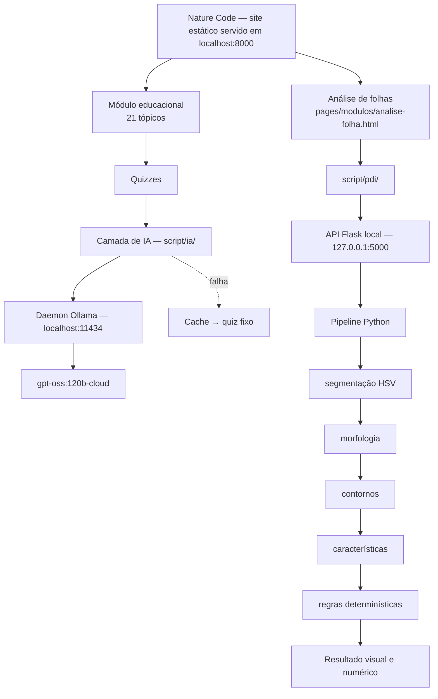

# Nature Code — Documentação técnica final (IA + PDI)

> **Documento técnico principal do projeto inteiro.** Resume os dois módulos técnicos —
> quizzes gerados por IA e análise morfológica de folhas por processamento digital de
> imagens — e aponta, em cada seção, o documento detalhado de onde o conteúdo vem.
>
> **Nenhum resultado aqui é novo.** Todos os números foram registrados nas fases de origem,
> que continuam sendo a fonte primária. Onde este documento e uma fase divergirem, vale a
> fase.
>
> **Estado:** pipeline de PDI congelado em `fase-9-completa` (`4b66981`); avaliação final
> (Fase 10) executada e inspeção humana dos 12 casos selecionados concluída (12/12
> utilizáveis); robustez com imagens externas (Fase 11) executada e inspecionada —
> **robustez externa limitada** (0 adequados, 2 parciais, 7 inadequados em 9); testes
> manuais de interface, API, CLI e IA concluídos.

---

## Índice

| | | | |
|---|---|---|---|
| 1 | [Apresentação](#1-apresentação) | 17 | [Contornos](#17-contornos) |
| 2 | [Objetivos](#2-objetivos) | 18 | [Características](#18-características) |
| 3 | [Integrantes](#3-integrantes) | 19 | [Classificação determinística](#19-classificação-determinística) |
| 4 | [Arquitetura](#4-arquitetura) | 20 | [Pipeline, CLI e API](#20-pipeline-cli-e-api) |
| 5 | [Site educacional](#5-site-educacional) | 21 | [Interface](#21-interface) |
| 6 | [IA](#6-ia) | 22 | [Avaliação — Fase 10](#22-avaliação--fase-10) |
| 7 | [Arquitetura da IA](#7-arquitetura-da-ia) | 23 | [Robustez — Fase 11](#23-robustez--fase-11) |
| 8 | [Prompt V4](#8-prompt-v4) | 24 | [Separação IA × PDI](#24-separação-ia--pdi) |
| 9 | [Fallback e cache](#9-fallback-e-cache) | 25 | [Testes](#25-testes) |
| 10 | [Testes da IA](#10-testes-da-ia) | 26 | [Riscos](#26-riscos) |
| 11 | [PDI](#11-pdi) | 27 | [Limitações](#27-limitações) |
| 12 | [Problema formal](#12-problema-formal) | 28 | [Reprodutibilidade](#28-reprodutibilidade) |
| 13 | [Dataset](#13-dataset) | 29 | [Git e tags](#29-git-e-tags) |
| 14 | [Pré-processamento](#14-pré-processamento) | 30 | [Conclusão](#30-conclusão) |
| 15 | [Segmentação](#15-segmentação) | 31 | [Próximos passos](#31-próximos-passos) |
| 16 | [Morfologia](#16-morfologia) | | |

---

## 1. Apresentação

O **Nature Code** é um site educacional de Biologia em HTML, CSS e JavaScript puros, com
21 tópicos em três módulos de conteúdo. Sobre ele foram construídos dois módulos técnicos,
em duas disciplinas:

| Módulo | Problema | Abordagem |
|---|---|---|
| **IA** | Quizzes fixos repetem sempre as mesmas perguntas | Gerar questões com uma LLM a partir do conteúdo do tópico |
| **PDI** | Descrever a forma de uma folha fotografada | Processamento digital de imagens **clássico**, sem IA |

Os módulos são **independentes**: não compartilham código, serviço nem dados. A integração
é de aplicação — os dois estão acessíveis pelo mesmo site.

---

## 2. Objetivos

**IA** — gerar questões novas por tópico, fiéis ao conteúdo, sem backend, sem chave de API
no navegador, sem alterar o conteúdo original, e com o site funcionando mesmo com a IA
desligada.

**PDI** — a partir de uma foto de uma folha isolada, separar a folha do fundo, extrair o
contorno principal, medir características morfológicas e produzir uma descrição
geométrica **transparente e determinística**, com cada decisão acompanhada dos valores e
limiares que a motivaram. O PDI **não** identifica espécie, **não** diagnostica doença e
**não** usa IA.

---

## 3. Integrantes

Universidade do Sagrado Coração — Bauru/SP · Ciência da Computação

- Amanda Pazold dos Santos
- Cesar Otavio da Silva Boiani
- Giovana Giraldeli
- Giovani Nogueira Pires
- Marcus Vinicius da Silva Capeteruchi
- Guilherme Ribeiro Zangrande

---

## 4. Arquitetura



Os dois ramos **não se cruzam**: não existe seta entre a camada de IA e o pipeline de PDI.
Nos dois casos o site continua estático e é o navegador que chama um serviço local.

---

## 5. Site educacional

| Módulo | Tópicos |
|---|---:|
| Reino Animal | 10 |
| Plantas | 5 |
| Ecossistemas | 6 |

Cada tópico tem um quiz de múltipla escolha. Os 21 quizzes fixos originais
(`local-storage/`) nunca foram apagados nem alterados; o progresso do aluno fica no
`LocalStorage`, no formato original. Mapa completo: [`00-MAPEAMENTO.md`](00-MAPEAMENTO.md).

---

## 6. IA

Resumo do módulo; a documentação completa está em
[`DOCUMENTACAO-FINAL-NATURE-CODE.md`](DOCUMENTACAO-FINAL-NATURE-CODE.md) e o resumo em
[`README.md`](README.md).

| Item | Valor |
|---|---|
| Modelo em produção | `gpt-oss:120b-cloud` |
| Prompt | V4 |
| Tópicos que geram por IA | 13 de 21 |
| Piloto (Fase 5) | 230 gerações · 752 questões · 648 aprovadas (86,2 %) |
| Leitura manual | ~90 questões · 2 defeitos pedagógicos confirmados |
| Testes | 256/256, offline |
| Benchmark local (Fase 6) | Duas sondagens; bateria completa **não** executada ([`06c-RESULTADO-BENCHMARK.md`](06c-RESULTADO-BENCHMARK.md)) |

---

## 7. Arquitetura da IA

```
conteúdo do tópico → Prompt V4 → Ollama → LLM → parser → validador → cache → quiz
```

| Arquivo | Responsabilidade |
|---|---|
| `script/ia/config-ia.js` | Configuração central — único lugar com modelo e URL |
| `script/ia/cliente-ollama.js` | HTTP com o daemon, timeout, erros classificados |
| `script/ia/prompt-quiz.js` | Prompts versionados V1–V4 |
| `script/ia/parser-quiz.js` | Extração tolerante do JSON |
| `script/ia/validador-quiz.js` | Validação estrutural e pedagógica |
| `script/ia/cache-quiz.js` | Banco de questões validadas |
| `script/ia/servico-quiz.js` | Orquestrador, cascata |
| `script/ia/interface-quiz.js` | Ponte com o motor original |
| `script/ia/metricas-ia.js` | Contadores |

Não há backend: o navegador fala direto com o daemon local do Ollama, que guarda a
credencial. **Nenhuma chave de API aparece no JavaScript.** Detalhes:
[`03-CAMADA-IA.md`](03-CAMADA-IA.md), [`04-INTERFACE.md`](04-INTERFACE.md).

---

## 8. Prompt V4

O prompt evoluiu por medição, não por opinião:

| Versão | Motivo |
|---|---|
| V3 | Pergunta negativa com duas respostas corretas → as não-respostas precisam ser afirmações explícitas do texto |
| **V4** | Questão decidida pelo título da seção → títulos organizam o texto e não são listas exaustivas |

No tópico em que o defeito ocorria, a aprovação subiu de 80 % para 91 %. Um erro de método
(avaliar o V2 num tópico onde o defeito tinha taxa-base zero) está registrado e corrigido.
Ver [`05-AVALIACAO-PILOTO.md`](05-AVALIACAO-PILOTO.md) e
[`05b-REVALIDACAO-V4.md`](05b-REVALIDACAO-V4.md).

---

## 9. Fallback e cache

```
IA → cache → quiz fixo original
```

O aluno sempre recebe um quiz. O cache reduz latência e, com o Ollama fora do ar, ainda
entrega questões já validadas. Na Fase 5 o limite do plano gratuito foi atingido no meio de
uma bateria: 20 erros HTTP seguidos, seis quizzes servidos pelo banco fixo, **nenhuma tela
vazia**. O quiz exibido fica em `sessionStorage`, então recarregar a página (F5) devolve as
mesmas perguntas sem nova chamada ao modelo.

---

## 10. Testes da IA

| Suíte | Asserções |
|---|---:|
| `scripts/testar-camada-ia.js` | 67 |
| `scripts/testar-integracao.js` | 46 |
| `scripts/testar-diagnostico.js` | 82 |
| `scripts/testar-benchmark.js` | 61 |
| **Total** | **256** |

Nenhuma exige internet nem Ollama em execução. Com `--rede`, as três primeiras fazem
chamadas reais (consomem cota).

---

## 11. PDI

Documentação fase a fase em [`processamento-imagens/`](processamento-imagens/):

| Fase | Documento | Conteúdo |
|---:|---|---|
| 0 | [`00-PLANEJAMENTO.md`](processamento-imagens/00-PLANEJAMENTO.md) | Planejamento, riscos, decisão arquitetural |
| 1 | [`01-DEFINICAO-PROBLEMA.md`](processamento-imagens/01-DEFINICAO-PROBLEMA.md) | Problema formal e contrato |
| 2 | [`02-DATASET.md`](processamento-imagens/02-DATASET.md) | Seleção do dataset, protocolo dev/avaliação |
| 3 | [`03-PRE-PROCESSAMENTO.md`](processamento-imagens/03-PRE-PROCESSAMENTO.md) | Ambiente, validação, leitura, redimensionamento |
| 4 | [`04-SEGMENTACAO.md`](processamento-imagens/04-SEGMENTACAO.md) | Comparação de estratégias; HSV + Gaussiano |
| 5 | [`05-MORFOLOGIA.md`](processamento-imagens/05-MORFOLOGIA.md) | Limpeza da máscara |
| 6 | [`06-CONTORNOS.md`](processamento-imagens/06-CONTORNOS.md) | Contorno, objeto principal, viés do perímetro |
| 7 | [`07-CARACTERISTICAS.md`](processamento-imagens/07-CARACTERISTICAS.md) | Características morfológicas |
| 8 | [`08-CLASSIFICACAO-DETERMINISTICA.md`](processamento-imagens/08-CLASSIFICACAO-DETERMINISTICA.md) | Regras e limiares |
| 9 | [`09-PIPELINE-INTEGRACAO.md`](processamento-imagens/09-PIPELINE-INTEGRACAO.md) | Pipeline, CLI, API, interface |
| 10 | [`10-AVALIACAO-FINAL.md`](processamento-imagens/10-AVALIACAO-FINAL.md) | Avaliação final congelada |
| 11 | [`11-ROBUSTEZ-FOTOS-EXTERNAS.md`](processamento-imagens/11-ROBUSTEZ-FOTOS-EXTERNAS.md) | Robustez com imagens externas: execução, inspeção e conclusão |

Regra que atravessa todas as fases: **uma fase por vez, medir antes de decidir, nenhum
parâmetro escolhido por opinião**, e registrar os erros encontrados.

---

## 12. Problema formal

Dada a fotografia de **uma folha isolada** sobre fundo claro, produzir: a máscara binária da
folha, o contorno principal, um conjunto de características morfológicas em **pixels** e
uma descrição geométrica por regras explícitas.

Fora do escopo, por definição: identificação de espécie, diagnóstico, medidas em unidade
física (não há objeto de referência), múltiplas folhas por imagem. Contrato de entrada e
saída: [`01-DEFINICAO-PROBLEMA.md`](processamento-imagens/01-DEFINICAO-PROBLEMA.md).

---

## 13. Dataset

**Flavia Leaf Dataset** — 1.907 imagens, 32 espécies, JPEG 1600×1200, fundo branco.
Fonte: http://flavia.sourceforge.net/ · https://sourceforge.net/projects/flavia/.

| Conjunto | Imagens | Uso |
|---|---:|---|
| Desenvolvimento | 64 (2 por espécie) | Todas as decisões e calibrações |
| Avaliação | 96 (3 por espécie) | **Tocado uma única vez**, na Fase 10 |

Amostragem aleatória estratificada por espécie, semente `20260919`, registrada no
[`manifesto.csv`](../processamento-imagens/dataset/manifesto.csv). **O dataset não é
versionado.** Instruções: [`processamento-imagens/dataset/README.md`](../processamento-imagens/dataset/README.md).

**Ressalva de licença:** o SourceForge declara o *projeto* Flavia como GPLv2, que inclui o
software; não foi localizada licença específica para as imagens. Uso estritamente
acadêmico, sem redistribuição ([`02-DATASET.md`](processamento-imagens/02-DATASET.md)).

---

## 14. Pré-processamento

Validação (existência, extensão JPG/JPEG/PNG/BMP, tamanho ≤ 12 MB, decodificação,
resolução mínima) → leitura com orientação EXIF aplicada em JPEG e canal alfa composto
sobre branco em PNG → redimensionamento com lado maior ≤ **1024 px** → filtro
**Gaussiano, kernel 5**. Gaussiano e mediana foram comparados; o Gaussiano venceu por
qualidade de máscara. Ver [`03-PRE-PROCESSAMENTO.md`](processamento-imagens/03-PRE-PROCESSAMENTO.md)
e [`09-PIPELINE-INTEGRACAO.md`](processamento-imagens/09-PIPELINE-INTEGRACAO.md) §14.

---

## 15. Segmentação

**HSV, faixa `H ∈ [25, 95]`, `S ≥ 40`, `V ≥ 20`**, sobre a imagem suavizada. Comparada com
Otsu e limiarização adaptativa no conjunto de desenvolvimento:

| Critério | HSV | Otsu | Adaptativo |
|---|---:|---:|---:|
| Máximo de componentes | **3** | 66 | 2.148 |
| Imagens com > 1 componente | **12/64** | 22/64 | 64/64 |
| Falhas na inspeção | **0/64** | — | — |

Separa por cor, não por brilho — resiste a sombra e reflexo. O ponto fraco declarado é a
folha **não verde**. Ver [`04-SEGMENTACAO.md`](processamento-imagens/04-SEGMENTACAO.md).

---

## 16. Morfologia

Abertura e fechamento foram medidos e **não adotados**, porque alteravam a geometria. A
limpeza é feita por **remoção de componentes** com área abaixo de 0,1 % da do maior
componente e **preenchimento de buracos internos** abaixo de 0,2 % dela. Resultado no
desenvolvimento: **0,0000 % de alteração no perímetro** e 44 das 64 máscaras intactas. Ver
[`05-MORFOLOGIA.md`](processamento-imagens/05-MORFOLOGIA.md).

---

## 17. Contornos

`RETR_EXTERNAL` (igual a `RETR_TREE` em 64/64 imagens) e `CHAIN_APPROX_SIMPLE` (−46 % de
pontos). O objeto principal é o **maior** contorno, com a **dominância** registrada. Saem
daqui área, perímetro, caixa alinhada, caixa de área mínima, centroide, orientação,
anisotropia e envelope convexo.

**Viés medido do perímetro digital (R14):** ~+5 % em bordas curvas; um círculo digital
perfeito tem circularidade ≈ 0,90, nunca 1,0. Ver [`06-CONTORNOS.md`](processamento-imagens/06-CONTORNOS.md).

---

## 18. Características

| Grupo | Características |
|---|---|
| Dimensões | área do contorno, área da máscara, perímetro, largura, altura, lados da caixa mínima |
| Forma | aspect ratio, **elongação**, **circularidade**, **solidez**, **extent**, extent rotacionado |
| Orientação | ângulo, **anisotropia**, confiabilidade |
| Convexidade | área e perímetro do envelope, **razão perímetro/hull** |
| Cor | médias e medianas RGB/HSV, `proporcao_verde` |
| Qualidade | centroide normalizado, toca borda, distância à borda, nº de contornos, dominância |

Cada uma com definição, fórmula, intervalo e limitação em
[`07-CARACTERISTICAS.md`](processamento-imagens/07-CARACTERISTICAS.md).

---

## 19. Classificação determinística

Cinco atributos, cada um com os valores usados, os limiares aplicados e a **margem
relativa** até o limiar mais próximo (não é probabilidade):

| Atributo | Característica | Limiares | Categorias |
|---|---|---|---|
| Alongamento | elongação | 1,5 · 3,0 · 6,0 | baixa · moderada · alta · extrema |
| Concavidade | solidez (+ elongação) | 0,70 · 0,92 | baixa · moderada · alta · ambígua |
| Compacidade | circularidade | 0,40 · 0,65 | baixa · moderada · alta |
| Complexidade da borda | razão perímetro/hull | 1,13 · 1,30 | regular · moderada · complexa |
| Orientação | anisotropia | 0,05 · 0,30 | indefinida · pouco definida · bem definida |

Valores inválidos resultam em `indeterminado`. Limiares derivados de quartis e vales do
conjunto de desenvolvimento. A concavidade vira **ambígua** quando a elongação é extrema,
porque uma acícula curvada tem solidez baixa sem recorte algum.

**Não é IA:** não há modelo, treinamento nem predição — são condições `if`/`elif` escritas
por pessoas. Ver [`08-CLASSIFICACAO-DETERMINISTICA.md`](processamento-imagens/08-CLASSIFICACAO-DETERMINISTICA.md).

---

## 20. Pipeline, CLI e API

A lógica fica **só** em `src/pipeline.py`; CLI e API são cascas finas, verificadas por teste.

| Interface | Comando | Destaques |
|---|---|---|
| CLI | `python -m src.cli <imagem>` | `--json-apenas`, `--sem-imagens`, `--saida`, `--verboso`; códigos de saída 0/1/2/3 |
| API | `python -m src.api` | `127.0.0.1:5000`, `debug=False`, upload ≤ 12 MB, CORS com lista fechada, proteção contra travessia de caminho, upload temporário sempre apagado |

Rotas: `GET /health`, `POST /api/processar-folha`, `GET /api/resultado/<id>/<arquivo>`.
Contrato JSON com 11 blocos sempre presentes, sem NaN nem caminho absoluto. Ver
[`09-PIPELINE-INTEGRACAO.md`](processamento-imagens/09-PIPELINE-INTEGRACAO.md).

---

## 21. Interface

`pages/modulos/analise-folha.html`, acessada por um botão em `plantas.html`. Mostra o aviso
obrigatório de que **não usa IA e não identifica espécies**, as condições ideais de foto,
o estado do serviço, upload com pré-visualização, as imagens (analisada, máscara, resultado
anotado com legenda), as medidas, a descrição e os avisos. Todo texto da API entra na
página por `textContent`. Com a API desligada, a página explica como iniciá-la.

O comportamento do JavaScript é testado no Node com DOM simulado (API fora, JSON inválido,
URL maliciosa, tempo esgotado, troca de imagem). A interface também foi **testada
manualmente no navegador** — upload, preview, processamento, troca e remoção de imagem,
arquivo inválido, API offline e recuperação, celular, tablet e desktop
([`TESTES-MANUAIS-FINAIS.md`](TESTES-MANUAIS-FINAIS.md) §2).

---

## 22. Avaliação — Fase 10

Pipeline congelado, executado **uma única vez** nas 96 imagens reservadas.

| Item | Resultado |
|---|---|
| Imagens | 96 (32 espécies × 3) |
| Processadas | 96/96 · **0 erros** |
| Taxa de processamento válido no conjunto reservado | **100 %** |
| Com / sem aviso técnico | 65 / 31 |
| Com pelo menos um atributo limítrofe | 62 |
| Tempo mediano por imagem | ~285 ms |
| Determinismo | Confirmado |
| Pipeline intacto | 9 hashes SHA-256 idênticos antes e depois |

Duas descobertas registradas **sem ajuste**: os "vales" usados para justificar os
limiares de concavidade (0,70) e orientação (0,30) não estão vazios no conjunto de
avaliação (7 e 6 imagens); e o limiar de complexidade da borda (1,13) fica numa região
densa, como a Fase 8 previa.

**Inspeção humana:** os 12 casos selecionados foram revisados — **12/12 considerados
visualmente utilizáveis**, sem necessidade de correção do pipeline. As outras 84 imagens
não foram inspecionadas individualmente.

> **Não é acurácia**: não há referência de verdade para as categorias. Ver
> [`10-AVALIACAO-FINAL.md`](processamento-imagens/10-AVALIACAO-FINAL.md).

---

## 23. Robustez — Fase 11

```text
Status: concluída — avaliação externa executada e inspecionada manualmente.
```

Pipeline congelado executado uma única vez sobre **9 imagens externas ao Flavia**, obtidas
de fontes externas, convertidas para JPG e nunca usadas no desenvolvimento. Hashes do
algoritmo idênticos antes e depois. Todas as 9 foram inspecionadas por uma pessoa.

| Métrica              | Resultado |
| -------------------- | --------: |
| Imagens externas     |         9 |
| Processadas          |         9 |
| Erros                |         0 |
| Resultado adequado   |         0 |
| Resultado parcial    |         2 |
| Resultado inadequado |         7 |

*Resultado* = coluna `resultado_util` da inspeção humana.

**Principais causas** (problema principal, por imagem):

- fundo confundido com folha: 5
- objeto secundário incorporado: 2
- folha parcialmente perdida: 1
- cor fora da faixa HSV: 1

> **Sucesso operacional não é adequação visual.** 100 % de processamento significa só que
> o pipeline chegou ao fim sem erro em todas as imagens; não significa que o objeto medido
> seja a folha.

**Conclusão.** O pipeline apresentou 100% de sucesso operacional nas 9 imagens externas,
pois todas chegaram ao fim do processamento sem erro. Porém, a inspeção humana mostrou
baixa robustez visual fora das condições controladas do Flavia: nenhum caso foi
considerado totalmente adequado, 2 foram parcialmente utilizáveis e 7 inadequados. As
principais limitações foram confusão entre fundo e folha, incorporação de objetos
secundários, perda parcial da folha e cores fora da faixa HSV calibrada. Isso indica que o
método funciona bem no domínio controlado para o qual foi desenvolvido, mas não generaliza
de forma confiável para fotografias naturais complexas sem novas estratégias de
segmentação.

| | Flavia — Fase 10 | Externas — Fase 11 |
|---|---|---|
| Processamento sem erro | 96/96 | 9/9 |
| Inspeção humana | 12/12 utilizáveis | 0 adequados · 2 parciais · 7 inadequados |

Ver [`11-ROBUSTEZ-FOTOS-EXTERNAS.md`](processamento-imagens/11-ROBUSTEZ-FOTOS-EXTERNAS.md)
e [`11-PROTOCOLO-FOTOS-EXTERNAS.md`](processamento-imagens/11-PROTOCOLO-FOTOS-EXTERNAS.md).

---

## 24. Separação IA × PDI

| Verificação automatizada | Resultado |
|---|---|
| O Python do PDI importa alguma biblioteca de IA/ML (27 verificadas por `ast`) | Não |
| O Python do PDI usa `cv2.dnn` | Não |
| O JavaScript do PDI fala com o Ollama (`11434`, `api/chat`) | Não |
| A página de análise carrega `script/ia/` | Não |
| A camada de IA referencia o PDI | Não |
| A URL da API do PDI aparece fora de `config-pdi.js` | Não |

Testes em `processamento-imagens/tests/test_isolamento.py`.

---

## 25. Testes

| Suíte | Resultado |
|---|---|
| PDI (`pytest`) | **886 passam, 1 pulado** — o link simbólico, sem permissão no Windows; a mesma checagem é coberta por outro teste |
| IA (Node) | **256/256** |

Os testes do PDI cobrem cada fase, o contrato JSON, a CLI, a API (inclusive segurança), o
isolamento, o comportamento da página com DOM simulado, a infraestrutura das Fases 10 e 11
e a integridade dos links da documentação. Os testes críticos foram verificados com
**mutantes** — versões sabotadas do código que os testes precisam detectar.

---

## 26. Riscos

| Risco | Estado |
|---|---|
| R12 — hífen no nome do diretório | 🟢 Resolvido (`python -m src.*`) |
| R13 — CORS na API local | 🟢 Resolvido |
| R16 — EXIF e canal alfa | 🟢 Resolvido, com uma limitação (PNG com alfa e rotação EXIF) |
| R32 — resumo textual contradizendo a categoria | 🟢 Resolvido na Fase 9 |
| R14 / R22 — viés do perímetro e da área digitais | 🟡 Medido e documentado, não corrigido |
| R19 — calibração só em folha verde e fundo claro | 🔴 **Confirmado na Fase 11** — 0/9 adequados fora do Flavia; não corrigido (pipeline congelado) |
| R25 — concavidade ambígua em objeto curvado | 🟡 Tratado pela categoria `ambigua` |
| R27 — descrição geométrica lida como botânica | 🟠 Mitigado por avisos na página, JSON e CLI |
| R30 — interface sem validação manual | 🟢 Resolvido — testada manualmente no navegador |
| R31 — servidor de desenvolvimento do Flask | 🟡 Adequado só a uso local |
| R33 — `minAreaRect` desalinhado do eixo | 🟡 Observado, não alterado |

---

## 27. Limitações

- O PDI foi calibrado e avaliado no **Flavia**: fundo branco, iluminação controlada. A
  avaliação da Fase 10 vem do mesmo domínio visual.
- **Não há ground truth** para as categorias geométricas, e **não há reconhecimento de
  espécie**.
- Medidas em **pixels**, sem calibração física.
- Perímetro digital com viés conhecido; `minAreaRect` pode divergir do eixo principal;
  `proporcao_verde` tem viés circular.
- A cor depende da iluminação.
- **Robustez externa limitada** (Fase 11): em 9 imagens externas, 0 adequadas, 2 parciais,
  7 inadequadas — fundo confundido com folha, objetos secundários, perda parcial, cor fora
  da faixa HSV. Amostra pequena, sem controle de aquisição.
- IA: depende do Ollama instalado e autenticado; não publicável em hospedagem nesta
  arquitetura; JSON Schema não respeitado por modelos `:cloud`; validação no cliente;
  leitura manual de ~12 % das questões.

---

## 28. Reprodutibilidade

| O quê | Como |
|---|---|
| Ambiente do PDI | `requirements.txt` com versões fixadas; verificado em ambiente virtual limpo |
| Dataset | Download da fonte oficial + `manifesto.csv` com a seleção exata |
| Subconjuntos | Semente fixa `20260919` |
| Avaliação | `avaliar_conjunto_final.py` + hashes do pipeline antes e depois |
| Resultados | JSON/CSV em `docs/processamento-imagens/dados-avaliacao/` |
| Determinismo | Mesma imagem → mesmo resultado (verificado) |
| IA | Amostras brutas em `docs/dados-piloto/`; 256 asserções offline |

Ressalva: o determinismo foi verificado na mesma máquina e nas mesmas versões de
bibliotecas; outra versão do OpenCV pode alterar valores.

---

## 29. Git e tags

| Tag | Commit | Marco |
|---|---|---|
| `fase-5-completa` | `8a85e29` | IA: piloto concluído |
| `pronto-para-apresentacao` | `c6a2b81` | IA: apresentação |
| `entrega-final` | `738f6b8` | IA: entrega |
| `entrega-final-documentada` | `d9f5f80` | IA: documentação final |
| `fase-9-completa` | `4b66981` | PDI: pipeline, CLI, API e interface — **congelado** |

Repositório: https://github.com/Cesar-Otavio/nature-code-IA-e-processamento-de-imagens.

---

## 30. Conclusão

O Nature Code reúne dois módulos técnicos com naturezas opostas e deliberadamente
separadas.

A **IA** gera questões com uma LLM sem backend e sem chave no navegador, protege o aluno
com parser, validador e uma cascata de fallback que foi testada de verdade quando a cota
acabou, e mede a qualidade lendo questões — o que revelou defeitos que a validação
automática não via.

O **PDI** resolve um problema de visão computacional **sem IA**: cada etapa foi escolhida
por medição no conjunto de desenvolvimento, e o pipeline foi congelado antes de ser
avaliado uma única vez em imagens nunca vistas — 96/96 processadas, sem erro, de forma
determinística e com o algoritmo provadamente intacto. A avaliação também mostrou onde as
justificativas do desenvolvimento não se sustentam, e isso foi registrado em vez de
corrigido.

A inspeção humana dos 12 casos selecionados da Fase 10 considerou todos utilizáveis. Fora
do Flavia, porém, a Fase 11 mostrou o limite do método: o pipeline processou 9/9 imagens
externas sem erro, mas **nenhuma** com resultado totalmente adequado (2 parciais, 7
inadequadas). O método funciona no domínio controlado para o qual foi desenvolvido e não
generaliza de forma confiável para fotografias naturais complexas.

---

## 31. Próximos passos

1. ~~Inspeção humana dos 12 casos da Fase 10~~ — concluída: 12/12 `correta`,
   registradas em `fase10-casos-inspecao.csv`.
2. ~~Imagens externas e execução da Fase 11~~ — concluída.
3. ~~Teste manual da interface~~ — concluído ([`TESTES-MANUAIS-FINAIS.md`](TESTES-MANUAIS-FINAIS.md)).
4. Conferência final ([`CHECKLIST-ENTREGA-FINAL.md`](CHECKLIST-ENTREGA-FINAL.md)) e
   demonstração ([`ROTEIRO-DEMO.md`](ROTEIRO-DEMO.md)).
5. Trabalho futuro, fora do escopo atual: benchmark completo do modelo local (IA);
   segmentação de PDI robusta a fundos naturais (não só por cor) — que exigiria **novo
   conjunto de avaliação**.
