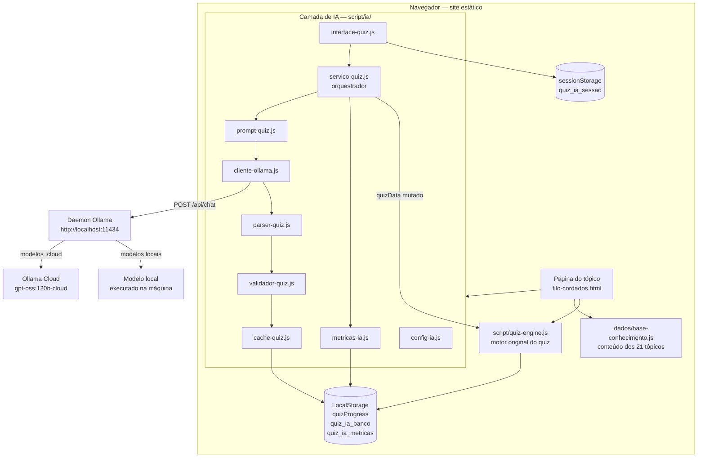
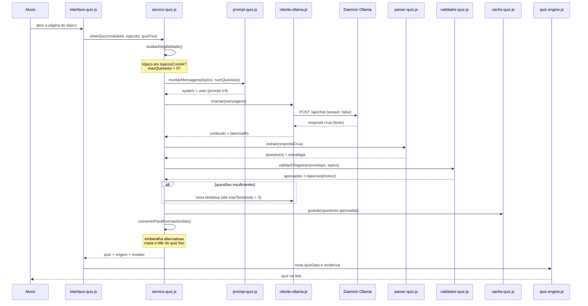
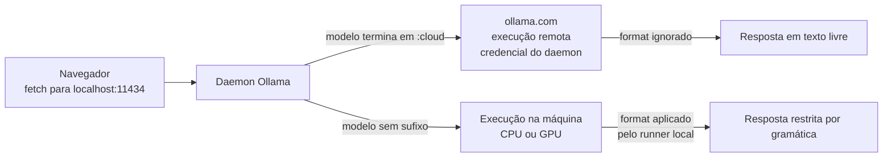
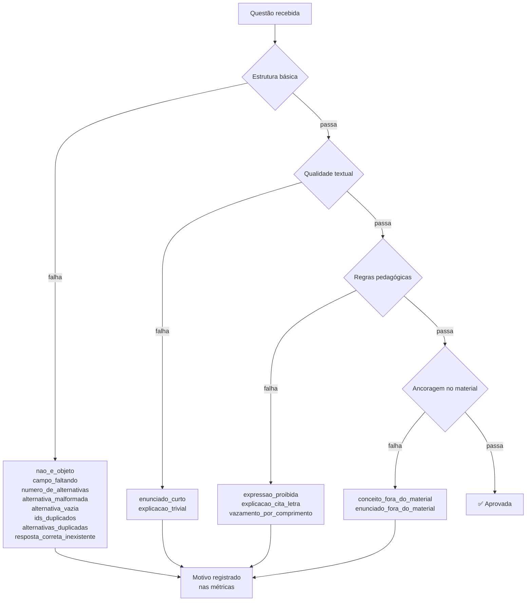
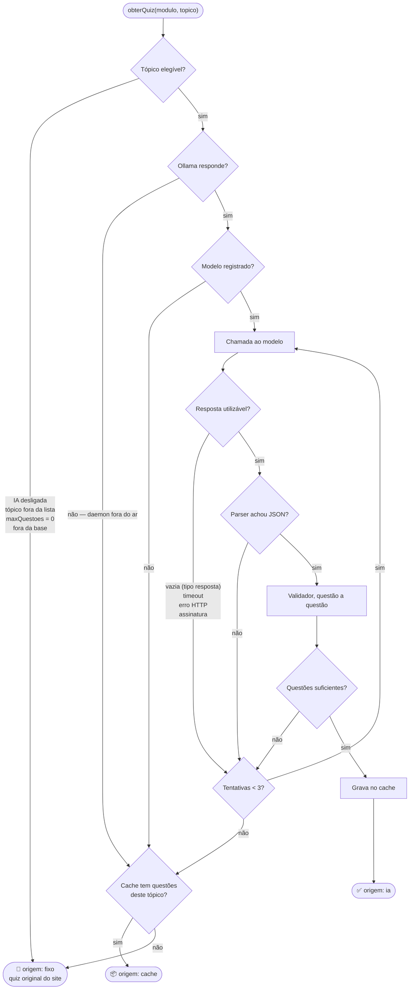
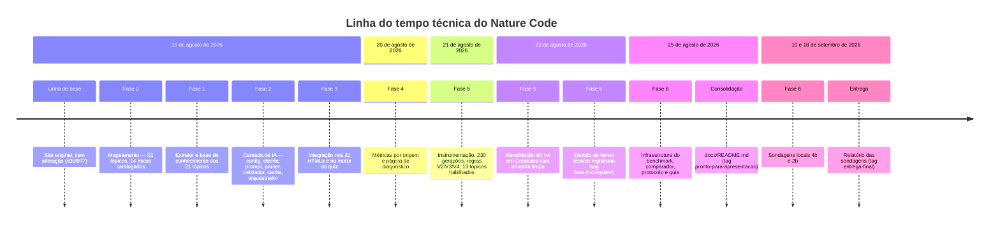
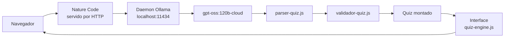

# Nature Code

> **Documentação final e definitiva do projeto.**
> Documento central, construído por auditoria do repositório completo. Consolida e
> referencia os documentos históricos de `docs/`, que permanecem íntegros como evidência
> de cada etapa.
>
> **Estado auditado:** branch `feat/quiz-ia`, commit `738f6b8`, tag `entrega-final`.
> Todo número deste documento foi conferido contra código-fonte, arquivos JSON de
> resultado ou histórico Git. A origem de cada resultado está indicada na §38.
>
> **Este documento foi escrito depois do commit auditado e ainda não faz parte dele.** Ver
> a §34 para o que a tag `entrega-final` e o pacote existente efetivamente representam.

---

## Índice

| | Seção |
|---|---|
| 1 | [Identificação do projeto](#1-identificação-do-projeto) |
| 2 | [Resumo executivo](#2-resumo-executivo) |
| 3 | [Contexto e motivação](#3-contexto-e-motivação) |
| 4 | [Estrutura educacional do Nature Code](#4-estrutura-educacional-do-nature-code) |
| 5 | [Arquitetura original dos quizzes](#5-arquitetura-original-dos-quizzes) |
| 6 | [Objetivos da integração com IA](#6-objetivos-da-integração-com-ia) |
| 7 | [Arquitetura final da solução](#7-arquitetura-final-da-solução) |
| 8 | [Ollama](#8-ollama) |
| 9 | [Modelos utilizados](#9-modelos-utilizados) |
| 10 | [Engenharia de prompt](#10-engenharia-de-prompt) |
| 11 | [Parser](#11-parser) |
| 12 | [Validador](#12-validador) |
| 13 | [Cache](#13-cache) |
| 14 | [Sistema de fallback](#14-sistema-de-fallback) |
| 15 | [Métricas](#15-métricas) |
| 16 | [Estratégia de testes](#16-estratégia-de-testes) |
| 17 | [Processo experimental](#17-processo-experimental) |
| 18 | [Resultados acumulados](#18-resultados-acumulados) |
| 19 | [Revalidação de Cordados — Prompt V4](#19-revalidação-de-cordados--prompt-v4) |
| 20 | [Fase 6 — objetivo](#20-fase-6--objetivo) |
| 21 | [Protocolo da sondagem](#21-protocolo-da-sondagem) |
| 22 | [Sondagem qwen3.5:4b](#22-sondagem-qwen354b) |
| 23 | [Decisão de testar qwen3.5:2b](#23-decisão-de-testar-qwen352b) |
| 24 | [Sondagem qwen3.5:2b](#24-sondagem-qwen352b) |
| 25 | [Comparação das sondagens](#25-comparação-das-sondagens) |
| 26 | [Interpretação das falhas locais](#26-interpretação-das-falhas-locais) |
| 27 | [Limitações experimentais](#27-limitações-experimentais) |
| 28 | [Validação funcional em nuvem](#28-validação-funcional-em-nuvem) |
| 29 | [Validação manual do sistema](#29-validação-manual-do-sistema) |
| 30 | [Execução via servidor HTTP](#30-execução-via-servidor-http) |
| 31 | [Como executar o projeto](#31-como-executar-o-projeto) |
| 32 | [Como executar os testes](#32-como-executar-os-testes) |
| 33 | [Como executar o benchmark futuramente](#33-como-executar-o-benchmark-futuramente) |
| 34 | [Estado final](#34-estado-final) |
| 35 | [Limitações atuais](#35-limitações-atuais) |
| 36 | [Trabalhos futuros](#36-trabalhos-futuros) |
| 37 | [Conclusão técnica](#37-conclusão-técnica) |
| 38 | [Fontes internas e evidências](#38-fontes-internas-e-evidências) |
| 39 | [Mapa do repositório](#39-mapa-do-repositório) |
| 40 | [Glossário terminológico](#40-glossário-terminológico) |

---

## 1. Identificação do projeto

| | |
|---|---|
| **Nome** | Nature Code |
| **Instituição** | Universidade do Sagrado Coração — Bauru/SP |
| **Curso** | Ciência da Computação |
| **Disciplina** | Aplicações Digitais: Planejamento e Produção |
| **Professor orientador** | Prof. Luiz Ricardo Mantovani da Silva |
| **Finalidade** | Trabalho acadêmico: portal educacional de Biologia com quizzes gerados por IA |

**Procedência de cada dado.** Disciplina e professor orientador constam do modal
"Informações do Projeto" em [`index.html`](../index.html). **Instituição e curso foram
fornecidos diretamente pela equipe para esta entrega** e não constam de nenhum arquivo do
repositório. Nenhum outro dado acadêmico — semestre, turma ou disciplina adicional — foi
informado, e este documento não supõe nenhum.

### Integrantes

- Amanda Pazold dos Santos
- Cesar Otavio da Silva Boiani
- Giovana Giraldeli
- Giovani Nogueira Pires
- Marcus Vinicius da Silva Capeteruchi
- Guilherme Ribeiro Zangrande

> A versão final da interface foi atualizada para exibir os **seis integrantes** no modal
> "Informações do Projeto" de [`index.html`](../index.html). A documentação e o
> `index.html` estão consistentes quanto à composição da equipe.

---

## 2. Resumo executivo

O **Nature Code** é um site educacional de Biologia construído em HTML, CSS e JavaScript
puros, sem framework, sem etapa de build e sem backend. Organiza conteúdo didático em três
módulos — Reino Animal, Plantas e Ecossistemas — distribuídos em **21 tópicos**, cada um
com um quiz de múltipla escolha ao final.

Na versão original, cada tópico tinha um **quiz fixo**, escrito à mão e armazenado em um
arquivo JavaScript próprio. O aluno via sempre as mesmas perguntas, em qualquer visita.

Este projeto acrescentou uma camada de **geração de questões por modelo de linguagem**. O
navegador conversa diretamente com o **daemon local do Ollama**, em
`http://localhost:11434`, que encaminha requisições de modelos com sufixo `:cloud` para o
serviço em nuvem. Não há backend próprio, não há dependência nova de CDN e **não existe
chave de API em nenhum ponto do JavaScript** — a credencial fica no daemon.

O texto devolvido pelo modelo passa por duas etapas distintas e sucessivas: um **parser
tolerante**, que localiza o JSON dentro da resposta, e um **validador rigoroso**, que
recusa questão por questão segundo quinze critérios estruturais e pedagógicos. Nenhuma
questão chega à tela sem passar pelo validador.

Quando a geração falha em qualquer ponto, uma **cascata de fallback** em três níveis
garante que o aluno sempre receba um quiz: **IA → cache → questões fixas**. As questões
fixas originais nunca foram removidas nem alteradas.

A qualidade foi medida, não presumida. O piloto da Fase 5 executou **230 gerações**,
recebeu **752 questões** e aprovou **648** (86,2%), com cerca de 90 lidas manualmente uma a
uma. Dois defeitos pedagógicos confirmados por leitura levaram a duas regras novas de
prompt, consolidadas na versão **V4**, hoje em uso.

A Fase 6 previa um benchmark comparando nuvem e execução local. Foram executadas **duas
sondagens** de um dos braços, em `qwen3.5:4b` e `qwen3.5:2b`. **A bateria completa A/B/C
não foi executada**, e o efeito do JSON Schema permanece sem resposta experimental.

O projeto é coberto por **256 asserções automatizadas** offline, todas aprovadas.

---

## 3. Contexto e motivação

### O problema original

O quiz fixo cumpre sua função pedagógica, mas tem três limitações estruturais:

1. **Repetição.** O aluno que refaz o quiz encontra exatamente as mesmas perguntas, na
   mesma ordem, com as mesmas alternativas. O segundo acerto pode ser memória, não
   aprendizado.
2. **Cobertura estreita.** Cada tópico tinha poucas questões — 27 no site inteiro,
   conforme o levantamento da Fase 0 — cobrindo uma fração pequena do conteúdo exposto.
3. **Custo de manutenção.** Ampliar a cobertura exigiria escrever questões à mão, tópico
   por tópico.

### A evolução proposta

Gerar questões sob demanda a partir do **conteúdo que já está no site**, com um modelo de
linguagem, de modo que:

- cada visita possa apresentar um conjunto diferente de perguntas;
- as questões venham do material didático real, não do conhecimento geral do modelo;
- o site continue funcionando **exatamente como antes** se a IA estiver indisponível.

A terceira condição foi tratada como requisito não negociável desde o início, e é o que
motiva toda a arquitetura de fallback descrita na §14.

---

## 4. Estrutura educacional do Nature Code

O conteúdo está organizado em três módulos e 21 tópicos. A tabela abaixo reproduz a
estrutura real extraída para [`dados/base-conhecimento.js`](../dados/base-conhecimento.js),
com o volume de texto de cada tópico e o teto de questões calculado na Fase 1.

### Módulo Reino Animal — 10 tópicos

| Tópico | Caracteres | `maxQuestoes` | Gera por IA |
|---|---:|---:|:---:|
| `filo-cordados` | 5.193 | 5 | ✅ |
| `filo-artropodes` | 1.195 | 2 | ✅ |
| `filo-poriferos` | 1.042 | 2 | ✅ |
| `filo-equinodermos` | 888 | 2 | ✅ |
| `filo-cnidarios` | 874 | 1 | ✅ |
| `filo-moluscos` | 804 | 1 | ✅ |
| `reino-animalia` | 798 | 1 | ✅ |
| `filo-platelmintos` | 675 | 0 | ❌ |
| `filo-nematelmintos` | 746 | 0 | ❌ |
| `filo-anelideos` | 662 | 0 | ❌ |

### Módulo Plantas — 5 tópicos

| Tópico | Caracteres | `maxQuestoes` | Gera por IA |
|---|---:|---:|:---:|
| `pteridofitas` | 999 | 2 | ✅ |
| `briofitas` | 862 | 2 | ✅ |
| `reino-plantae` | 856 | 2 | ❌ |
| `gimnospermas` | 456 | 0 | ❌ |
| `angiospermas` | 413 | 0 | ❌ |

### Módulo Ecossistemas — 6 tópicos

| Tópico | Caracteres | `maxQuestoes` | Gera por IA |
|---|---:|---:|:---:|
| `fluxo-de-energia` | 3.294 | 5 | ✅ |
| `piramides-ecologicas` | 2.824 | 4 | ✅ |
| `ecossistemas-da-terra` | 2.232 | 5 | ✅ |
| `sucessao-ecologica` | 2.183 | 5 | ✅ |
| `mundo-vivo-ecologia` | 1.098 | 2 | ❌ |
| `definicao-e-componentes` | 1.096 | 2 | ❌ |

> **Sobre as duas contagens de caracteres.** As tabelas acima usam o comprimento do campo
> `conteudo` da base de conhecimento — o texto como é montado para o prompt. Os arquivos de
> resultado de Fase 5 e Fase 6 gravam um segundo valor, `metricas.caracteres`, que conta
> apenas o texto extraído do HTML, sem os títulos de seção acrescentados na montagem. Por
> isso `filo-cordados` aparece como **5.193** aqui e como **4.675** na §22: são duas
> medidas distintas do mesmo tópico, não uma divergência.

### Relação conteúdo → quiz

A ligação entre um tópico e seu quiz é feita **pela URL da página**, sem nenhum atributo
adicional no HTML. A função `identificarTopicoPelaUrl()`, em
[`config-ia.js`](../script/ia/config-ia.js), extrai módulo e tópico do próprio caminho:

```
/pages/modulos/topicos/topicos-animais/filo-cordados.html
                       └── módulo: animais    └── tópico: filo-cordados
```

Essa decisão evitou acrescentar atributos `data-*` em 21 arquivos e resolveu de saída dois
riscos catalogados na Fase 0 (R4 e R5), em que a chave de progresso derivava de texto de
interface com acentos e maiúsculas.

**O teto de questões por tópico não é arbitrário.** Foi calculado na Fase 1 a partir do
volume de conteúdo: tópicos com pouco texto recebem teto baixo, e cinco tópicos com menos
de 800 caracteres receberam `maxQuestoes = 0` — nunca são consultados em tempo de execução.
A regra que sustenta essa decisão é do próprio roteiro: **é preferível entregar menos
questões do que inventar conteúdo que não está no material.**

---

## 5. Arquitetura original dos quizzes

Comportamento confirmado por leitura de [`script/quiz-engine.js`](../script/quiz-engine.js)
e dos arquivos de `local-storage/`.

### Como funcionava

Cada tópico carrega um arquivo JavaScript próprio, em `local-storage/quiz_<modulo>/`, que
declara uma constante global:

```js
const quizData = [ { title, question, options, answer, explanation }, ... ];
```

O motor [`quiz-engine.js`](../script/quiz-engine.js) lê essa global e cuida de tudo:
renderiza a questão corrente, registra a resposta do aluno, calcula a pontuação ao enviar,
exibe explicações e permite navegar entre as perguntas.

### Persistência

O progresso é gravado em **LocalStorage**, na chave `quizProgress`, como um objeto que
agrupa todos os tópicos do site. A chave interna de cada tópico vem de `getTopicId()`, que
a deriva do campo `title` da primeira questão.

### Restrições que essa arquitetura impôs ao projeto

Três características do código original determinaram o desenho da camada de IA:

| | Restrição | Consequência |
|---|---|---|
| **R7** | `quizData` é declarado com `const` no escopo global | Um segundo `const quizData` em outro script derruba a página com `SyntaxError`. A camada de IA **muta o array existente** em vez de reatribuí-lo |
| **R9** | A inicialização é síncrona, no fim do arquivo | `obterQuiz()` é assíncrono; foi preciso transformar essas duas linhas em um ponto de partida que aguarda a geração |
| **R4/R5** | A chave de progresso deriva do `title` da primeira questão | Se a IA trocasse o `title`, **o progresso do aluno seria perdido**. A conversão copia o `title` do quiz fixo, de propósito |

O motor lê `quizData` em 24 pontos diferentes. Alterar esses 24 pontos seria reescrever o
motor; mutar o array em seu lugar foi a decisão de menor risco.

---

## 6. Objetivos da integração com IA

Requisitos estabelecidos no roteiro [`PROMPT_CLAUDE_CODE_QUIZ_IA.md`](../PROMPT_CLAUDE_CODE_QUIZ_IA.md)
e confirmados pela implementação:

| | Requisito | Onde foi atendido |
|---|---|---|
| 1 | **Sem backend.** O navegador fala direto com o daemon local | [`cliente-ollama.js`](../script/ia/cliente-ollama.js) |
| 2 | **Sem chave de API no JavaScript** | Verificado por varredura: nenhuma ocorrência em `script/`, `scripts/` ou `ferramentas/` |
| 3 | **Sem npm, sem bundler, sem CDN nova** | Todos os arquivos são `<script>` clássicos |
| 4 | **Nenhuma resposta inválida aceita em silêncio** | [`validador-quiz.js`](../script/ia/validador-quiz.js) |
| 5 | **Fallback obrigatório em cascata** | [`servico-quiz.js`](../script/ia/servico-quiz.js) |
| 6 | **Progresso do aluno preservado** | `converterParaFormatoDoSite()` copia o `title` original |
| 7 | **Conteúdo original intocado** | `git diff` contra a linha de base: apenas `<script>` acrescentados |
| 8 | **Interface nunca bloqueada** | Estado de carregamento assíncrono em [`interface-quiz.js`](../script/ia/interface-quiz.js) |
| 9 | **Migração gradual por tópico** | `CONFIG_IA.topicosComIA` |
| 10 | **Tudo em português do Brasil** | Código, comentários, documentação e interface |

---

## 7. Arquitetura final da solução

### Visão geral



### Fluxo completo de geração



### A cascata, em uma frase

> **IA → cache → questões fixas.** O aluno sempre recebe um quiz. O que muda é a origem.

---

## 8. Ollama

### Ollama não é o modelo

Esta distinção é central e costuma ser confundida:

| | O que é | Papel no projeto |
|---|---|---|
| **Ollama** | Um **runtime e servidor HTTP** para modelos de linguagem. Não gera texto por si mesmo | Recebe requisições em `localhost:11434`, escolhe onde executar, guarda credenciais |
| **LLM / modelo** | O **modelo de linguagem** propriamente dito (`gpt-oss:120b`, `qwen3.5:4b`) | É quem produz o texto das questões |

Dizer "o Ollama gerou as questões" é impreciso: **o Ollama executa ou encaminha; o modelo
gera.**

### Como a comunicação acontece

O único ponto de contato é [`cliente-ollama.js`](../script/ia/cliente-ollama.js), que faz
`POST http://localhost:11434/api/chat` com `stream: false`. A página de diagnóstico também
consulta `GET /api/tags` para listar os modelos registrados.

`stream: false` foi uma escolha deliberada: simplifica o parsing, e a interface mostra um
estado de carregamento em vez de texto aparecendo aos poucos.

### Nuvem e local, no mesmo endereço



O detalhe arquitetural mais importante: **o endereço é o mesmo nos dois casos.** Trocar de
nuvem para local exige mudar **uma linha** em
[`config-ia.js`](../script/ia/config-ia.js) — `provedor: "cloud"` para `provedor: "local"` —
e nenhum outro arquivo da camada.

### Vantagens arquiteturais

- **Nenhuma chave de API no código.** A credencial vive no daemon, em
  `~/.ollama/id_ed25519`. Trocar de conta é `ollama signout` seguido de `ollama signin`,
  sem tocar em um único arquivo do projeto.
- **Um só endereço para dois modos de execução.**
- **Sem backend intermediário**, o que era requisito explícito do trabalho.

### Limitações encontradas

| Limitação | Como foi medida |
|---|---|
| **Modelos `:cloud` ignoram o parâmetro `format` com JSON Schema** | Testado nos modelos gratuitos, em `/api/chat` e `/api/generate`, com schema e com `"json"`, e com `think: false` e `think: "low"` — todas as combinações devolveram Markdown |
| **Origem `file://` é recusada** | Requisição de verificação devolveu **403** para origem `null` e **204** para servidores HTTP locais |
| **O plano gratuito tem limite de uso por sessão** | Após cerca de 200 gerações seguidas, `/api/chat` passou a responder com erro de limite de uso |
| **Requer Ollama instalado e autenticado** | O site não funciona com IA em máquina sem o daemon |

A primeira limitação é a razão de existir da Fase 6, e está detalhada na §20.

---

## 9. Modelos utilizados

| Modelo | Papel | Onde executa | Situação |
|---|---|---|---|
| **`gpt-oss:120b-cloud`** | Modelo de produção do projeto | Servidores da ollama.com | **Em uso na versão entregue** |
| **`qwen3.5:4b`** | Candidato principal para execução local | CPU da máquina | Avaliado em sondagem — §22 |
| **`qwen3.5:2b`** | Modelo reserva, previsto pelo protocolo | CPU da máquina | Avaliado em sondagem — §24 |
| `qwen3:4b` | Valor de espaço reservado em `config-ia.js` | — | Nunca executado; seria substituído pelo vencedor do benchmark |

### Sobre o modelo de produção

A escolha do `gpt-oss:120b-cloud` foi medida, não presumida. Entre os modelos abertos pelo
plano gratuito, ele apresentou a **menor latência mediana**, inclusive menor que a do
`gpt-oss:20b-cloud`. Outros modelos do catálogo exigem assinatura paga e respondem com erro
explícito de plano.

> **Nota de escopo, importante.** Os modelos `qwen3.5:4b` e `qwen3.5:2b` foram avaliados em
> **sondagem**, não em benchmark completo. Uma sondagem é a etapa exploratória prevista no
> protocolo, com 3 gerações em um único tópico, cujo propósito é dimensionar a bateria
> seguinte — não medir qualidade. **Nenhum dos dois passou pelo procedimento completo**, e
> nenhuma conclusão de qualidade pode ser extraída deles.

---

## 10. Engenharia de prompt

Não houve **treinamento** nem **ajuste fino** de pesos em momento algum do projeto. Toda a
adaptação do comportamento do modelo foi feita por **engenharia de prompt** — isto é,
alterando o texto de instrução enviado a cada chamada.

### Estrutura do prompt

Implementado em [`prompt-quiz.js`](../script/ia/prompt-quiz.js), o prompt é montado em duas
mensagens:

| Parte | Conteúdo |
|---|---|
| **Mensagem de sistema** | Papel do modelo: professor de Biologia do ensino médio brasileiro, especialista em elaboração de avaliações |
| **Mensagem de usuário** | Material do tópico, número de questões pedido, formato JSON esperado, regras da versão ativa e, em retentativas, os conceitos a evitar |

### Objetivos e restrições codificados no prompt

- as questões devem sair **exclusivamente do material fornecido**;
- é preferível **devolver menos questões** do que inventar conteúdo;
- exatamente **4 alternativas** por questão, com uma correta;
- a explicação deve descrever a alternativa **pelo que ela diz**, nunca por letra;
- o formato de saída é um JSON com envelope `{"questoes": [...]}`.

A regra sobre letras existe por um motivo concreto: o serviço **embaralha as alternativas**
antes de exibir, porque modelos tendem a colocar a resposta correta sempre na mesma
posição. Uma explicação que diga "a alternativa C está errada" passa a apontar para outra
opção depois do sorteio.

### Evolução das versões

Cada versão acrescenta ao V1 **uma regra e nada mais**, para que a comparação entre elas
tenha causa única.

| Versão | O que acrescenta | Resultado medido |
|---|---|---|
| **V1** | Prompt original | Linha de base |
| **V2** | Títulos de seção não são listas exaustivas | **Medido em Cordados e recusado** — não reduziu o problema e a aprovação caiu de 92,3% para 87,4% |
| **V3** | Perguntas negativas exigem três não-respostas explícitas no texto | Enunciados negativos caíram de 5,2% para 2,1%, e os restantes vieram ancorados no material |
| **V4** | As duas regras juntas | **ADOTADO.** Medido em Artrópodes: aprovação de 80% para 91%, retentativas de 5 para 2 |

### Os dois defeitos que originaram as regras

**Defeito 1 — pergunta negativa com duas respostas válidas.** Em uma questão sobre
condrictes, a resposta esperada era "bexiga natatória", mas o distrator "brânquias
externas" **também** não se aplica ao grupo. A própria explicação do modelo hesitava. A
causa é estrutural: numa pergunta negativa, as três alternativas que não são a resposta
precisam ser verdadeiras, e o modelo tende a inventá-las. → **Regra V3.**

**Defeito 2 — questão decidida pelo título da seção.** Em Artrópodes, uma questão
perguntava qual característica estava incluída em "Características Gerais", e a explicação
justificava as demais alternativas dizendo que apareciam "na seção de Morfologia" — só que
o item citado está, sim, em Características Gerais. A pergunta era decidida por **onde** o
fato estava escrito, não pelo que o texto afirma. → **Regra V4.**

### Um erro de método, registrado e não escondido

A regra do V2 foi medida em Cordados e recusada por "não melhorar nada". **O raciocínio
estava errado:** a taxa-base do defeito em Cordados era **zero** — em 193 questões ele não
apareceu uma única vez. Um experimento sobre um defeito que não ocorre no tópico testado
não pode demonstrar melhora.

Refeito em Artrópodes, onde o defeito efetivamente ocorre, a mesma regra melhorou todos os
indicadores, e passou a integrar o V4. O episódio está documentado em
[`05-AVALIACAO-PILOTO.md`](05-AVALIACAO-PILOTO.md) §5.1.

---

## 11. Parser

**Arquivo:** [`script/ia/parser-quiz.js`](../script/ia/parser-quiz.js) — 214 linhas.
**Função pública:** `ParserQuiz.extrair(respostaCrua)`.

### Por que este arquivo existe

Não estava previsto no roteiro original. Existe por causa de uma limitação medida: como os
modelos `:cloud` ignoram o `format` com JSON Schema, a resposta chega em **texto livre**,
frequentemente com o JSON embrulhado em blocos de código ou cercado de prosa.

### Entrada e saída

| | |
|---|---|
| **Entrada** | `string` — o conteúdo cru de `message.content` |
| **Saída** | `{ok, dados, estrategia, erro, observacao?}` |
| **Sucesso** | `dados` normalizado para `{questoes: [...]}` |
| **Falha** | `ok: false`, `estrategia: "nenhuma"` e `erro` descrevendo cada tentativa |

### As quatro estratégias

Aplicadas em ordem, da mais limpa para a mais defensiva. A que funcionou é devolvida em
`estrategia` e vira métrica.

| Ordem | Estratégia | Quando se aplica |
|---|---|---|
| 1 | `direto` | `JSON.parse` do texto inteiro funciona — o modelo obedeceu |
| 2 | `cerca` | A resposta veio embrulhada em bloco de código; as cercas são removidas |
| 3 | `recorte` | O JSON está íntegro, mas cercado de prosa; é localizado por varredura de profundidade |
| 4 | `reparo` | A resposta foi **truncada**; recolhem-se os objetos completos e descarta-se o incompleto |
| — | `nenhuma` | Nenhuma estratégia funcionou |

A varredura de profundidade (`acharFechamento`) sabe distinguir chaves dentro e fora de
string, respeitando escapes — não é uma contagem ingênua de caracteres.

A estratégia `reparo` merece destaque: em vez de **remendar** o texto cortado, o que
produziria um objeto incompleto que passa no `parse` e falha na tela, ela **descarta a
questão truncada e aproveita as inteiras**.

### Normalização de envelope

O parser aceita as formas que os modelos costumam inventar e devolve sempre a mesma:

```
{"questoes":[...]}   → formato pedido
[...]                → array solto
{"perguntas":[...]}  → outro nome de chave
{...}                → questão única, fora de array
```

### Princípio de desenho

> **Tolerante na extração, rigoroso depois.** Aqui só se tenta *achar* o JSON. Julgar se o
> conteúdo presta é trabalho do validador.

---

## 12. Validador

**Arquivo:** [`script/ia/validador-quiz.js`](../script/ia/validador-quiz.js) — 303 linhas.
**Funções:** `validarQuestao()`, `validarLote()`, `validarERegistrar()`.

### Parsing e validação são coisas diferentes

| | Parser | Validador |
|---|---|---|
| **Pergunta que responde** | "Onde está o JSON?" | "Esta questão presta?" |
| **Postura** | Tolerante, tenta quatro caminhos | Rigoroso, recusa sem exceção |
| **Falha significa** | Não achei estrutura aproveitável | Achei a estrutura, e o conteúdo é inadequado |
| **Granularidade** | Resposta inteira | **Questão por questão** |

A validação **por questão** é o que permite aproveitar parte de uma resposta: se o modelo
devolver 5 questões e 2 forem ruins, as 3 boas são aproveitadas e as que faltam são pedidas
em nova tentativa.

### Critérios verificados



### Limiares, todos justificados

| Limiar | Valor | Razão |
|---|---:|---|
| `MIN_ENUNCIADO` | 25 caracteres | Enunciado menor não formula pergunta |
| `MIN_EXPLICACAO` | 60 caracteres | 2 a 4 frases não cabem em menos |
| `NUM_ALTERNATIVAS` | 4 | Formato do site |
| `FATOR_COMPRIMENTO` | 1,7× | Vazamento por comprimento da correta |
| `DIFERENCA_MINIMA_CARACTERES` | 25 | Exigido **junto** com o fator, para não punir correta legitimamente descritiva |
| `COBERTURA_CONCEITO` | 0,5 | Anti-alucinação: metade das palavras de conteúdo deve estar no material |
| `COBERTURA_ENUNCIADO` | 0,35 | Idem, mais tolerante no enunciado |

As duas últimas são a defesa direta contra alucinação: medem a fração de palavras de
conteúdo da questão que efetivamente aparece no texto do tópico.

### Por que a resposta da IA não vai direto para o aluno

Três razões, todas com evidência no projeto:

1. **O modelo erra em formato.** Respostas truncadas e envelopes inventados foram
   observados e medidos.
2. **O modelo erra em conteúdo.** Dois defeitos pedagógicos confirmados por leitura
   manual, ambos com aparência perfeitamente correta.
3. **Aceitar em silêncio é pior que falhar.** Uma questão errada apresentada como certa
   ensina errado. O validador recusa com **motivo nomeado e registrado**, e o motivo vira
   contador nas métricas.

---

## 13. Cache

**Arquivo:** [`script/ia/cache-quiz.js`](../script/ia/cache-quiz.js) — 235 linhas.
**Chave:** `quiz_ia_banco`, no LocalStorage.

### Função dupla

1. **Reduz latência.** Questão já gerada e validada não exige nova chamada ao modelo.
2. **É o segundo nível do fallback.** Com o Ollama fora do ar, o quiz continua saindo com
   **questões geradas por IA** — e não com o quiz fixo.

A segunda função é a que importa para a demonstração.

### Comportamento confirmado no código

| Aspecto | Implementação |
|---|---|
| **O que guarda** | Questões **já aprovadas** pelo validador, no formato da IA |
| **Quando grava** | Após validação bem-sucedida, ao fim de uma geração |
| **Quando lê** | Quando a geração por IA falha, ou para excluir conceitos repetidos |
| **Deduplicação** | Por hash do enunciado |
| **Teto de tamanho** | 1.500.000 bytes |
| **Ao estourar a cota** | Descarta metade das mais antigas e tenta gravar de novo, uma vez |
| **Se ficar ilegível** | Recomeça vazio, sem quebrar a página |
| **Versionamento** | Campo `versao`; estrutura de versão diferente é descartada |

O teto de 1,5 MB não é arbitrário: o LocalStorage costuma oferecer cerca de 5 MB por
origem, e essa cota é **compartilhada com o `quizProgress` do aluno**, que tem prioridade
absoluta.

### O que o cache nunca faz

**Nunca encosta em `quizProgress`.** O isolamento entre as quatro chaves de armazenamento é
uma invariante do projeto, verificada por teste automatizado:

| Chave | Onde | Dono | Conteúdo |
|---|---|---|---|
| `quizProgress` | LocalStorage | **Site original** | Progresso do aluno nos 21 tópicos |
| `quiz_ia_banco` | LocalStorage | Camada de IA | Cache de questões validadas |
| `quiz_ia_metricas` | LocalStorage | Camada de IA | Contadores de uso |
| `quiz_ia_sessao` | **sessionStorage** | Camada de IA | Quiz exibido nesta aba |

A quarta usa `sessionStorage` de propósito: o quiz precisa sobreviver a um F5 **sem**
persistir entre sessões, porque as respostas salvas em `quizProgress` são guardadas por
índice e passariam a apontar para outras perguntas.

---

## 14. Sistema de fallback

Esta é a garantia central do projeto: **o aluno sempre recebe um quiz.**

### A cascata



### Cenários, um a um

| Cenário | Caminho | Origem | Motivo registrado |
|---|---|---|---|
| **Normal** | Modelo responde, parser extrai, validador aprova | `ia` | — |
| **Ollama fechado** | A verificação de disponibilidade falha | `cache` ou `fixo` | `Ollama fora do ar` |
| **Resposta vazia** | HTTP 200, mas `message.content` vazio | `cache` ou `fixo` | `falha na chamada: resposta` |
| **JSON inválido** | Nenhuma das quatro estratégias funcionou | `cache` ou `fixo` | `modelo não devolveu questão aproveitável` |
| **Questões recusadas** | Validador rejeitou todas | `cache` ou `fixo` | `questões recusadas pelo validador` |
| **Modelo não registrado** | `ollama pull` nunca foi executado | `cache` ou `fixo` | `modelo não registrado` |
| **Plano exige assinatura** | Modelo pago sem assinatura | `cache` ou `fixo` | `falha na chamada: assinatura` |
| **Tópico não elegível** | Fora de `topicosComIA` ou `maxQuestoes = 0` | `fixo` | `tópico não elegível: <razão>` |
| **Cache disponível** | Geração falhou, mas há questões guardadas | `cache` | motivo da falha original |
| **Cache vazio** | Geração falhou e não há nada guardado | `fixo` | motivo da falha original |

### Uma correção que a Fase 5 tornou necessária

Falhas que **não interrompem o laço** — erros HTTP e timeouts geram nova tentativa — não
deixavam rastro no motivo, e o fallback aparecia genericamente como "modelo não devolveu
questão aproveitável". Isso foi observado quando o plano gratuito atingiu o limite de uso
da sessão: **20 erros HTTP seguidos foram registrados como se o modelo tivesse respondido**.

Um motivo errado no diagnóstico é pior que motivo nenhum — manda procurar problema de
qualidade onde o problema é de infraestrutura. A função `motivoDoFallback()` foi corrigida
para nomear falhas de chamada quando **todas** as tentativas falharam pelo mesmo tipo.

---

## 15. Métricas

**Arquivo:** [`script/ia/metricas-ia.js`](../script/ia/metricas-ia.js) — 180 linhas.
**Chave:** `quiz_ia_metricas`, no LocalStorage.

### Distinções que precisam ficar claras

Esta é a seção onde mais fácil se erra ao ler um relatório. As métricas medem coisas
diferentes em níveis diferentes, e confundi-las inverte conclusões.

| Termo | O que conta exatamente | Nível |
|---|---|---|
| **Geração tentada** | Uma invocação de `obterQuiz()` | Geração completa |
| **Geração bem-sucedida** (`geracoes`) | Uma **chamada ao modelo** que voltou com texto | Chamada individual |
| **Falha de chamada** (`falhasDeChamada`) | Chamada que **nem chegou a produzir texto** | Chamada individual |
| **Questões recebidas** | Objetos de questão extraídos pelo parser | Conteúdo |
| **Questões aprovadas** | Questões que passaram no validador | Conteúdo |
| **Questões rejeitadas** | Recusadas, agrupadas por motivo | Conteúdo |
| **Retentativas** | Chamadas além da primeira, dentro da mesma geração | Geração completa |
| **Origem** | Qual nível da cascata atendeu: `ia`, `cache` ou `fixo` | Geração completa |
| **Latência** | Ver aviso abaixo | **Depende do contexto** |
| **JSON válido de primeira** | A primeira tentativa usou a estratégia `direto` | Chamada individual |

### Dois avisos de leitura, ambos relevantes para os resultados

**1. Latência tem dois significados diferentes.**

- Em [`metricas-ia.js`](../script/ia/metricas-ia.js), `latenciasMs` registra o tempo de uma
  **chamada bem-sucedida ao modelo**. Chamada que falha não entra na amostra.
- Nos arquivos de resultado de Fase 5 e Fase 6, o campo `totalMs` mede o tempo de uma
  **geração completa**, incluindo **todas as tentativas internas** (até 3).

Uma geração com mediana de 505,7 s **não** significa uma chamada de 505,7 s: significa três
chamadas de cerca de 168 s cada. Confundir os dois inflaciona a latência por chamada em até
três vezes.

**2. "JSON válido de primeira" não mede entrega.**

O indicador é `estrategias[0] === "direto"`, isto é: a primeira tentativa devolveu JSON puro,
sem cercas nem prosa. Como os modelos `:cloud` **sempre** embrulham a resposta, esse
indicador é **0% mesmo em amostras com 100% de entrega por IA** — é exatamente o que
acontece na revalidação da §19, com 15/15 gerações entregues e 0/15 de JSON direto. Ele
mede **obediência ao formato**, não sucesso.

### O que mais é registrado

- `rejeicoesPorMotivo` — contador por motivo do validador;
- `estrategiasDoParser` — quantas respostas precisaram de reparo;
- `falhasPorTipo` — `rede`, `timeout`, `assinatura`, `modelo`, `http`, `resposta`;
- `motivosDeFallback` — por que cada quiz não veio da IA;
- `porModelo` — gerações e aprovações por modelo;
- mediana e p95 das últimas 200 latências.

---

## 16. Estratégia de testes

Quatro suítes, todas em Node.js puro, **sem nenhuma dependência externa**. Os arquivos de
`script/ia/` são scripts clássicos que declaram globais; as suítes os carregam em um
contexto `vm` com `localStorage`, `fetch` e DOM dublados. **O que roda no teste é o mesmo
código que roda no navegador**, sem adaptação.

| Suíte | Asserções | Propósito |
|---|---:|---|
| [`testar-camada-ia.js`](../scripts/testar-camada-ia.js) | **67** | Camada de IA isolada: parser nas quatro estratégias, cada motivo do validador, cache, métricas, cascata |
| [`testar-integracao.js`](../scripts/testar-integracao.js) | **46** | Regressão da integração: carrega a mesma sequência de `<script>` da página e **executa o `quiz-engine.js` de verdade** — renderizar, responder, enviar, pontuar, resetar |
| [`testar-diagnostico.js`](../scripts/testar-diagnostico.js) | **82** | Página de diagnóstico: cruza os ids procurados pelo JS com os declarados no HTML, e aciona a página como um clique acionaria |
| [`testar-benchmark.js`](../scripts/testar-benchmark.js) | **61** | Infraestrutura da Fase 6 **sem modelo nenhum**, com daemon dublado |
| | **256** | **Total** |

### Resultado verificado nesta auditoria

```
testar-camada-ia       67 passaram, 0 falharam
testar-integracao      46 passaram, 0 falharam
testar-diagnostico     82 passaram, 0 falharam
testar-benchmark       61 passaram, 0 falharam
```

**256 asserções, 256 aprovadas, 0 falhas.**

Com a opção `--rede`, três das suítes acrescentam chamadas reais ao Ollama, totalizando
**270** asserções. O número de referência do projeto é o offline, que roda sem internet e
sem consumir cota.

### O que a suíte de benchmark protege

Em ordem de importância declarada no próprio arquivo:

1. os braços A e B recebem prompts **byte a byte idênticos**, e o benchmark **para** se
   divergirem — sem isso a comparação nuvem × local não significa nada;
2. `config-ia.js` **não é alterado** por nenhum braço;
3. os dados da Fase 5 **não são lidos, escritos nem apagados**;
4. a gravação acontece **só** em `docs/dados-benchmark/`, sem sobrescrever por acidente.

---

## 17. Processo experimental

Datas extraídas do histórico Git. São as datas dos commits, e nada foi inferido.



### As fases em detalhe

| Fase | Data | Entrega | Commits |
|---|---|---|---|
| **Linha de base** | 19/08 | Site original preservado e versionado | `d3cf977` |
| **0 — Mapeamento** | 19/08 | 21 tópicos, 27 questões fixas, LocalStorage, fluxo do quiz, **14 riscos** | `ce71465` |
| **1 — Base de conhecimento** | 19/08 | Extrator + base dos 21 tópicos + `maxQuestoes` por volume | `6688a24` `b42b8b7` `7f076a0` |
| **2 — Camada de IA** | 19/08 | 9 arquivos em `script/ia/` + bateria de testes | `ba2452d` `3655640` `daa11f0` `7ed406c` `1fc54cd` |
| **3 — Integração** | 19/08 | Ponte com o motor, 21 HTMLs, testes de regressão | `cebe880` `0087f34` `8c6e700` `2fc557d` `241ecc0` |
| **4 — Diagnóstico** | 20/08 | Métricas por origem + página de diagnóstico | `a69350d` `e4e2e6b` `eedfa9d` `80c8e6f` `ca482eb` |
| **5 — Piloto** | 21–23/08 | 230 gerações, prompts V2/V3/V4, 13 tópicos habilitados, revalidação | `08b2516` … `8a85e29` |
| **6 — Preparação** | 25/08 | Benchmark de três braços, comparador, protocolo, guia | `6b0cb2f` `c537d3b` `05b3165` `34bb642` `c6a2b81` |
| **Consolidação** | 25/08 | `docs/README.md` | `ecef180` |
| **6 — Sondagens** | 10 e 18/09 | Duas sondagens locais e relatório | `738f6b8` |

### Sobre a habilitação gradual

Os tópicos não foram habilitados de uma vez. A Fase 3 ligou **apenas Cordados**; os outros
20 seguiram no quiz fixo até que a Fase 5 medisse cada um. A ampliação para 13 tópicos
aconteceu no commit `2837726`, depois das ondas de avaliação, com critério explícito
descrito na §18.

---

## 18. Resultados acumulados

### Piloto da Fase 5 — ondas 1 a 8

| Métrica | Valor |
|---|---:|
| Gerações executadas | **230** |
| Questões recebidas do modelo | **752** |
| Questões aprovadas pelo validador | **648** |
| Taxa de aprovação estrutural | **86,2%** |
| Questões lidas manualmente | ~90 |
| Defeitos pedagógicos confirmados por leitura | **2** |
| Tópicos habilitados ao fim da fase | **13 de 21** |

Detalhamento por onda, conferido nos arquivos brutos de
[`docs/dados-piloto/`](dados-piloto/):

| Onda | Prompt | Escopo | Gerações | Recebidas | Aprovadas |
|---|---|---|---:|---:|---:|
| 1 | V1 | Cordados | 20 | 104 | 96 |
| 2 | V2 | Cordados | 20 | 111 | 97 |
| 3 | V3 | Cordados | 20 | 108 | 96 |
| 4 | V3 | Tópicos grandes | 40 | 206 | 176 |
| 5 | V3 | Tópicos médios | 80 | 145 | 116 |
| 6 | V3 | Tópicos pequenos | 30 | 34 | 28 |
| 7 | V4 | Artrópodes | 10 | 22 | 20 |
| 8 | V4 | Cordados | 10 | 22 | 19 |
| | | **Total** | **230** | **752** | **648** |

> A onda 8 foi contaminada pelo limite de uso da sessão do plano gratuito e **não** foi
> usada para a decisão sobre o V4 — essa decisão saiu da onda 9, documentada na §19, que é
> contabilizada separadamente.

### A leitura mais importante desses números

> **86,2% de aprovação automática não é 86,2% de qualidade.**

Os dois defeitos pedagógicos confirmados **passaram pelo validador sem um arranhão**, e
nenhum dos dois tinha marcador automático. Foram encontrados **lendo as questões uma a
uma**. A taxa de aprovação mede conformidade estrutural, não correção pedagógica.

### Critério de habilitação por tópico

Um tópico entrou na lista de geração por IA apenas ao atender **três critérios
simultâneos**:

1. entregar quiz por IA em pelo menos **80%** das tentativas;
2. taxa de aprovação estrutural acima de **70%**;
3. nenhum defeito pedagógico não corrigido encontrado na leitura.

**Oito tópicos ficaram de fora**, com motivo medido:

| Tópico | Motivo |
|---|---|
| `reino-plantae` | Entregou quiz em **1 de 10** tentativas |
| `definicao-e-componentes` | **3 de 10** |
| `mundo-vivo-ecologia` | **4 de 10** |
| `angiospermas`, `gimnospermas`, `filo-platelmintos`, `filo-anelideos`, `filo-nematelmintos` | `maxQuestoes = 0` desde a Fase 1 — nem chegam a ser consultados |

Nos três primeiros, o modelo respondeu `{"questoes":[]}` — **ele próprio julgou o material
insuficiente**. Habilitá-los faria o aluno esperar alguns segundos para receber o quiz fixo
na maioria das vezes.

> **Escopo destes resultados.** Todos os números acima vieram de execuções com
> `gpt-oss:120b-cloud`, prompt V4 ou anterior, nos tópicos indicados. **Não são garantia
> universal**: outro modelo, outro material ou outro tópico produziriam outra distribuição.

---

## 19. Revalidação de Cordados — Prompt V4

Amostra **separada e limpa**, gravada em
[`onda9-v4-cordados-revalidacao.json`](dados-piloto/onda9-v4-cordados-revalidacao.json), com
o único objetivo de medir o V4 adotado em condições não contaminadas pelo limite de cota
que afetou a onda 8.

### Metodologia

| | |
|---|---|
| Modelo | `gpt-oss:120b-cloud` |
| Prompt | **V4** |
| Tópico | `filo-cordados` |
| Gerações | 15 |
| Amostra | Separada; **não** somada às ondas 1 a 8 |

### Resultados

| Métrica | Valor |
|---|---:|
| Gerações | **15** |
| Entrega por IA | **15 / 15 (100%)** |
| Questões recebidas | **77** |
| Questões aprovadas | **74** |
| Questões rejeitadas | **3** |
| **Taxa de aprovação** | **96,1%** |
| Latência mediana | **12,2 s** |
| p95 | **24,4 s** |
| Tentativas por geração | 11 com 1 tentativa, 4 com 2 |
| JSON válido de primeira | 0 / 15 |

A aprovação de 96,1% contrasta com os 86,2% acumulados das ondas anteriores, e a entrega
foi integral. Os 0/15 de "JSON válido de primeira" são o comportamento esperado descrito na
§15: o modelo de nuvem embrulha a resposta, e o parser resolve.

### Limitações desta amostra

- **Um único tópico** (`filo-cordados`), o de maior volume de texto do site;
- **15 gerações** — amostra pequena;
- **um único modelo**, em nuvem, sujeito a variação do serviço entre execuções;
- a taxa de 96,1% é **aprovação estrutural pelo validador**, com a ressalva da §18: não
  equivale a correção pedagógica verificada.

---

## 20. Fase 6 — objetivo

### A limitação que originou a fase

Medição da Fase 2: **nenhum modelo `:cloud` respeita o parâmetro `format` com JSON
Schema.** O daemon repassa a requisição para a ollama.com, e a restrição por gramática —
aplicada pelo *runner* local — não chega lá.

Isso significa que **o mecanismo correto de saída estruturada só existe rodando o modelo na
própria máquina**. Todo o parser tolerante da §11 é um contorno para essa limitação.

### As três perguntas experimentais

1. Um modelo pequeno em CPU produz questões de qualidade comparável ao `gpt-oss:120b-cloud`?
2. **Quanto o JSON Schema melhora a confiabilidade do formato?** — a pergunta central
3. A latência local é aceitável para uso na apresentação?

### Os três braços planejados

| Braço | Provedor | Modelo | Schema | O que isola |
|---|---|---|:---:|---|
| **A** | nuvem | `gpt-oss:120b-cloud` | não | Linha de base |
| **B** | local | modelo local | **não** | **o modelo** — prompt idêntico ao A |
| **C** | local | mesmo do B | **sim** | **o JSON Schema** — mesmo modelo do B |

**Por que o braço B existe.** Sem ele, comparar nuvem com local mudaria modelo **e** prompt
ao mesmo tempo: quando `suportaSchema` é `true`, a camada **remove do prompt** o bloco de
instrução de JSON, porque o schema passa a garantir o formato. A comparação ficaria sem
causa única.

- **A × B** → mesmo prompt, modelos diferentes. Mede o **modelo**.
- **B × C** → mesmo modelo, prompt diferindo só no bloco de JSON. Mede o **schema**.

### Integridade verificada, não prometida

O script calcula o **SHA-256** do conjunto exato de mensagens enviado ao modelo e compara
os braços A e B, tópico a tópico. **Se divergirem, o benchmark para.** Uma comparação
inválida não continua em silêncio.

---

## 21. Protocolo da sondagem

Definido em [`06-BENCHMARK-LOCAL.md`](06-BENCHMARK-LOCAL.md) §5 e nos passos 20 e 21 de
[`06b-GUIA-PC-MESA.md`](06b-GUIA-PC-MESA.md), **antes** de qualquer execução.

### O que é uma sondagem

A etapa exploratória que **dimensiona a bateria antes de gastar horas nela**: 3 gerações em
um único tópico, no braço B. Não mede qualidade; mede viabilidade e tempo.

### Critérios de decisão

| Mediana da sondagem | Decisão | N por tópico |
|---|---|---:|
| até 60 s | segue com o modelo principal | 10 |
| 60 a 150 s | segue com o modelo principal | 6 |
| acima de 150 s | segue, com bateria curta | 3 |
| **acima de 300 s**, ou o modelo não coube | **testar o modelo reserva** | — |

O braço A roda com o **mesmo N**, no mesmo dia, para que a comparação não seja contaminada
por variação do serviço entre datas.

### Modelo principal e reserva, conforme planejado

| | Tamanho previsto no protocolo | Situação |
|---|---|---|
| `qwen3.5:4b` | 3,4 GB | Candidato principal |
| `qwen3.5:2b` | 1,9 GB | Reserva, se o 4b for inviável |

> **Planejado × executado.** O protocolo registra 1,9 GB para o `qwen3.5:2b`. Esse valor é
> uma estimativa feita no planejamento e **não** foi confirmado nesta documentação a partir
> de artefato experimental. A §22 e a §24 usam exclusivamente o que os JSONs registram.

---

## 22. Sondagem `qwen3.5:4b`

**Fonte:** [`fase6-sondagem-qwen3-5-4b.json`](dados-benchmark/fase6-sondagem-qwen3-5-4b.json)
**Execução:** 10/09/2026, 02:26 → 02:52 UTC (26,4 minutos)

### Ambiente **realmente registrado**

| | Valor no JSON |
|---|---|
| Plataforma | `win32` |
| Node.js | `v24.21.0` |
| CPUs lógicas | 12 |
| Memória total | 15,7 GB |
| Modelo de CPU | **não registrado** |
| GPU | **não registrada** |

> **Planejado × executado — atenção.** O [`06b-GUIA-PC-MESA.md`](06b-GUIA-PC-MESA.md) foi
> escrito para um PC de mesa com **Ryzen 7 5800X, 32 GB e GTX 1650**. O ambiente
> efetivamente registrado tem **12 CPUs lógicas e 15,7 GB** — praticamente metade da
> memória prevista. **Nenhum resultado desta seção pode ser atribuído àquele hardware.** O
> campo `maquina` não grava modelo de processador nem presença de GPU, portanto **o uso de
> GPU não foi registrado nem confirmado**.

### Parâmetros

| | |
|---|---|
| Braço | B — Local sem schema |
| Provedor | `local` · `schemaEnviado: false` |
| Prompt | **V4** · hash `db375a6d…0c43` · 9.263 caracteres |
| Tópico | `filo-cordados` (4.675 caracteres registrados, `maxQuestoes` = 5) |

### Resultados

| Métrica | Valor |
|---|---|
| Gerações tentadas | **3** |
| **Entrega por IA** | **0 / 3 (0%)** |
| Origem dos quizzes servidos | `fixo`: 3 · `ia`: 0 · `cache`: 0 |
| Questões recebidas | **0** |
| Questões aprovadas | **0** |
| Chamadas ao modelo | **9** |
| Retentativas | **6** |
| Falhas de chamada | **9 — todas do tipo `resposta`** |
| JSON válido de primeira | **0 / 3 (0%)** |
| Latência mediana | **505,7 s** |
| Máximo observado (p95 com n=3) | **581,2 s** |
| Mínimo | 498,5 s |
| Média por chamada | ~168,6 s |
| Fallback | **nas três gerações** |

### O que efetivamente falhou

O tipo `resposta`, em [`cliente-ollama.js`](../script/ia/cliente-ollama.js), tem um
significado único e preciso:

> `"O modelo devolveu uma resposta vazia."`

**A requisição HTTP foi bem-sucedida.** O campo `message.content` voltou **vazio**. Não
houve JSON malformado, não houve Markdown em excesso, não houve texto para o parser tentar
reparar — **não houve texto nenhum**.

Consequência direta, confirmada pelos campos `rejeicoesPorMotivo` e `estrategiasDoParser`,
ambos **vazios** no arquivo: **o parser e o validador nunca chegaram a processar questão
alguma.** Não é um resultado sobre a qualidade das questões — é um resultado sobre a
ausência delas.

---

## 23. Decisão de testar `qwen3.5:2b`

A mediana medida no `qwen3.5:4b` foi **505,7 s**. O critério do passo 20 do guia estabelece
que acima de **300 s** deve-se ir ao passo 21 — *"somente se necessário: testar o 2b"*.

O limiar foi ultrapassado por larga margem (505,7 s contra 300 s). O modelo reserva foi
testado **por regra escrita no protocolo antes da execução**, e não por escolha tomada
depois de ver os dados. O rótulo do arquivo gerado
(`--rotulo fase6-sondagem-qwen3-5-2b`) corresponde exatamente ao previsto no guia.

---

## 24. Sondagem `qwen3.5:2b`

**Fonte:** [`fase6-sondagem-qwen3-5-2b.json`](dados-benchmark/fase6-sondagem-qwen3-5-2b.json)
**Execução:** 18/09/2026, 02:32 → 02:48 UTC (16,3 minutos)

Ambiente registrado **idêntico** ao da sondagem anterior: `win32`, Node `v24.21.0`, 12 CPUs
lógicas, 15,7 GB. Mesmo prompt, mesmo hash, mesmo tópico, mesmo braço.

### Resultados

| Métrica | Valor |
|---|---|
| Gerações tentadas | **3** |
| **Entrega por IA** | **0 / 3 (0%)** |
| Origem dos quizzes servidos | `fixo`: 3 · `ia`: 0 · `cache`: 0 |
| Questões recebidas | **0** |
| Questões aprovadas | **0** |
| Chamadas ao modelo | **9** |
| Retentativas | **6** |
| Falhas de chamada | **9 — todas do tipo `resposta`** |
| JSON válido de primeira | **0 / 3 (0%)** |
| Latência mediana | **316,6 s** |
| Máximo observado (p95 com n=3) | **355,9 s** |
| Mínimo | 307,5 s |
| Média por chamada | ~105,5 s |
| Fallback | **nas três gerações** |

A mediana de 316,6 s **permaneceu acima do limiar de 300 s** do protocolo, e o resultado de
entrega foi idêntico ao do modelo principal.

---

## 25. Comparação das sondagens

> **Enquadramento metodológico.** As duas execuções são **sondagens do mesmo braço B**,
> diferindo apenas no modelo local. **Não** são braços distintos. **Não** houve execução de
> A/B/C. Nenhuma conclusão de superioridade geral entre os modelos pode ser extraída daqui.

| Métrica | `qwen3.5:4b` | `qwen3.5:2b` | Variação |
|---|---:|---:|---|
| Braço | B (sondagem) | B (sondagem) | mesmo braço |
| Schema enviado | não | não | — |
| Gerações | 3 | 3 | — |
| **Entrega por IA** | **0/3 (0%)** | **0/3 (0%)** | **nenhuma** |
| Questões recebidas | 0 | 0 | — |
| Questões aprovadas | 0 | 0 | — |
| Chamadas | 9 | 9 | — |
| Retentativas | 6 | 6 | — |
| Falhas (tipo `resposta`) | 9 | 9 | — |
| JSON válido de 1ª | 0/3 | 0/3 | — |
| **Latência mediana observada** | 505,7 s | **316,6 s** | **−37,4%** |
| Máximo observado | 581,2 s | 355,9 s | −38,8% |
| Média por chamada | ~168,6 s | ~105,5 s | −37,4% |
| Duração da sondagem | 26,4 min | 16,3 min | −38,3% |

### O que se pode e o que não se pode afirmar

**Pode-se afirmar:** na sondagem realizada, o `qwen3.5:2b` apresentou **menor latência
mediana observada** que o `qwen3.5:4b` — cerca de 1,6× mais rápido, de forma consistente em
todas as medidas de tempo. **Ambos tiveram 0/3 entregas por IA.**

**Não se pode afirmar** que o 2b seja "melhor" que o 4b: eles empataram no único indicador
de resultado — entrega — e nenhum dos dois produziu questão alguma para comparar qualidade.

**Validade do contraste.** Como o prompt era byte a byte idêntico (mesmo hash SHA-256),
mesmo tópico e mesmo ambiente registrado, mudando somente o modelo, a comparação de tempo é
uma comparação de variável única legítima. Ela sustenta uma conclusão estreita: **reduzir o
tamanho do modelo, nesta configuração, resolveu parte do problema de tempo e nenhuma parte
do problema de entrega.**

---

## 26. Interpretação das falhas locais

### O que os dados mostram

```mermaid
flowchart LR
    A["Chamada ao modelo local"] --> B["HTTP bem-sucedido"]
    B --> C["message.content vazio"]
    C --> D["ErroOllama tipo: resposta"]
    D --> E["Parser NÃO executado"]
    E --> F["Validador NÃO executado"]
    F --> G["Retentativa (até 3)"]
    G --> H["Fallback → quiz fixo"]
    style C fill:#ffe0e0,stroke:#c00
    style E fill:#f0f0f0,stroke:#999
    style F fill:#f0f0f0,stroke:#999
```



| Etapa | O que foi registrado |
|---|---|
| **Serviço HTTP** | A requisição foi bem-sucedida; não houve erro de rede, de status nem de timeout |
| **Conteúdo** | `message.content` **vazio** |
| **Tipo de falha** | `resposta` — em [`cliente-ollama.js`](../script/ia/cliente-ollama.js): *"O modelo devolveu uma resposta vazia"* |
| **Parser** | **Não executado** — `estrategiasDoParser` vazio nos dois JSONs |
| **Validador** | **Não executado** — `rejeicoesPorMotivo` vazio nos dois JSONs |
| **Timeout** | **Não atingido** — ~168 s e ~105 s por chamada, contra 300 s configurados |

### Hipótese sobre a causa

> ### ⚠️ HIPÓTESE NÃO COMPROVADA
>
> Os dados registrados **não identificam a causa** da resposta vazia. O que segue é uma
> hipótese técnica plausível e prioritária para investigação, **que não foi verificada
> nesta execução** e que não deve ser apresentada como causa determinada.

O `qwen3.5` é um modelo com raciocínio explícito. Nessa família, os tokens de pensamento são
emitidos em campo separado de `message.content`. Se o teto de geração
(`numPredict: 4500`) se esgotar antes de o modelo sair da fase de raciocínio, a chamada
retorna normalmente, com HTTP bem-sucedido, e `content` vazio.

Três observações são **consistentes** com essa leitura, sem prová-la:

1. **Nenhuma chamada atingiu o timeout** de 300 s. A chamada terminou por conta própria,
   não foi cortada.
2. Os tempos por chamada são **estáveis dentro de cada modelo**, padrão compatível com
   gerar um orçamento fixo de tokens até o fim.
3. A razão de tempo entre 4b e 2b (~1,6×) **acompanha a diferença de tamanho** dos modelos,
   como se ambos produzissem quantidade semelhante de tokens.

**O parâmetro `think` não foi alterado, e isso foi deliberado.** O protocolo determinou que
a primeira sondagem mediria o comportamento da **configuração atual**, sem ajustes, e que a
decisão sobre `think: false` viria depois, com número em mãos. Esse teste está registrado
como trabalho futuro na §36 — **não como resultado desta execução**.

### Sobre viabilidade interativa

Independentemente da causa, os tempos medidos já respondem à terceira pergunta da fase. Com
medianas de **505,7 s** e **316,6 s** por geração completa — e ~168 s e ~105 s por chamada
isolada — o aluno esperaria de dois a dez minutos por um quiz.

> **Formulação correta do resultado:** no hardware e na configuração testados, os modelos
> avaliados **não atingiram o critério de viabilidade definido pelo protocolo**.

---

## 27. Limitações experimentais

| # | Limitação | Implicação |
|---|---|---|
| 1 | **n = 3 por modelo** | Não sustenta estatística. Sustenta decisão de viabilidade, que é o propósito da sondagem |
| 2 | **Um único tópico** (`filo-cordados`) | Outros tópicos têm volume diferente e produziriam prompts de outro tamanho |
| 3 | **Um único ambiente**, diferente do planejado | Nada se generaliza para outro hardware |
| 4 | **Hardware apenas parcialmente registrado** | O JSON grava plataforma, Node, CPUs lógicas e RAM — **não** grava modelo de CPU |
| 5 | **GPU não registrada nem confirmada** | O passo 19 do guia manda conferir `ollama ps`; esse registro **não consta** nos JSONs |
| 6 | **Braço A não executado experimentalmente** | Não há linha de base instrumentada para comparar |
| 7 | **Braço C não executado** | Sem comparação B × C |
| 8 | **Nenhuma comparação experimental de schema** | A pergunta central da Fase 6 segue **sem resposta** |
| 9 | **Causa da resposta vazia não identificada** | Apenas registrada e hipotetizada |
| 10 | **Qualidade não pôde ser avaliada** | Zero questões recebidas: nada para validador, triagem ou leitura manual. A nota de português prevista no roteiro ficou sem objeto |
| 11 | **`think` não testado** | Por decisão do protocolo |
| 12 | **Impossibilidade de generalização** | Os resultados valem para os modelos, hardware, configuração e tópico testados — e nada além |

### Sobre o p95 com n = 3

O comparador calcula `latencias[floor(n * 0,95)]`. Com **n = 3**, `floor(2,85) = 2`, que é o
**último índice do vetor ordenado**. Portanto o "p95" reportado nas sondagens é
**literalmente o maior dos três valores observados**, e não uma estimativa de cauda de
distribuição. Deve ser lido como **máximo observado**.

---

## 28. Validação funcional em nuvem

> **Isto não é o braço A do benchmark.** É validação funcional de ponta a ponta, sem coleta
> instrumentada, sem N definido e sem gravação em `docs/dados-benchmark/`. Os números desta
> seção **não são comparáveis** com os das sondagens locais.

Realizada manualmente no computador principal, com **`gpt-oss:120b-cloud`**.

| Item verificado | Resultado |
|---|---|
| Ollama em execução | ✅ |
| Modelo de nuvem disponível | ✅ |
| Geração real de quiz pelo site | ✅ |
| Perguntas renderizadas | ✅ |
| Respostas funcionando | ✅ |
| Explicações funcionando | ✅ |
| Finalização do quiz | ✅ |
| Geração de novas perguntas | ✅ |
| **Fallback com Ollama indisponível** | ✅ |

Suítes automatizadas executadas novamente na mesma ocasião: **256 / 256 asserções, 0
falhas** (detalhamento na §16).

Tratar essa validação como braço experimental seria repetir exatamente o erro metodológico
que a Fase 5 já registrou uma vez — medir sem controle de variável e concluir a partir daí.

---

## 29. Validação manual do sistema

Fluxo completo exercitado à mão, no navegador:



Confirmado durante a validação manual:

- **gerar questões** — o selo de origem indica geração por IA;
- **responder** — seleção de alternativa registrada;
- **avançar** — navegação entre questões;
- **visualizar explicações** — texto exibido após o envio;
- **finalizar** — pontuação calculada e apresentada;
- **gerar novas questões** — o botão de regeneração produz um conjunto diferente.

---

## 30. Execução via servidor HTTP

### Por que servidor, e não duplo clique

Uma página aberta por duplo clique tem origem `file://`, que os navegadores reportam como
origem **`null`**. O daemon do Ollama **recusa essa origem**.

Medição registrada em [`02-EXECUCAO.md`](02-EXECUCAO.md), enviando requisição de verificação
(*preflight*) a `http://localhost:11434/api/chat` com cada origem:

| Origem da página | Resposta do Ollama |
|---|---|
| `http://127.0.0.1:5500` | **204**, com cabeçalho de permissão de origem |
| `http://localhost:5500` | **204** |
| `http://localhost:8000` · `http://127.0.0.1:8000` | **204** |
| `http://localhost:3000` | **204** |
| **`null`** — página aberta por `file://` | **403 Forbidden** |

> **Escopo desta medição.** Os valores acima foram obtidos **nesta máquina, nesta versão do
> Ollama, nesta data**. É o comportamento do **daemon do Ollama** diante da origem recebida —
> não uma característica universal de navegadores, nem uma regra que valha para qualquer
> versão ou configuração. A variável `OLLAMA_ORIGINS` não precisou ser alterada.

**Consequência prática:** abrindo por `file://`, o quiz não quebra — ele **cai no fallback**
e exibe as questões fixas. O comportamento é correto, mas esconde a funcionalidade que se
quer demonstrar.

### Comando e endereço

```bash
python -m http.server 8000
```

```
http://localhost:8000/index.html
```

---

## 31. Como executar o projeto

### Pré-requisitos

| Requisito | Para quê | Obrigatório |
|---|---|:---:|
| **Ollama** instalado e autenticado | Executar ou encaminhar o modelo | ✅ |
| **Python 3** | Servir o site por HTTP | ✅ |
| **Internet** | O modelo de produção é de nuvem | ✅ |
| **Node.js** | Rodar as suítes de teste e o benchmark | Opcional |
| **Git** | Clonar e inspecionar o histórico | Opcional |

### Passo 1 — Ollama

Abra o Ollama pela **bandeja do sistema** e confirme que está autenticado:

```bash
ollama signin        # apenas se ainda não estiver autenticado
ollama pull gpt-oss:120b-cloud
ollama list
```

Modelos `:cloud` são ponteiros de poucos centenas de bytes — o download é imediato e não
ocupa espaço em disco relevante.

### Passo 2 — servir o site

Na **raiz do projeto**:

```bash
python -m http.server 8000
```

### Passo 3 — acessar

| Página | Endereço |
|---|---|
| Início | `http://localhost:8000/index.html` |
| **Tópico com IA** (Cordados) | `http://localhost:8000/pages/modulos/topicos/topicos-animais/filo-cordados.html` |
| **Diagnóstico** | `http://localhost:8000/ferramentas/diagnostico.html` |

> **Nunca abra por duplo clique.** Ver §30.

### Passo 4 — verificar o Ollama

A página de diagnóstico mostra modelo ativo, provedor, latência, tentativas, motivos de
rejeição e a resposta crua do modelo. É o instrumento correto para verificar a integração.

Verificação direta, pelo terminal:

```bash
curl http://localhost:11434/api/tags
```

### Passo 5 — demonstrar

1. Abra o tópico de Cordados e aguarde o estado de carregamento.
2. Observe o selo indicando que as perguntas foram geradas por IA.
3. Use o botão de gerar novas perguntas para mostrar que o conteúdo muda.
4. **Demonstre o fallback:** feche o Ollama **pela bandeja** — fechar a janela não encerra o
   daemon — e gere novamente. O quiz continua saindo, com selo de origem fixa.

### Botão de pânico

`CONFIG_IA.habilitada = false` em [`config-ia.js`](../script/ia/config-ia.js) devolve o site
inteiro ao comportamento original, sem tocar em mais nada.

---

## 32. Como executar os testes

```bash
node scripts/testar-camada-ia.js
node scripts/testar-integracao.js
node scripts/testar-diagnostico.js
node scripts/testar-benchmark.js
```

### O que esperar

| Comando | Saída esperada |
|---|---|
| `testar-camada-ia.js` | `67 passaram, 0 falharam` |
| `testar-integracao.js` | `46 passaram, 0 falharam` |
| `testar-diagnostico.js` | `82 passaram, 0 falharam` |
| `testar-benchmark.js` | `61 passaram, 0 falharam` |

**Total: 256 asserções, 0 falhas.** Nenhuma delas exige internet ou Ollama em execução.

Com `--rede`, as três primeiras acrescentam chamadas reais ao Ollama (72, 50 e 87), o que
**consome cota** do plano de nuvem.

### Verificações auxiliares

```bash
node scripts/extrair-conteudo.js --verificar      # base de conhecimento em dia?
node scripts/integrar-paginas.js --verificar      # os 21 HTMLs integrados?
node scripts/benchmark-fase6.js --verificar-prompts  # braços A e B idênticos?
node scripts/resumo-piloto.js                     # consolidado da Fase 5
node scripts/comparar-benchmark.js                # consolidado da Fase 6
```

---

## 33. Como executar o benchmark futuramente

> Procedimento documentado **sem execução**. O guia completo, com 28 passos e resultado
> esperado de cada um, está em [`06b-GUIA-PC-MESA.md`](06b-GUIA-PC-MESA.md).

### Sequência

```bash
# 1. Validar a infraestrutura, sem baixar modelo nenhum
node scripts/testar-benchmark.js

# 2. Baixar o modelo local escolhido
ollama pull <modelo-local>

# 3. Sondagem — dimensiona a bateria
node scripts/benchmark-fase6.js --sondagem --modelo-local <modelo-local>

# 4. Decidir o N pela tabela da §21, e então rodar os três braços
node scripts/benchmark-fase6.js --braco A --n <N>
node scripts/benchmark-fase6.js --braco B --n <N> --modelo-local <modelo-local>
node scripts/benchmark-fase6.js --braco C --n <N> --modelo-local <modelo-local>

# 5. Consolidar
node scripts/comparar-benchmark.js
node scripts/comparar-benchmark.js --markdown
```

### ⚠️ Alertas sobre custo de tempo

- **A sondagem existe justamente para não desperdiçar tempo.** Rode-a **sempre** antes da
  bateria, e respeite a tabela de dimensionamento.
- **As sondagens já executadas consumiram 42,7 minutos** para 6 gerações que não produziram
  nenhuma questão. Uma bateria completa nas mesmas condições levaria **horas** sem retorno.
- O braço A consome **cota do plano de nuvem**, que tem limite por sessão.
- O braço A deve rodar com o **mesmo N e no mesmo dia** que os locais, para não contaminar
  a comparação.

### Salvaguardas já implementadas

| Salvaguarda | Efeito |
|---|---|
| `destinoSeguro()` | Recusa gravar fora de `docs/dados-benchmark/` e recusa sobrescrever sem `--forcar` |
| `conferirConfigIntacta()` | Compara o SHA-256 de `config-ia.js` antes e depois |
| `verificarPrompts()` | **Aborta** se os braços A e B receberem prompts diferentes |
| Configuração em memória | Nenhum braço grava alteração em `config-ia.js` |

---

## 34. Estado final

Confirmado por inspeção do Git nesta auditoria.

| | Valor | Confirmado |
|---|---|:---:|
| **Branch** | `feat/quiz-ia` | ✅ |
| **Commit final** | `738f6b8847f12f373577cb33aa28ba774eb58882` (`738f6b8`) | ✅ |
| **Tag** | `entrega-final` → `738f6b8` (anotada) — marca a **consolidação dos resultados da Fase 6** | ✅ |
| **Tag anterior preservada** | `pronto-para-apresentacao` → `c6a2b81` | ✅ |
| **Tag de restauração da Fase 5** | `fase-5-completa` → `8a85e29` | ✅ |
| **Total de commits** | 36 | ✅ |
| **Remotos configurados** | nenhum — repositório local | ✅ |
| **Pacote existente** | `Nature-Code-entrega-final.zip` (124.536.830 bytes, não versionado) — representa o estado da tag `entrega-final` | ✅ |
| **Relatório da Fase 6** | [`06c-RESULTADO-BENCHMARK.md`](06c-RESULTADO-BENCHMARK.md) | ✅ |
| **JSONs das sondagens** | [`fase6-sondagem-qwen3-5-4b.json`](dados-benchmark/fase6-sondagem-qwen3-5-4b.json) · [`fase6-sondagem-qwen3-5-2b.json`](dados-benchmark/fase6-sondagem-qwen3-5-2b.json) | ✅ |

### Configuração congelada

```js
provedor: "cloud",
modelo:   "gpt-oss:120b-cloud",
versaoPrompt: "V4",
topicosComIA: [ 13 tópicos ],
```

### Conteúdo do commit de entrega

`738f6b8` acrescenta **três arquivos, 867 linhas, nenhuma remoção**: o relatório da Fase 6 e
os dois JSONs das sondagens.

### Rastreabilidade: o que a tag e o pacote representam

> **Importante para a rastreabilidade.** O commit `738f6b8` e a tag `entrega-final`
> correspondem à **consolidação dos resultados da Fase 6** — o relatório das sondagens e os
> dois JSONs. **Este documento não faz parte desse commit.**

| Artefato | O que representa | Contém este documento? |
|---|---|:---:|
| Commit `738f6b8` | Consolidação dos resultados da Fase 6 | ❌ |
| Tag `entrega-final` | Aponta para `738f6b8` | ❌ |
| `Nature-Code-entrega-final.zip` | Pacote gerado a partir da tag `entrega-final`, **antes** da criação desta documentação | ❌ |
| `DOCUMENTACAO-FINAL-NATURE-CODE.md` | Documentação consolidada, criada **posteriormente** | — |

Consequências práticas:

1. O pacote `Nature-Code-entrega-final.zip` **representa fielmente o estado da tag
   `entrega-final`** e permanece válido como tal.
2. **Ele não contém esta documentação consolidada**, que foi escrita depois.
3. Após o versionamento deste documento, **um novo pacote deverá ser gerado**, e um novo
   marco de entrega documentada será criado — **nome a definir**.

### Restauração

```bash
git checkout feat/quiz-ia
git reset --hard entrega-final      # consolidação da Fase 6 (sem esta documentação)
git reset --hard fase-5-completa    # estado anterior à Fase 6
```

---

## 35. Limitações atuais

### Limitações da IA

| # | Limitação |
|---|---|
| 1 | **Modelos `:cloud` ignoram o JSON Schema.** O formato é pedido no texto do prompt, com parser tolerante como rede de segurança |
| 2 | **Aprovação estrutural não é qualidade pedagógica.** Os dois defeitos confirmados passaram pelo validador |
| 3 | **Defeito conhecido e não corrigido:** alucinação ou corrupção de termo técnico parcialmente mascarada pela sobreposição lexical. Frequência medida: 1 em 74 |
| 4 | **A triagem lexical não julga distratores** em nenhuma das direções — três marcadores foram construídos, medidos e descartados por medirem a coisa errada |
| 5 | **Cobertura parcial:** 13 de 21 tópicos geram por IA |
| 6 | **Sem questões de verdadeiro/falso** — o site suporta, a camada ainda não gera |

### Limitações de execução local

| # | Limitação |
|---|---|
| 7 | No hardware e na configuração testados, os modelos avaliados **não atingiram o critério de viabilidade** do protocolo |
| 8 | Ambos retornaram **conteúdo vazio** em 100% das chamadas; a causa não foi identificada |
| 9 | O provedor local **nunca foi ativado** na versão entregue |

### Limitações experimentais

| # | Limitação |
|---|---|
| 10 | **Bateria A/B/C não executada** — apenas duas sondagens do braço B |
| 11 | **O efeito do JSON Schema segue sem resposta experimental** |
| 12 | Amostras pequenas: n=3 nas sondagens, 15 gerações na revalidação |
| 13 | Hardware das sondagens **parcialmente registrado**; GPU não registrada |

### Limitações arquiteturais

| # | Limitação |
|---|---|
| 14 | **Só funciona em máquina com Ollama instalado e autenticado** |
| 15 | **Não é publicável em hospedagem** nesta arquitetura: o navegador de um visitante não teria o daemon local. Publicar exigiria um backend intermediário guardando a credencial |
| 16 | **A validação roda no cliente** e, num cenário real com usuários, poderia ser contornada |
| 17 | **Requer servidor HTTP local** — `file://` cai no fallback |
| 18 | **Depende de internet** enquanto o provedor for de nuvem, e do limite de uso do plano |
| 19 | O cache compartilha a cota do LocalStorage com o progresso do aluno |

### Limitações de interface conhecidas

Catalogadas na Fase 0 e **deliberadamente não corrigidas**, porque o escopo do trabalho
proibia alterar o site original:

| # | Defeito | Onde |
|---|---|---|
| 20 | **Resetar apaga o progresso dos 21 tópicos**, não só o do tópico atual (defeito A2) | `quiz-engine.js:346` |
| 21 | O botão de voltar executa um `alert` de espaço reservado (defeito A3) | `quiz-engine.js:340` |
| 22 | Caminho de script deformado, replicado nos 21 arquivos originais | fim do `<body>` |
| 23 | `<title>` de `filo-nematelmintos.html` diz "Filo dos Equinodermos" | cosmético |
| 24 | **Cinco tópicos têm menos de 800 caracteres** de texto, com imagens fazendo o trabalho pedagógico | conteúdo |
| 25 | Sem internet, o site perde as fontes e o CSS do Bootstrap, que vêm de CDN preexistente | todas as páginas |

---

## 36. Trabalhos futuros

> **Todos os itens abaixo são propostas.** Nenhum foi implementado, testado ou validado.
> Não são funcionalidades do sistema entregue.

| # | Proposta | Fundamento nos resultados |
|---|---|---|
| 1 | **Testar `think: false`** | Hipótese prioritária (§26) para a resposta vazia. Exigiria acrescentar o parâmetro ao `cliente-ollama.js` e repetir a sondagem, sem mudar mais nada |
| 2 | **Avaliar outros modelos locais** | A família `qwen3.5` foi a única testada. Modelos sem raciocínio explícito podem se comportar de outra forma |
| 3 | **Testar hardware mais adequado** | Inclusive o PC de mesa originalmente previsto, com mais memória e GPU dedicada |
| 4 | **Avaliar aceleração por GPU** | Não houve registro nesta execução; uma rodada com `ollama ps` documentado responderia |
| 5 | **Executar A/B/C completo** | Só faz sentido depois que alguma configuração local passe da sondagem |
| 6 | **Testar JSON Schema** | A pergunta central da Fase 6 segue sem resposta |
| 7 | **Ampliar a cobertura de tópicos** | 8 dos 21 seguem no quiz fixo |
| 8 | **Melhorar observabilidade** | Registrar modelo de CPU e saída de `ollama ps` nos JSONs de resultado corrigiria a limitação 13 |
| 9 | **Validar termo técnico inédito** | Pegaria o defeito da limitação 3 sem depender do comportamento do modelo |
| 10 | **RAG para conteúdos maiores** | Hoje o tópico inteiro cabe no prompt; com material maior seria preciso recuperar só os trechos relevantes |
| 11 | **Ajuste fino para estilo pedagógico** | Reduziria a dependência de regras acumuladas no prompt |
| 12 | **Backend para publicação** | Único caminho para o site sair de `localhost` mantendo a geração por IA |
| 13 | **Questões de verdadeiro/falso** | O site já suporta o formato |
| 14 | **Aperfeiçoar a interface** | Estado de carregamento, mensagens de erro e selos de origem |
| 15 | **Corrigir os defeitos visuais conhecidos** | Limitações 20 a 23, hoje fora de escopo |
| 16 | **Enriquecer os tópicos curtos** | Deliberadamente evitado: alterar o conteúdo para melhorar a geração seria trocar o problema de lugar |

---

## 37. Conclusão técnica

O projeto entregou uma integração **funcional** de geração de questões por modelo de
linguagem em um site educacional estático, sem backend, sem dependência nova e sem chave de
API no código. A troca entre execução em nuvem e execução local exige alterar **uma linha**
de configuração.

A **validação** foi tratada como camada obrigatória, não como verificação opcional. Parser e
validador são componentes distintos com responsabilidades distintas: o primeiro tolerante,
para localizar a estrutura; o segundo rigoroso, recusando questão a questão por quinze
critérios, com o motivo sempre nomeado e contabilizado.

A **resiliência** foi demonstrada, não afirmada. Nas seis gerações das sondagens locais, o
modelo falhou integralmente e **o site entregou seis quizzes**. A cascata IA → cache →
questões fixas operou em todos os casos, com o motivo do fallback corretamente classificado.

Os **testes** cobrem a camada de IA isolada, a integração real com o motor original do
quiz, a página de diagnóstico e a infraestrutura de benchmark: **256 asserções, 0 falhas**,
sem nenhuma dependência externa.

A **experimentação** foi conduzida com disciplina de variável única — cada versão de prompt
acrescentando uma regra e apenas uma, com verificação de integridade por hash entre braços —
e produziu tanto resultados quanto **um erro de método documentado**, em que uma regra foi
recusada por ter sido medida em um tópico onde o defeito-alvo nunca ocorreu.

As **limitações** estão documentadas com o mesmo cuidado dos resultados. A mais relevante é
de escopo: a Fase 6 executou duas sondagens, não o benchmark completo, e **o efeito do JSON
Schema — sua pergunta central — permanece sem resposta experimental**. No hardware e na
configuração testados, os modelos locais avaliados não atingiram o critério de viabilidade
do protocolo, e a versão entregue permanece com o provedor de nuvem.

O resultado mais transferível do trabalho talvez não seja a integração em si, mas a
constatação que a sustenta: **86,2% de aprovação automática não são 86,2% de qualidade**. Os
dois defeitos pedagógicos confirmados atravessaram o validador intactos e só apareceram na
leitura manual das questões — o que define, com precisão, o que a automação consegue e o
que ela não consegue fazer neste problema.

---

## 38. Fontes internas e evidências

Todo número deste documento tem origem verificável. Nenhuma fonte externa foi utilizada.

### Documentos consultados

| Documento | Papel |
|---|---|
| [`docs/README.md`](README.md) | Documentação consolidada anterior |
| [`docs/00-MAPEAMENTO.md`](00-MAPEAMENTO.md) | Estrutura original, LocalStorage, 14 riscos (§4, §5, §35) |
| [`docs/01-EXTRACAO.md`](01-EXTRACAO.md) | Base de conhecimento e volume por tópico (§4) |
| [`docs/02-EXECUCAO.md`](02-EXECUCAO.md) | Medição de origem e CORS (§30) |
| [`docs/03-CAMADA-IA.md`](03-CAMADA-IA.md) | Parser, validador, limitação do schema (§11, §12, §20) |
| [`docs/04-INTERFACE.md`](04-INTERFACE.md) | Integração e preservação do progresso (§5, §7) |
| [`docs/04b-DIAGNOSTICO.md`](04b-DIAGNOSTICO.md) | Página de diagnóstico (§31) |
| [`docs/05-AVALIACAO-PILOTO.md`](05-AVALIACAO-PILOTO.md) | Piloto, defeitos, erro de método (§10, §18) |
| [`docs/05b-REVALIDACAO-V4.md`](05b-REVALIDACAO-V4.md) | Revalidação do V4 (§19) |
| [`docs/06-BENCHMARK-LOCAL.md`](06-BENCHMARK-LOCAL.md) | Protocolo e braços (§20, §21) |
| [`docs/06b-GUIA-PC-MESA.md`](06b-GUIA-PC-MESA.md) | Critérios dos passos 20 e 21 (§21, §23) |
| [`docs/06c-RESULTADO-BENCHMARK.md`](06c-RESULTADO-BENCHMARK.md) | Relatório das sondagens (§22 a §27) |
| [`PROMPT_CLAUDE_CODE_QUIZ_IA.md`](../PROMPT_CLAUDE_CODE_QUIZ_IA.md) | Roteiro e requisitos (§6) |

### Arquivos de dados

| Arquivo | Números que sustenta |
|---|---|
| [`dados-benchmark/fase6-sondagem-qwen3-5-4b.json`](dados-benchmark/fase6-sondagem-qwen3-5-4b.json) | **Toda a §22** e a coluna 4b da §25 |
| [`dados-benchmark/fase6-sondagem-qwen3-5-2b.json`](dados-benchmark/fase6-sondagem-qwen3-5-2b.json) | **Toda a §24** e a coluna 2b da §25 |
| [`dados-piloto/onda1-v1-cordados.json`](dados-piloto/) … `onda8-v4-cordados.json` | Os **230 / 752 / 648** da §18 |
| [`dados-piloto/onda9-v4-cordados-revalidacao.json`](dados-piloto/onda9-v4-cordados-revalidacao.json) | Os **15 / 77 / 74 / 96,1% / 12,2 s / 24,4 s** da §19 |

### Código-fonte auditado

| Arquivo | Seção |
|---|---|
| [`script/ia/config-ia.js`](../script/ia/config-ia.js) | §4, §8, §9, §10 |
| [`script/ia/cliente-ollama.js`](../script/ia/cliente-ollama.js) | §8, §22, §26 |
| [`script/ia/prompt-quiz.js`](../script/ia/prompt-quiz.js) | §10 |
| [`script/ia/parser-quiz.js`](../script/ia/parser-quiz.js) | §11 |
| [`script/ia/validador-quiz.js`](../script/ia/validador-quiz.js) | §12 |
| [`script/ia/cache-quiz.js`](../script/ia/cache-quiz.js) | §13 |
| [`script/ia/servico-quiz.js`](../script/ia/servico-quiz.js) | §7, §14 |
| [`script/ia/metricas-ia.js`](../script/ia/metricas-ia.js) | §15 |
| [`script/ia/interface-quiz.js`](../script/ia/interface-quiz.js) | §7, §13 |
| [`script/quiz-engine.js`](../script/quiz-engine.js) | §5 |
| [`dados/base-conhecimento.js`](../dados/base-conhecimento.js) | §4 |
| [`scripts/benchmark-fase6.js`](../scripts/benchmark-fase6.js) | §20, §33 |
| [`scripts/comparar-benchmark.js`](../scripts/comparar-benchmark.js) | §25, §27 |
| `scripts/testar-*.js` | §16 |
| [`index.html`](../index.html) | §1 |

### Histórico Git

`git log --reverse --date=short` — datas e commits da §17 e da §34. Nenhuma data foi
inferida.

---

## 39. Mapa do repositório

```
Site-Nature-Code-main/
│
├── index.html                    Página inicial; contém o modal de identificação (§1)
├── README.md                     README original do site, anterior à integração com IA
├── PROMPT_CLAUDE_CODE_QUIZ_IA.md Roteiro que define requisitos e fases
│
├── pages/modulos/topicos/        21 páginas de tópico — conteúdo didático + quiz
│   ├── topicos-animais/          10 tópicos
│   ├── topicos-plantas/           5 tópicos
│   └── topicos-ecossistemas/      6 tópicos
│
├── local-storage/                Quizzes fixos originais, um arquivo por tópico
│                                 Nunca removidos — são o último nível do fallback
│
├── dados/
│   └── base-conhecimento.js      Conteúdo dos 21 tópicos extraído do HTML,
│                                 com maxQuestoes calculado por volume de texto
│
├── script/
│   ├── quiz-engine.js            Motor original do quiz. ÚNICA alteração: +10/−2 linhas
│   │                             no ponto de partida, delegando à camada de IA
│   └── ia/                       ── CAMADA DE IA ──────────────────────────────
│       ├── config-ia.js          Fonte única de modelo, provedor e parâmetros
│       ├── cliente-ollama.js     Único ponto de contato HTTP com o daemon
│       ├── prompt-quiz.js        Prompts V1 a V4 e o JSON Schema
│       ├── parser-quiz.js        Extração tolerante — quatro estratégias
│       ├── validador-quiz.js     Recusa rigorosa — quinze motivos
│       ├── cache-quiz.js         Banco de questões validadas (quiz_ia_banco)
│       ├── servico-quiz.js       Orquestrador da cascata — única porta de entrada
│       ├── metricas-ia.js        Contadores de uso (quiz_ia_metricas)
│       └── interface-quiz.js     Ponte com o motor; estado de carregamento e selos
│
├── ferramentas/
│   ├── diagnostico.html          Página de diagnóstico, fora do fluxo do site
│   └── diagnostico.js            Conexão, geração real, métricas e resposta crua
│
├── scripts/                      ── FERRAMENTAS DE DESENVOLVIMENTO (Node.js) ───
│   ├── extrair-conteudo.js       Gera a base de conhecimento a partir do HTML
│   ├── integrar-paginas.js       Insere a camada de IA nos 21 HTMLs
│   ├── avaliar-topicos.js        Instrumentação da avaliação da Fase 5
│   ├── resumo-piloto.js          Consolida os dados do piloto
│   ├── analisar-questoes.js      Marcadores de triagem pedagógica
│   ├── benchmark-fase6.js        Benchmark de três braços, com salvaguardas
│   ├── comparar-benchmark.js     Consolida e compara os braços (somente leitura)
│   ├── testar-camada-ia.js       67 asserções
│   ├── testar-integracao.js      46 asserções
│   ├── testar-diagnostico.js     82 asserções
│   ├── testar-benchmark.js       61 asserções
│   └── lib/                      Carregador da camada e DOM de teste compartilhado
│
├── docs/                         ── DOCUMENTAÇÃO E EVIDÊNCIAS ─────────────────
│   ├── DOCUMENTACAO-FINAL-NATURE-CODE.md   Este documento
│   ├── README.md                 Consolidação anterior
│   ├── 00-MAPEAMENTO.md … 06c-RESULTADO-BENCHMARK.md    Um por fase
│   ├── dados-piloto/             9 JSONs — evidência bruta da Fase 5
│   └── dados-benchmark/          2 JSONs — evidência bruta das sondagens
│
├── css/ · images/                Recursos visuais originais, intocados
└── Nature-Code-entrega-final.zip Pacote do estado da tag entrega-final (não versionado;
                                  anterior a esta documentação — ver §34)
```

### Responsabilidades, em uma linha cada

| Componente | Responsabilidade única |
|---|---|
| `config-ia.js` | Saber qual modelo, qual provedor, quais parâmetros. **Ninguém mais sabe** |
| `cliente-ollama.js` | Falar HTTP com o daemon. Não sabe o que é uma questão |
| `prompt-quiz.js` | Montar as mensagens. Não chama ninguém |
| `parser-quiz.js` | Achar o JSON. Não julga conteúdo |
| `validador-quiz.js` | Julgar conteúdo. Não conserta nada |
| `cache-quiz.js` | Guardar e recuperar questões aprovadas |
| `servico-quiz.js` | Orquestrar a cascata. **Única porta de entrada do site** |
| `metricas-ia.js` | Contar. Não decide nada |
| `interface-quiz.js` | Ligar o resultado ao motor original sem alterá-lo |

---

## 40. Glossário terminológico

Definições usadas com rigor ao longo deste documento.

| Termo | Definição precisa | Não confundir com |
|---|---|---|
| **LLM / modelo** | O modelo de linguagem que gera texto (`gpt-oss:120b`, `qwen3.5:4b`) | O Ollama |
| **Ollama** | Runtime e servidor HTTP que executa ou encaminha modelos | O modelo |
| **Prompt** | O texto de instrução enviado ao modelo a cada chamada | Treinamento |
| **Contexto** | O conteúdo do tópico incluído no prompt para ancorar as questões | Memória do modelo |
| **Parser** | Componente que **localiza** o JSON na resposta crua | Validador |
| **Validador** | Componente que **julga** cada questão segundo critérios fixos | Parser |
| **Cache** | Armazenamento de questões **já aprovadas**, no LocalStorage | Quiz fixo |
| **Fallback** | A cascata IA → cache → questões fixas | Erro |
| **Benchmark** | A bateria completa de braços A/B/C, com N definido | Sondagem |
| **Sondagem** | Etapa exploratória de 3 gerações que dimensiona a bateria | Benchmark |
| **Teste automatizado** | Asserção executada por `node scripts/testar-*.js` | Validação manual |
| **Validação manual** | Conferência humana no navegador ou leitura de questões | Teste automatizado |
| **Geração** | Uma invocação de `obterQuiz()`, que pode conter até 3 chamadas | Chamada |
| **Chamada** | Uma requisição individual ao modelo | Geração |

### Formulações que este documento evita

| ❌ Não se diz | ✅ Diz-se |
|---|---|
| "Treinamos a IA" | "Ajustamos o prompt" — **não houve treinamento nem ajuste fino de pesos** |
| "O Ollama gerou as questões" | "O modelo gerou; o Ollama executou ou encaminhou" |
| "O qwen local não funciona" | "No hardware e na configuração testados, os modelos avaliados não atingiram o critério de viabilidade definido pelo protocolo" |
| "O 2b é melhor que o 4b" | "Na sondagem realizada, o 2b apresentou menor latência mediana observada, mas ambos tiveram 0/3 entregas por IA" |
| "O benchmark da Fase 6 foi executado" | "Foram executadas duas sondagens do braço B; a bateria A/B/C não foi executada" |
| "86,2% de qualidade" | "86,2% de aprovação estrutural pelo validador" |

---

*Documento gerado por auditoria completa do repositório em 18 de setembro de 2026, sobre o
estado do commit `738f6b8` (tag `entrega-final`). O próprio documento é posterior a esse
commit e será versionado em um novo marco de entrega documentada — nome a definir.*
