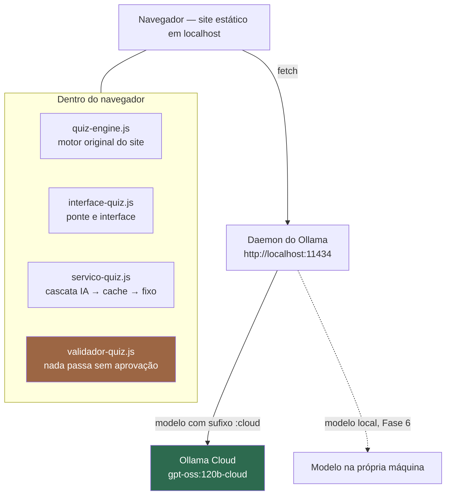

# Quiz gerado por IA no Nature Code — documentação final

> Trabalho acadêmico. Um site educacional de Biologia em HTML, CSS e JavaScript puros
> passou a gerar as questões dos seus quizzes com uma LLM, a partir do próprio conteúdo
> de cada tópico, **sem backend, sem dependências novas e sem alterar o conteúdo original**.
>
> **Estado:** implementado, integrado, testado e documentado. **13 dos 21 tópicos** geram
> questões por IA. Falta apenas executar o benchmark do modelo local (Fase 6), que roda em
> outra máquina.

---

## 1. Arquitetura, e por que não há backend



**Não existe servidor de aplicação.** O navegador fala direto com o daemon local do Ollama,
que é quem guarda a credencial da conta e autentica com a nuvem. Consequência prática:
**nenhuma chave de API aparece no JavaScript**, porque o navegador nunca fala com
`ollama.com`.

O preço dessa escolha está na §6: o projeto só funciona em máquina com Ollama instalado, e
não é publicável em hospedagem nesta forma.

### Camadas

| Arquivo | Responsabilidade |
|---|---|
| `script/ia/config-ia.js` | Configuração central. **Único lugar** com nome de modelo e URL |
| `script/ia/metricas-ia.js` | Contadores em `quiz_ia_metricas` |
| `script/ia/cliente-ollama.js` | HTTP com o daemon: timeout, erros classificados |
| `script/ia/prompt-quiz.js` | Prompts versionados (V1 a V4) e o JSON Schema |
| `script/ia/parser-quiz.js` | Extração tolerante do JSON, inclusive truncado |
| `script/ia/validador-quiz.js` | Validação estrutural e pedagógica |
| `script/ia/cache-quiz.js` | Banco de questões em `quiz_ia_banco` |
| `script/ia/servico-quiz.js` | Orquestrador. `obterQuiz()` é a única porta de entrada |
| `script/ia/interface-quiz.js` | Ponte com o motor do site. Todo o DOM e CSS novos |

2.347 linhas em `script/ia/`, mais 4.718 linhas de scripts de desenvolvimento e teste.

### O que foi tocado no site original

| | Diff contra a linha de base |
|---|---|
| 21 HTMLs de tópico | **+252 / −0** — só inserção de `<script>` |
| `script/quiz-engine.js` | **+10 / −2** — só a chamada de partida |
| CSS, imagens, quizzes fixos, conteúdo dos tópicos | **zero** |

As 24 leituras de `quizData` dentro do motor não foram alteradas: a camada troca o
*conteúdo* do array no lugar (`quizData.length = 0` e `push`). `const` impede reatribuir,
não mutar.

---

## 2. Como executar

Detalhes e solução de problemas em [`02-EXECUCAO.md`](02-EXECUCAO.md).

```powershell
# 1. Abra o Ollama pela bandeja do sistema
# 2. Sirva o site por HTTP, a partir da raiz do projeto
python -m http.server 8000
```

| Página | Endereço |
|---|---|
| Início | `http://localhost:8000/index.html` |
| Cordados (gera por IA) | `http://localhost:8000/pages/modulos/topicos/topicos-animais/filo-cordados.html` |
| Diagnóstico | `http://localhost:8000/ferramentas/diagnostico.html` |

**O site precisa ser servido por HTTP.** Medido: o Ollama responde **204** a origens como
`http://localhost:8000` e `http://127.0.0.1:5500`, e **403** a `null` — que é a origem de
uma página aberta por duplo clique (`file://`). Abrindo por `file://` o quiz cai no banco
fixo: é o fallback funcionando, não um defeito.

`OLLAMA_ORIGINS` **não precisou ser configurado** nesta máquina. Se em outra aparecer erro
de CORS, `setx OLLAMA_ORIGINS "*"` e reiniciar o Ollama pela bandeja.

---

## 3. Decisões técnicas

### 3.1 Por que a validação roda no cliente

Não há onde mais: não existe backend. Mas a decisão tem consequência real e ela está
declarada na §6 — num cenário com usuários de verdade, a validação poderia ser contornada
pelo console do navegador.

O que a validação faz, e por que existe: **o modelo erra**. Em 752 questões medidas, 104
foram recusadas (13,8%) por regras estruturais e pedagógicas — número de alternativas,
resposta correta inexistente, explicação trivial, "todas as anteriores", vazamento da
resposta pelo comprimento, e duas checagens de fidelidade contra o texto do tópico.

Sem essa camada, tudo isso chegaria ao aluno.

### 3.2 Por que a cascata de fallback

```
IA  →  cache  →  quiz fixo original
```

A regra do trabalho é que **o site continue funcionando com a IA desligada**, porque a
apresentação não pode depender de o Ollama estar no ar. Os 21 arquivos de quiz fixo nunca
foram apagados e são o último nível.

O cache tem função dupla: reduz latência e, com o Ollama fora do ar, ainda entrega
questões geradas por IA em vez de cair direto no banco fixo.

Isso não é teoria. Durante a Fase 5 o plano gratuito do Ollama Cloud atingiu o limite de
uso no meio de uma bateria: 20 erros HTTP seguidos, seis quizzes servidos pelo banco fixo,
**nenhuma tela vazia, nenhum erro na frente do aluno**. Foi o teste de fallback mais
realista do projeto, e não foi simulado.

### 3.3 Por que o schema no `format` — e por que ele não está sendo usado

O roteiro manda usar o parâmetro `format` com JSON Schema, porque é o mecanismo correto:
a saída estruturada passa a ser garantida por gramática, não por pedido.

**Foi medido que isso não funciona na nuvem.** Testado nos três modelos cloud gratuitos,
em `/api/chat` e `/api/generate`, com `format` como schema e como `"json"`, e com
`think: false` e `think: "low"` — **todas as combinações devolveram Markdown em prosa**. A
restrição por gramática é aplicada pelo runner local, e modelos `:cloud` são repassados
para `ollama.com`, onde ela não chega.

O contorno tem três camadas, nesta ordem: instrução de formato no prompt, parser tolerante
e validador rigoroso. Medido, entrega JSON aproveitável de forma confiável — mas
**o schema não está sendo respeitado, está sendo compensado**. A configuração declara isso
em `suportaSchema: false`, e a página de diagnóstico mostra na tela.

Trocar `CONFIG_IA.provedor` para `"local"` religa o schema automaticamente. Quanto isso
melhora é a pergunta da Fase 6.

### 3.4 Por que a quantidade de questões varia por tópico

O conteúdo do site tem 25.649 caracteres de prosa distribuídos de forma muito desigual:
de 4.675 caracteres em Cordados a 209 em Angiospermas, onde 5 das 6 seções são só imagem.

`maxQuestoes` é calculado por tópico como o menor entre volume de texto (350 caracteres
por questão, derivado dos ~296 medidos por seção), seções com texto, conceitos-chave
distintos e um teto de 5 — com piso de 600 caracteres, abaixo do qual o tópico fica fora
da IA.

**Nunca se pede ao modelo mais do que o material sustenta.** Cinco tópicos têm
`maxQuestoes = 0` e nem chegam a ser consultados.

### 3.5 Por que só 13 tópicos geram por IA

Decisão por medição, não por disponibilidade da API. Um tópico entrou quando atendeu aos
três critérios: entrega por IA em pelo menos 80% das tentativas, aprovação estrutural acima
de 70%, e nenhum defeito pedagógico pendente na leitura manual.

Três tópicos com conteúdo suficiente **ficaram de fora**: em Reino Plantae, Definição e
Componentes e Mundo Vivo, o modelo responde `{"questoes":[]}` na maioria das tentativas —
JSON válido, array vazio. Ele mesmo julga o material insuficiente, obedecendo à instrução
de entregar menos em vez de inventar. Em Reino Plantae, 9 vezes em 10.

A recusa do modelo virou um **segundo critério de suficiência de conteúdo**, que surgiu
sozinho e é mais rigoroso que a fórmula da Fase 1.

### 3.6 Por que o progresso do aluno não se perde

O motor deriva a chave de progresso do LocalStorage de `quizData[0].title`. Se o quiz
gerado usasse o título da base de conhecimento — "Filo dos Cordados" —, a chave viraria
`filo_dos_cordados` em vez de `cordados` e o histórico do tópico sumiria.

Por isso o `title` das questões geradas é **copiado do quiz fixo**. Há teste automatizado
só para isso.

Quatro depósitos, sem mistura:

| Chave | Onde | Guarda | Quem escreve |
|---|---|---|---|
| `quizProgress` | LocalStorage | Progresso do aluno, **formato original** | só o motor |
| `quiz_ia_banco` | LocalStorage | Cache de questões validadas | só `cache-quiz.js` |
| `quiz_ia_metricas` | LocalStorage | Contadores | só `metricas-ia.js` |
| `quiz_ia_sessao` | **sessionStorage** | O quiz exibido nesta aba | só `interface-quiz.js` |

O `quiz_ia_sessao` resolve um problema sutil: `quizProgress` guarda respostas **por
índice**. Se cada F5 gerasse um quiz diferente, a resposta salva no índice 0 passaria a
apontar para outra pergunta. Guardando o conjunto exibido, recarregar devolve as mesmas
perguntas — e não faz chamada nova ao modelo.

---

## 4. O que foi medido

| | |
|---|---|
| Gerações executadas | **230** |
| Questões recebidas do modelo | **752** |
| Questões aprovadas pelo validador | **648 (86,2%)** |
| Questões lidas manualmente | **~90** |
| Defeitos pedagógicos confirmados por leitura | **2** |
| Amostras brutas versionadas | 9 arquivos, 0,9 MB, com o texto de 722 questões |
| Asserções automatizadas | **256**, todas passando |

**A frase mais importante do projeto:** 86,2% de aprovação automática **não é** 86,2% de
qualidade. Os dois defeitos confirmados passaram pelo validador sem um arranhão, e nenhum
dos dois tinha marcador automático. Foram encontrados **lendo as questões**.

### 4.1 Os dois defeitos, e o que se fez com eles

**Pergunta negativa com duas respostas.** *"Sobre os condrictes, qual característica NÃO se
aplica a eles?"* — a resposta era "bexiga natatória", mas "brânquias externas", oferecida
como distrator, também não se aplica. A própria explicação do modelo hesitava.
→ Prompt **V3**: numa pergunta negativa, as três não-respostas precisam ser afirmações
explícitas do texto sobre aquele mesmo assunto. Enunciados negativos caíram de 5,2% para
2,1%, e os que restaram vieram ancorados.

**Questão decidida pelo título da seção.** Em Artrópodes, *"qual característica está
incluída nas 'Características Gerais'?"* — a explicação dizia que as outras opções
"aparecem na seção de Morfologia", só que "apêndices articulados" está, sim, em
Características Gerais. → Prompt **V4**: títulos de seção organizam o texto e não são
listas exaustivas. Aprovação subiu de 80% para 91% no tópico, retentativas caíram de 5 para 2.

### 4.2 Um erro de método, registrado

O prompt V2 foi medido em Cordados e recusado por "não reduzir nada e piorar a aprovação".
**O raciocínio estava errado:** a taxa-base do defeito em Cordados era zero — em 193
questões ele não apareceu uma vez. Um experimento sobre um defeito que não ocorre no tópico
testado não pode demonstrar melhora.

Refeito em Artrópodes, onde o defeito ocorre, a mesma regra melhorou tudo. Está em
[`05-AVALIACAO-PILOTO.md`](05-AVALIACAO-PILOTO.md) §5.1.

### 4.3 O que a triagem automática não consegue fazer

Três marcadores foram construídos, medidos e descartados por medirem a coisa errada.
**Sobreposição lexical não julga distrator em nenhuma das direções:** cobertura alta é sinal
de distrator *bem construído*, porque ele usa o vocabulário do material — numa questão
correta, as quatro alternativas tinham 100% de cobertura. Cobertura baixa é sinal de
distrator *falso*, que é exatamente o que ele deve ser.

Detectar "esta alternativa também é uma resposta correta" exige saber se a afirmação é
verdadeira **para o assunto daquela pergunta**, e isso nenhum método lexical resolve.

---

## 5. Índice da documentação

| Documento | Fase | Conteúdo |
|---|---|---|
| [`00-MAPEAMENTO.md`](00-MAPEAMENTO.md) | 0 | Mapa do site: 3 módulos, 21 tópicos, 27 questões fixas, o formato do `quizData`, o fluxo do quiz e 14 riscos |
| [`01-EXTRACAO.md`](01-EXTRACAO.md) | 1 | Extração do conteúdo, a regra de `maxQuestoes` e o alerta dos 11 tópicos abaixo de 800 caracteres |
| [`02-EXECUCAO.md`](02-EXECUCAO.md) | — | Como executar, CORS medido, mensagens de erro e conferência pré-apresentação |
| [`03-CAMADA-IA.md`](03-CAMADA-IA.md) | 2 | As 7 camadas, a limitação do JSON Schema e os 72 testes |
| [`04-INTERFACE.md`](04-INTERFACE.md) | 3 | Antes e depois de cada arquivo alterado, as quatro chaves de armazenamento, 50 testes |
| [`04b-DIAGNOSTICO.md`](04b-DIAGNOSTICO.md) | 4 | A página de diagnóstico e seus 87 testes |
| [`05-AVALIACAO-PILOTO.md`](05-AVALIACAO-PILOTO.md) | 5 | 230 gerações, decisão tópico a tópico, os experimentos de prompt |
| [`05b-REVALIDACAO-V4.md`](05b-REVALIDACAO-V4.md) | 5 | Revalidação do V4 em amostra limpa |
| [`06-BENCHMARK-LOCAL.md`](06-BENCHMARK-LOCAL.md) | 6 | Protocolo do benchmark Cloud × Local |
| [`06b-GUIA-PC-MESA.md`](06b-GUIA-PC-MESA.md) | 6 | Passo a passo de 28 etapas para executar em outra máquina |

---

## 6. Limitações conhecidas

Escritas com honestidade, porque este ponto conta na avaliação.

1. **Só funciona em máquina com Ollama instalado e autenticado.** Não há backend; o
   navegador depende do daemon local.

2. **Não é publicável em hospedagem nesta arquitetura.** O navegador de um visitante não
   teria o daemon. Publicar exigiria um backend intermediário guardando a credencial — o
   que anularia a decisão de projeto que torna esta versão possível sem chave no código.

3. **A validação roda no cliente** e, num cenário real com usuários, poderia ser contornada
   pelo console do navegador.

4. **O JSON Schema não é respeitado na nuvem.** Compensado por prompt, parser e validador —
   não resolvido. Ver §3.3.

5. **Só se geram questões de múltipla escolha.** O site também suporta verdadeiro/falso, e
   5 das 27 questões fixas são desse tipo, mas a camada de IA não gera nenhuma.

6. **Defeito conhecido e não corrigido:** *alucinação ou corrupção de termo técnico
   parcialmente mascarada pela sobreposição lexical*. O modelo escreveu "trilobulados" onde
   o material diz "triblásticos". Como as outras palavras da alternativa seguram o índice
   de cobertura em 67%, nem o validador nem a triagem pegam. Frequência medida: 1 em 74.
   A correção proposta — recusar alternativa correta com termo técnico inédito no material
   — está registrada como trabalho futuro, não implementada.

7. **A leitura manual cobriu ~12% das questões geradas.** A taxa de defeito observada não é
   estimativa estatística; defeitos raros passam sem ser vistos.

8. **A diversidade é medida por enunciado, não por sentido.** Pirâmides marcou 100% de
   enunciados distintos e produziu duas perguntas semanticamente iguais com redações
   diferentes.

9. **Depende de internet enquanto o modelo for `:cloud`.** Sem rede, o quiz cai para cache
   e depois para o banco fixo. O site também usa Bootstrap e Google Fonts por CDN, o que já
   era assim antes da IA.

10. **O plano gratuito do Ollama Cloud tem limite de uso por sessão**, atingido após cerca
    de 200 gerações.

11. **Nenhuma verificação visual em navegador por automação.** Não há Playwright nem
    Puppeteer, e instalá-los violaria a regra de zero dependências. O que existe é o motor
    real rodando sobre um DOM mínimo, mais checagem de carregamento por HTTP. Layout e CSS
    foram conferidos manualmente.

12. **O benchmark do modelo local não foi executado.** É a Fase 6, pendente.

---

## 7. Trabalhos futuros

| | Por quê |
|---|---|
| **Modelo local** | Religa o JSON Schema, remove a dependência de internet e o limite de cota. É a Fase 6, já preparada |
| **Validar termo técnico inédito** | Pegaria o defeito da §6.6 sem depender do comportamento do modelo |
| **RAG para conteúdos maiores** | Hoje o tópico inteiro cabe no prompt. Com material maior, seria preciso recuperar só os trechos relevantes |
| **Ajuste fino para estilo pedagógico** | Reduziria a dependência de regras acumuladas no prompt |
| **Backend para publicação** | Único caminho para o site sair de `localhost` mantendo a geração por IA |
| **Questões de verdadeiro/falso** | O site já suporta; a camada ainda não gera |
| **Enriquecer os tópicos curtos** | Cinco tópicos têm menos de 600 caracteres. Foi deliberadamente evitado: alterar o conteúdo para melhorar a geração seria trocar o problema de lugar |

---

## 8. Reprodutibilidade

Todo número deste documento veio de execução, e pode ser reconferido:

```bash
node scripts/testar-camada-ia.js        # 67 (72 com --rede)
node scripts/testar-integracao.js       # 46 (50 com --rede)
node scripts/testar-diagnostico.js      # 82 (87 com --rede)
node scripts/testar-benchmark.js        # 61
node scripts/extrair-conteudo.js --verificar
node scripts/integrar-paginas.js --verificar
node scripts/resumo-piloto.js
node scripts/analisar-questoes.js onda3-v3-cordados
node scripts/benchmark-fase6.js --verificar-prompts
```

As amostras brutas em `docs/dados-piloto/` guardam o texto integral de cada questão
gerada, então qualquer afirmação sobre qualidade pode ser conferida sem gerar de novo — e
sem gastar cota.

**Ponto de restauração:** tag `fase-5-completa`, no commit `8a85e29`.
