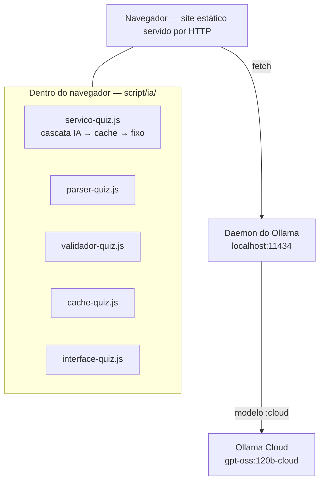

# Relatório final — Inteligência Artificial

**Nature Code: geração de quizzes educacionais por LLM**

> Relatório da disciplina de **Inteligência Artificial**. É autocontido: resume o problema,
> a solução, os experimentos e os resultados. Cada seção aponta o documento detalhado de
> onde o conteúdo vem; onde houver divergência, vale o documento de origem.
>
> Relatório da outra disciplina: [`RELATORIO-FINAL-PDI.md`](RELATORIO-FINAL-PDI.md).
> Integração entre as duas: [`DOCUMENTACAO-FINAL-IA-PDI.md`](DOCUMENTACAO-FINAL-IA-PDI.md).

---

## 1. Identificação do projeto

| | |
|---|---|
| **Projeto** | Nature Code — módulo de quizzes gerados por IA |
| **Disciplina** | Inteligência Artificial |
| **Instituição** | Universidade do Sagrado Coração — Bauru/SP |
| **Curso** | Ciência da Computação |
| **Repositório** | https://github.com/Cesar-Otavio/nature-code-IA-e-processamento-de-imagens |
| **Código do módulo** | [`script/ia/`](../script/ia/) |

---

## 2. Integrantes

- Amanda Pazold dos Santos
- Cesar Otavio da Silva Boiani
- Giovana Giraldeli
- Giovani Nogueira Pires
- Marcus Vinicius da Silva Capeteruchi
- Guilherme Ribeiro Zangrande

---

## 3. Contexto do Nature Code

O Nature Code é um site educacional de Biologia, feito em HTML, CSS e JavaScript puros, sem
backend. Tem três módulos de conteúdo — **Reino Animal** (10 tópicos), **Plantas** (5) e
**Ecossistemas** (6) —, somando **21 tópicos**, cada um com texto, imagens e um quiz.

Detalhes do site original: [`00-MAPEAMENTO.md`](00-MAPEAMENTO.md).

---

## 4. Problema original

Os quizzes eram **fixos**: 27 questões escritas à mão para os 21 tópicos, sempre as
mesmas. Um aluno que refaz o quiz vê as mesmas perguntas e as mesmas respostas, e o quiz
deixa de avaliar compreensão para avaliar memória.

Três restrições tornavam o problema não trivial:

1. o site **não tem backend**, e não deveria passar a ter;
2. **nenhuma chave de API** poderia aparecer no JavaScript do navegador;
3. o site **tinha de continuar funcionando com a IA desligada** — a apresentação não podia
   depender de um serviço externo estar no ar.

---

## 5. Objetivo da integração de IA

Gerar **questões novas de múltipla escolha a partir do próprio texto de cada tópico**, com
uma LLM, garantindo que:

- as questões saiam exclusivamente do material do tópico;
- nenhuma questão chegue ao aluno sem passar por validação estrutural e pedagógica;
- o aluno **nunca fique sem quiz**;
- o conteúdo original, os quizzes fixos e o progresso do aluno não sejam alterados.

Não houve treinamento nem ajuste fino de pesos: toda a adaptação do modelo foi feita por
**engenharia de prompt**.

---

## 6. Arquitetura

```
conteúdo → prompt → Ollama → LLM → parser → validador → cache → quiz
```



**Não existe servidor de aplicação.** O navegador fala diretamente com o daemon local do
Ollama, que guarda a credencial da conta e autentica com a nuvem.

| Arquivo | Responsabilidade |
|---|---|
| `config-ia.js` | Configuração central — **único** lugar com nome de modelo e URL |
| `cliente-ollama.js` | HTTP com o daemon: timeout e erros classificados |
| `prompt-quiz.js` | Prompts versionados (V1 a V4) e JSON Schema |
| `parser-quiz.js` | Extração tolerante do JSON |
| `validador-quiz.js` | Validação estrutural e pedagógica |
| `cache-quiz.js` | Banco de questões validadas |
| `metricas-ia.js` | Contadores de uso e de rejeição |
| `servico-quiz.js` | Orquestrador; `obterQuiz()` é a única porta de entrada |
| `interface-quiz.js` | Ponte com o motor original do site |

Impacto no site original: 21 HTMLs de tópico com **+252 / −0** linhas (só `<script>`),
`quiz-engine.js` com **+10 / −2**; CSS, imagens, conteúdo e quizzes fixos **intactos**.

Detalhes: [`03-CAMADA-IA.md`](03-CAMADA-IA.md) · [`DOCUMENTACAO-FINAL-NATURE-CODE.md`](DOCUMENTACAO-FINAL-NATURE-CODE.md) §7.

---

## 7. Ollama

O **Ollama** é executado como daemon local em `localhost:11434`. Ele recebe as requisições
do navegador e, para modelos com sufixo `:cloud`, as repassa para `ollama.com`.

| Consequência | Efeito |
|---|---|
| **Nenhuma chave no JavaScript** | O navegador nunca fala com a nuvem; a credencial fica no daemon |
| **Origem HTTP obrigatória** | Medido: o daemon responde 204 a `http://localhost:8000` e 403 à origem `null` de `file://` |
| **JSON Schema não aplicado** | Medido nos modelos `:cloud`: o parâmetro `format` com JSON Schema não é respeitado (a restrição por gramática é do runner local). Compensado por prompt, parser e validador — `suportaSchema: false` |
| **Dependência operacional** | O módulo só gera questões em máquina com Ollama instalado, autenticado e com internet |

Detalhes: [`02-EXECUCAO.md`](02-EXECUCAO.md) · [`DOCUMENTACAO-FINAL-NATURE-CODE.md`](DOCUMENTACAO-FINAL-NATURE-CODE.md) §8.

---

## 8. Modelo utilizado

| | |
|---|---|
| **Modelo em produção** | **`gpt-oss:120b-cloud`** |
| Provedor | `cloud`, via daemon local do Ollama |
| Temperatura | 0,7 |
| Tentativas por geração | até 3 |
| Timeout por chamada | 120 s (cloud) |

A troca de modelo ou de provedor exige editar só [`config-ia.js`](../script/ia/config-ia.js).

---

## 9. Prompt V4

O prompt tem uma mensagem de sistema (papel: professor de Biologia do ensino médio,
especialista em avaliações) e uma de usuário (material do tópico, número de questões,
formato JSON e regras). Regras permanentes:

- questões **exclusivamente do material fornecido**; é preferível devolver menos questões a
  inventar;
- exatamente **4 alternativas**, uma correta;
- a explicação descreve a alternativa **pelo que ela diz**, nunca pela letra — porque as
  alternativas são embaralhadas antes da exibição;
- saída no envelope `{"questoes": [...]}`.

Cada versão acrescenta **uma** regra, para que a comparação tenha causa única:

| Versão | Regra acrescentada | Resultado medido |
|---|---|---|
| V1 | — | Linha de base |
| V2 | Títulos de seção não são listas exaustivas | Recusada em Cordados — **erro de método**: o defeito tinha taxa-base zero ali. Refeita em Artrópodes, melhorou |
| V3 | Pergunta negativa exige três não-respostas explícitas no texto | Enunciados negativos de 5,2 % para 2,1 % |
| **V4** | **As duas regras juntas** | **Adotada.** Em Artrópodes, aprovação de 80 % para 91 %, retentativas de 5 para 2 |

As duas regras nasceram de **defeitos encontrados lendo questões**, não de métricas:
uma pergunta negativa com duas respostas válidas (condrictes) e uma questão decidida pelo
título da seção em que o fato aparecia (artrópodes).

Detalhes: [`05-AVALIACAO-PILOTO.md`](05-AVALIACAO-PILOTO.md) · [`DOCUMENTACAO-FINAL-NATURE-CODE.md`](DOCUMENTACAO-FINAL-NATURE-CODE.md) §10.

---

## 10. Base de conhecimento

O texto de cada tópico foi **extraído das páginas do próprio site** para
[`dados/base-conhecimento.js`](../dados/base-conhecimento.js), por seção. O conteúdo
original não foi alterado nem enriquecido.

O volume é muito desigual — 25.649 caracteres de prosa no total, de 4.675 em Cordados a 209
em Angiospermas. Por isso, o número máximo de questões por tópico (`maxQuestoes`) é
calculado como o menor entre: volume de texto (350 caracteres por questão), seções com
texto, conceitos-chave distintos e um teto de 5, com piso de 600 caracteres. Abaixo do
piso, o tópico fica fora da IA. **Nunca se pede ao modelo mais do que o material sustenta.**

Detalhes: [`01-EXTRACAO.md`](01-EXTRACAO.md).

---

## 11. Geração de questões

1. `obterQuiz(modulo, topico)` verifica se o tópico é elegível (IA ligada, tópico
   habilitado, `maxQuestoes > 0`).
2. Monta o prompt V4 com o material do tópico e, em retentativas, os conceitos a evitar.
3. Chama o modelo pelo daemon.
4. O parser extrai o JSON; o validador julga **questão por questão**.
5. Se faltarem questões, pede as que faltam em nova tentativa (até 3).
6. As aprovadas vão para o cache e para a tela, com as alternativas embaralhadas.

Só se geram questões de **múltipla escolha**.

---

## 12. Parser

**Tolerante na extração, rigoroso depois.** Como os modelos `:cloud` ignoram o JSON
Schema, a resposta chega em texto livre. O parser aplica quatro estratégias, em ordem:

| Estratégia | Quando se aplica |
|---|---|
| `direto` | O texto inteiro é JSON válido |
| `cerca` | JSON dentro de bloco de código |
| `recorte` | JSON íntegro cercado de prosa, localizado por varredura de profundidade que respeita strings e escapes |
| `reparo` | Resposta **truncada**: aproveita as questões completas e descarta a incompleta, em vez de remendar |

Também normaliza envelopes inventados pelo modelo (array solto, outro nome de chave,
questão única). Detalhes: [`DOCUMENTACAO-FINAL-NATURE-CODE.md`](DOCUMENTACAO-FINAL-NATURE-CODE.md) §11.

---

## 13. Validador

Julga cada questão em quatro camadas; a reprovada é descartada com **motivo nomeado**, que
vira métrica.

| Camada | Critérios |
|---|---|
| Estrutura | campos obrigatórios, exatamente 4 alternativas, ids e textos não duplicados, resposta correta existente |
| Qualidade textual | enunciado ≥ 25 caracteres, explicação ≥ 60 |
| Regras pedagógicas | sem "todas/nenhuma das anteriores", explicação sem citar letra, sem vazamento da resposta pelo comprimento (1,7× e ≥ 25 caracteres) |
| Ancoragem no material | cobertura mínima das palavras de conteúdo no texto do tópico: 0,5 no conceito, 0,35 no enunciado — defesa contra alucinação |

No piloto, **104 de 752 questões (13,8 %)** foram recusadas. Sem essa camada, todas teriam
chegado ao aluno. Detalhes: [`DOCUMENTACAO-FINAL-NATURE-CODE.md`](DOCUMENTACAO-FINAL-NATURE-CODE.md) §12.

---

## 14. Cache

Banco de questões **já aprovadas**, no `localStorage` (`quiz_ia_banco`), com
deduplicação por hash do enunciado e teto de 1,5 MB — a cota do navegador é compartilhada
com o progresso do aluno, que tem prioridade. Função dupla: reduz latência e é o **segundo
nível do fallback**, entregando questões geradas por IA mesmo com o Ollama fora do ar.

O progresso original do aluno (`quizProgress`) nunca é tocado; um teste verifica o
isolamento entre as quatro chaves de armazenamento (`quizProgress`, `quiz_ia_banco`,
`quiz_ia_metricas`, `quiz_ia_sessao`).

---

## 15. Fallback

```
IA → cache → questões fixas
```

| Situação | Resultado |
|---|---|
| IA gera e o validador aprova | Quiz gerado por IA |
| Ollama fora do ar, sem internet, sem cota, timeout, resposta vazia ou inválida após 3 tentativas | Questões do **cache** do tópico |
| Sem cache para o tópico | **Quiz fixo original** — os 21 nunca foram apagados |
| Tópico não habilitado ou IA desligada | Quiz fixo |

O fallback foi testado em condição real: durante a Fase 5, a cota do plano gratuito
esgotou no meio de uma bateria — 20 erros HTTP seguidos, 6 quizzes servidos pelo banco
fixo, **nenhuma tela vazia**. Botão de pânico: `CONFIG_IA.habilitada = false` devolve o
site ao comportamento original.

---

## 16. Integração com os 21 tópicos

**13 dos 21 tópicos** geram questões por IA. A habilitação foi **decidida por medição**,
com três critérios: entrega por IA em ≥ 80 % das tentativas, aprovação estrutural > 70 % e
nenhum defeito pedagógico pendente na leitura manual.

Os outros 8 usam o quiz fixo: 5 têm `maxQuestoes = 0` (texto insuficiente) e 3 (Reino
Plantae, Definição e Componentes, Mundo Vivo) ficaram de fora porque o modelo devolve
`{"questoes":[]}` na maioria das tentativas — ele mesmo julga o material insuficiente,
obedecendo à instrução de não inventar.

Detalhes: [`05-AVALIACAO-PILOTO.md`](05-AVALIACAO-PILOTO.md).

---

## 17. Interface

[`interface-quiz.js`](../script/ia/interface-quiz.js) liga a camada ao motor original
(`quiz-engine.js`) sem alterar a lógica dele: troca o conteúdo do array `quizData` no
lugar. Mostra estado de carregamento, **selo de origem** (IA, cache ou fixo) e o botão de
gerar novas perguntas.

Um F5 devolve as **mesmas** perguntas, sem nova chamada ao modelo (`quiz_ia_sessao`, em
`sessionStorage`), porque o progresso do aluno é salvo por índice. O título das questões é
copiado do quiz fixo para que a chave de progresso não mude.

Detalhes: [`04-INTERFACE.md`](04-INTERFACE.md).

---

## 18. Diagnóstico

[`ferramentas/diagnostico.html`](../ferramentas/diagnostico.html) mostra modelo, provedor,
estado do daemon, latência, resposta crua do modelo, estratégia do parser, motivos de
rejeição e o motivo de cada fallback — além da declaração `suportaSchema: false`.
Detalhes: [`04b-DIAGNOSTICO.md`](04b-DIAGNOSTICO.md).

---

## 19. Avaliação experimental

| Etapa | O que mediu |
|---|---|
| **Piloto (Fase 5)** | 230 gerações em todos os tópicos elegíveis, decisão tópico a tópico e experimentos de prompt V1–V4 |
| **Leitura manual** | ~90 questões lidas, para encontrar defeitos que o validador não vê |
| **Revalidação V4 (Fase 5)** | 15 gerações limpas em Cordados, com o prompt final |
| **Sondagem local (Fase 6)** | Dois modelos locais, 3 gerações cada, em Cordados |

Métricas usadas: entrega por IA, taxa de aprovação pelo validador, retentativas, latência,
enunciados distintos e defeitos por leitura manual. **Aprovação automática não é o mesmo
que qualidade pedagógica** — por isso a leitura manual.

---

## 20. Resultados

### Piloto

| | |
|---|---|
| Gerações | **230** |
| Questões recebidas | **752** |
| Aprovadas pelo validador | **648 (86,2 %)** |
| Questões lidas manualmente | ~90 |
| Defeitos pedagógicos confirmados por leitura | 2 — ambos passaram pelo validador, e originaram as regras V3 e V4 |

### Revalidação do Prompt V4 em Cordados

| Métrica | Resultado |
|---|---|
| Gerações | **15** |
| Servidas pela IA | 15 de 15 — nenhum fallback |
| Questões recebidas | **77** |
| Questões aprovadas | **74** |
| **Taxa de aprovação** | **96,1 %** — a maior das quatro versões (V1 92,3 %, V2 87,4 %, V3 88,9 %) |
| Retentativas | 4 gerações de 15 |
| Latência por quiz | **mediana ≈ 12,2 s** · média 13,1 s · máx. 24,4 s |
| Enunciados distintos | 74 de 74 |
| Defeito novo | 1 em 74 — termo técnico corrompido ("trilobulados" por "triblásticos"), não detectado pelo validador |

A amostra do V4 tem 15 gerações, contra 20 das versões anteriores. Detalhes:
[`05b-REVALIDACAO-V4.md`](05b-REVALIDACAO-V4.md).

---

## 21. Benchmark local × cloud

A Fase 6 foi desenhada para comparar três braços — **A** (cloud, sem schema), **B** (local,
sem schema) e **C** (local, com JSON Schema) —, porque o JSON Schema só é aplicado por modelo
local. **Só a sondagem do braço B foi executada**, em dois modelos:

| | `qwen3.5:4b` | `qwen3.5:2b` |
|---|---:|---:|
| Gerações | 3 | 3 |
| Entregues pela IA | **0/3** | **0/3** |
| Latência mediana por geração | 505,7 s | 316,6 s |
| Falhas de chamada | 9 — resposta vazia | 9 — resposta vazia |

Mesmo prompt (hash idêntico), mesmo tópico, mesma máquina (12 CPUs lógicas, 15,7 GB de
RAM). O 2b foi testado **por regra do protocolo**, escrita antes da execução (mediana acima
de 300 s no 4b).

**Conclusão restrita:** **no hardware e na configuração testados**, os dois modelos locais
**não atingiram o critério de viabilidade** do protocolo — nenhum quiz entregue e latência
de minutos por geração. Isso **não** permite concluir que modelos locais não funcionam, nem
nada sobre o efeito do JSON Schema: os braços A e C não foram executados. A causa das
respostas vazias **não foi comprovada**; a hipótese registrada (orçamento de tokens
esgotado na fase de raciocínio do modelo) é trabalho futuro.

Detalhes: [`06-BENCHMARK-LOCAL.md`](06-BENCHMARK-LOCAL.md) · [`06c-RESULTADO-BENCHMARK.md`](06c-RESULTADO-BENCHMARK.md).

---

## 22. Testes

| Suíte | Comando | Resultado |
|---|---|---|
| Camada de IA | `node scripts\testar-camada-ia.js` | 67/67 |
| Integração | `node scripts\testar-integracao.js` | 46/46 |
| Diagnóstico | `node scripts\testar-diagnostico.js` | 82/82 |
| Benchmark | `node scripts\testar-benchmark.js` | 61/61 |
| **Total** | | **256/256** |

Rodam offline, sem Ollama e sem dependências. Cobrem parser, validador, cache, cascata de
fallback, métricas, configuração, recarregamento da página, pontuação e o motor real do
site sobre um DOM mínimo. Além disso, o fluxo completo foi **testado manualmente no
navegador**: geração real, novo conjunto, resposta ao quiz, F5, cache, fallback para
questões fixas, Ollama desligado e religado, diagnóstico
([`TESTES-MANUAIS-FINAIS.md`](TESTES-MANUAIS-FINAIS.md) §3).

---

## 23. Limitações

1. Só funciona em máquina com **Ollama instalado e autenticado**; não é publicável em
   hospedagem nesta arquitetura sem um backend intermediário.
2. Depende de **internet** enquanto o modelo for `:cloud`, e o plano gratuito tem **cota**.
3. O **JSON Schema não é respeitado** pelos modelos `:cloud` — compensado, não resolvido.
4. A **validação roda no cliente** e poderia ser contornada pelo console.
5. **A leitura manual cobriu ~12 %** das questões; defeitos raros podem passar.
6. Defeito conhecido não corrigido: **corrupção de termo técnico** mascarada pela
   sobreposição lexical (1 em 74 no V4).
7. **A diversidade é medida por enunciado**, não por sentido.
8. Só questões de **múltipla escolha**.
9. **8 dos 21 tópicos** não geram por IA.
10. O **benchmark local × cloud não foi concluído** (§21).

---

## 24. Reprodutibilidade

| O quê | Como |
|---|---|
| Testes | `node scripts\testar-*.js` — 256 asserções offline |
| Amostras brutas | [`dados-piloto/`](dados-piloto/) — respostas do modelo usadas no piloto e na revalidação |
| Benchmark | [`dados-benchmark/`](dados-benchmark/) e `node scripts/comparar-benchmark.js` |
| Execução | [`02-EXECUCAO.md`](02-EXECUCAO.md) · README raiz §10.4 |

Ressalva: LLMs não são determinísticas com temperatura 0,7; reexecutar a geração produz
questões diferentes. O que se reproduz é o **processo** e as **medições** sobre as amostras
versionadas.

---

## 25. Relação com o módulo PDI

O Nature Code também contém um módulo de **Processamento Digital de Imagens** (análise
morfológica de folhas), da outra disciplina. Os dois compartilham **só o site**:

| | IA | PDI |
|---|---|---|
| Usa IA | Sim | **Não** |
| Código | `script/ia/` | `processamento-imagens/`, `script/pdi/` |
| Serviço | Ollama, `localhost:11434` | API Flask, `127.0.0.1:5000` |

Nenhum módulo importa o outro, e testes verificam isso: a camada de IA não referencia o PDI,
e o PDI não usa nenhuma biblioteca de IA nem fala com o Ollama. Ver
[`RELATORIO-FINAL-PDI.md`](RELATORIO-FINAL-PDI.md) e
[`DOCUMENTACAO-FINAL-IA-PDI.md`](DOCUMENTACAO-FINAL-IA-PDI.md) §24.

---

## 26. Conclusão

O módulo de IA transformou quizzes fixos em quizzes gerados a partir do próprio conteúdo de
cada tópico, **sem backend, sem chave no navegador e sem alterar o site original**. A
decisão central foi não confiar na saída do modelo: um parser tolerante, um validador com
critérios estruturais, pedagógicos e de ancoragem no material, e uma cascata **IA → cache →
questões fixas** que garante que o aluno nunca fique sem quiz — o que foi comprovado quando
a cota da nuvem acabou no meio de um experimento.

Com o **Prompt V4** e o modelo **`gpt-oss:120b-cloud`**, a revalidação em Cordados teve
**96,1 % de aprovação** (74 de 77) e latência mediana de **≈ 12,2 s**; **13 dos 21 tópicos**
foram habilitados por critério medido. O trabalho também registra o que não resolveu: o
JSON Schema continua sem efeito na nuvem, a leitura manual encontrou defeitos que nenhuma
métrica automática via, e os modelos locais testados não foram viáveis **naquele hardware
e naquela configuração** — um resultado experimental delimitado, não uma conclusão geral.
