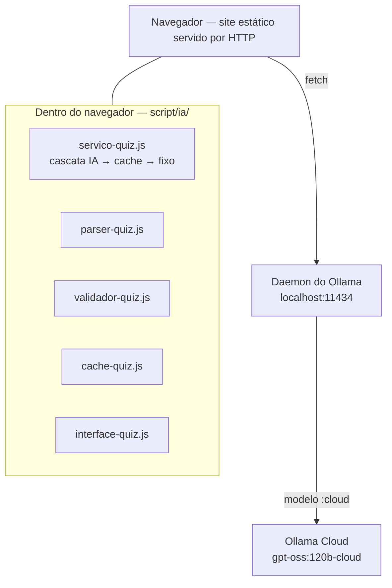
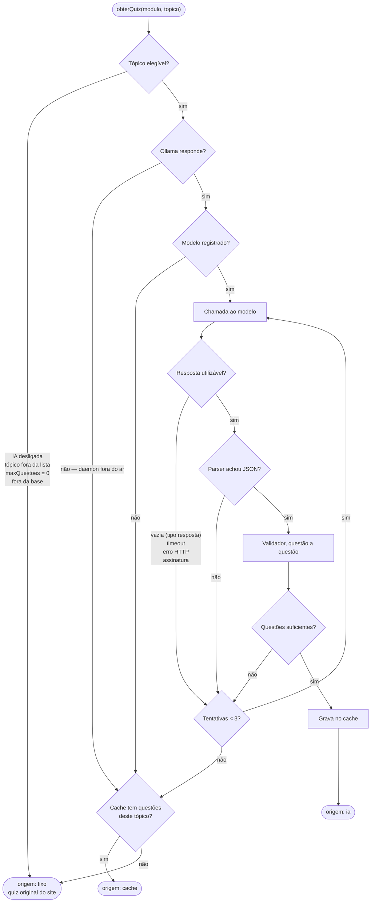

# Relatório final — Inteligência Artificial

**Nature Code: geração de quizzes educacionais por LLM**

> Relatório da disciplina de **Inteligência Artificial**. É autocontido: resume o problema,
> a solução, os experimentos e os resultados. Cada seção aponta o documento detalhado de
> onde o conteúdo vem; onde houver divergência, vale o documento de origem.
>
> Relatório da outra disciplina: [`Relatorio final - Processamento de Imagens e Sinais.md`](Relatorio%20final%20-%20Processamento%20de%20Imagens%20e%20Sinais.md).
> Integração entre as duas: [`Relatorio final - IA + Processamento de Imagens e Sinais.md`](Relatorio%20final%20-%20IA%20+%20Processamento%20de%20Imagens%20e%20Sinais.md).

---

## Requisitos da atividade

Localização, neste relatório, de cada requisito da atividade:

| Requisito | Onde está |
|---|---|
| **1. Descrição da aplicação** | [§3 Descrição da aplicação](#3-descrição-da-aplicação) · [§4 Problema original](#4-problema-original) · [§5 Objetivo da integração de IA](#5-objetivo-da-integração-de-ia) |
| **2. Ferramentas utilizadas** | [§6 Ferramentas utilizadas](#6-ferramentas-utilizadas) |
| **3. Processo de desenvolvimento** | [§7 Processo de desenvolvimento](#7-processo-de-desenvolvimento) — etapas em ordem cronológica, detalhadas nas §8 a §24: arquitetura, prompt V4 completo e sua evolução, fluxograma da geração, parser, validador, cache, fallback e testes |
| **4. Visão crítica** | [§25 Visão crítica](#25-visão-crítica) — resultados obtidos, limitações enfrentadas e lições aprendidas |
| **5. Conclusões e sugestões futuras** | [§28 Conclusão](#28-conclusão) · [§29 Sugestões futuras](#29-sugestões-futuras) |

---

## 1. Identificação do projeto

| | |
|---|---|
| **Projeto** | Nature Code — módulo de quizzes gerados por IA |
| **Disciplina** | Inteligência Artificial |
| **Instituição** | Universidade do Sagrado Coração — Bauru/SP |
| **Curso** | Ciência da Computação |
| **Repositório** | https://github.com/Cesar-Otavio/nature-code-IA-e-processamento-de-imagens |
| **Código do módulo** | [`script/ia/`](../script/ia/) |

---

## 2. Integrantes

- Amanda Pazold dos Santos
- Cesar Otavio da Silva Boiani
- Giovana Giraldeli
- Giovani Nogueira Pires
- Marcus Vinicius da Silva Capeteruchi
- Guilherme Ribeiro Zangrande

---

## 3. Descrição da aplicação

O Nature Code é um site educacional de Biologia, feito em HTML, CSS e JavaScript puros, sem
backend. Tem três módulos de conteúdo — **Reino Animal** (10 tópicos), **Plantas** (5) e
**Ecossistemas** (6) —, somando **21 tópicos**, cada um com texto, imagens e um quiz.

A aplicação desenvolvida neste trabalho é um **módulo de IA generativa** integrado a esse
site: quando o aluno abre um tópico habilitado, uma LLM gera questões de múltipla escolha a
partir do próprio texto do tópico, e um botão permite gerar um novo conjunto. As questões
fixas originais permanecem como último nível de contingência. O problema que motivou o
módulo está na §4, e o objetivo da solução, na §5.

Detalhes do site original: [`00-MAPEAMENTO.md`](00-MAPEAMENTO.md).

---

## 4. Problema original

Os quizzes eram **fixos**: 27 questões escritas à mão para os 21 tópicos, sempre as
mesmas. Um aluno que refaz o quiz vê as mesmas perguntas e as mesmas respostas, e o quiz
deixa de avaliar compreensão para avaliar memória.

Três restrições tornavam o problema não trivial:

1. o site **não tem backend**, e não deveria passar a ter;
2. **nenhuma chave de API** poderia aparecer no JavaScript do navegador;
3. o site **tinha de continuar funcionando com a IA desligada** — a apresentação não podia
   depender de um serviço externo estar no ar.

---

## 5. Objetivo da integração de IA

Gerar **questões novas de múltipla escolha a partir do próprio texto de cada tópico**, com
uma LLM, garantindo que:

- as questões saiam exclusivamente do material do tópico;
- nenhuma questão chegue ao aluno sem passar por validação estrutural e pedagógica;
- o aluno **nunca fique sem quiz**;
- o conteúdo original, os quizzes fixos e o progresso do aluno não sejam alterados.

Não houve treinamento nem ajuste fino de pesos: toda a adaptação do modelo foi feita por
**engenharia de prompt**.

---

## 6. Ferramentas utilizadas

O foco deste requisito são as **ferramentas de IA generativa**. Elas aparecem primeiro e
separadas das demais: o restante do sistema é software convencional e determinístico, que
integra a IA, mas não é IA.

### Ferramentas de IA generativa

| Ferramenta / técnica | Tipo | Função no projeto |
|---|---|---|
| **`gpt-oss:120b-cloud`** | Modelo de linguagem (LLM) — **o único em produção** | Gera as questões de múltipla escolha, com explicação e conceito avaliado, a partir do texto de cada tópico (§10) |
| **Ollama** (daemon local e Ollama Cloud) | Plataforma de execução e orquestração de LLMs | Recebe as requisições do navegador em `localhost:11434`, guarda a credencial da conta e repassa os modelos `:cloud` para execução remota (§9) |
| **Engenharia de prompt** (Prompt V1 → V4) | Técnica de condicionamento da LLM | Define o papel do modelo, as regras pedagógicas, a restrição ao material do tópico, a quantidade de questões e o formato da saída (§11) |
| `qwen3.5:4b` e `qwen3.5:2b` | Modelos de linguagem locais — **avaliados, não adotados** | Testados via Ollama local na sondagem da Fase 6; não entregaram nenhum quiz no hardware e na configuração testados (§23) |

O modelo **não foi treinado nem submetido a ajuste fino** (*fine-tuning*): é usado como foi
publicado. Seu comportamento é orientado por **engenharia de prompt** — as instruções e o
conteúdo do tópico enviados a cada chamada — e a saída é conferida por regras
determinísticas antes de chegar ao aluno.

### Infraestrutura de integração com a IA

Código e recursos que conectam o site à LLM e conferem a saída dela. Nenhum deles é IA.

| Componente | Tipo | Função no projeto |
|---|---|---|
| Camada [`script/ia/`](../script/ia/) | Código JavaScript próprio (9 arquivos, §8) | Cliente HTTP do Ollama, montagem do prompt, parser, validador, cache, métricas, orquestração da cascata de fallback e ponte com a interface |
| Parâmetro `format` com JSON Schema | Recurso de saída estruturada do Ollama | Previsto para garantir o formato da resposta; **medido como não respeitado** pelos modelos `:cloud` e, por isso, compensado por prompt, parser e validador (`suportaSchema: false`, §9) |
| API `fetch` do navegador | Interface HTTP do navegador | Chamada direta do site ao daemon do Ollama, sem servidor de aplicação |
| `localStorage` e `sessionStorage` | Armazenamento do navegador | Cache de questões validadas (`quiz_ia_banco`), métricas (`quiz_ia_metricas`) e quiz da sessão atual (`quiz_ia_sessao`); o progresso original do aluno (`quizProgress`) é preservado (§16) |
| Página de diagnóstico | Ferramenta própria ([`ferramentas/diagnostico.html`](../ferramentas/diagnostico.html)) | Exibe modelo, latência, resposta crua do modelo e o motivo de cada fallback (§20) |

### Tecnologias tradicionais do sistema

| Tecnologia | Função no projeto |
|---|---|
| HTML, CSS e JavaScript puros | O site Nature Code original, sem backend e sem dependências novas |
| Servidor HTTP estático (`python -m http.server`) | Serve o site por HTTP — exigência do Ollama, que recusa a origem `file://` (§9) |
| Node.js | Executa as 256 asserções de teste offline (§24) |

---

## 7. Processo de desenvolvimento

O módulo foi desenvolvido em **fases sequenciais**, cada uma registrada em documento
próprio. As decisões foram tomadas por medição — por exemplo, a adoção do Prompt V4 (§11) e
a habilitação de cada tópico (§18) —, e não por suposição sobre o comportamento do modelo.

| Fase | Etapa | Resultado | Detalhamento |
|---|---|---|---|
| 0 | Mapeamento do site existente | Estrutura dos 3 módulos, 21 tópicos e 27 questões fixas; formato do `quizData` e fluxo do quiz | [`00-MAPEAMENTO.md`](00-MAPEAMENTO.md) |
| 1 | Extração do conteúdo | Base de conhecimento por tópico e regra de `maxQuestoes` | §12 · [`01-EXTRACAO.md`](01-EXTRACAO.md) |
| 2 | Camada de IA em JavaScript | Cliente do Ollama, prompt, parser, validador, cache, métricas e orquestrador com a cascata de fallback; medição de que o JSON Schema não é respeitado na nuvem | §8–§17 · [`03-CAMADA-IA.md`](03-CAMADA-IA.md) |
| 3 | Integração na interface | Ponte com o motor original do quiz, selo de origem e persistência das questões entre recarregamentos | §19 · [`04-INTERFACE.md`](04-INTERFACE.md) |
| 4 | Página de diagnóstico | Visibilidade de modelo, latência, resposta crua e motivo de fallback | §20 · [`04b-DIAGNOSTICO.md`](04b-DIAGNOSTICO.md) |
| 5 | Avaliação piloto e engenharia de prompt | 230 gerações; evolução do Prompt V1 ao V4; habilitação de 13 dos 21 tópicos; revalidação do V4 | §11, §18, §21–§22 · [`05-AVALIACAO-PILOTO.md`](05-AVALIACAO-PILOTO.md) · [`05b-REVALIDACAO-V4.md`](05b-REVALIDACAO-V4.md) |
| 6 | Benchmark local × cloud | Sondagem de dois modelos locais; bateria completa não executada | §23 · [`06c-RESULTADO-BENCHMARK.md`](06c-RESULTADO-BENCHMARK.md) |

Os testes automatizados acompanharam as fases (§24). As seções 8 a 24 detalham cada
componente com as respectivas justificativas técnicas; o fluxo completo de uma geração —
da chamada ao modelo até o fallback — está no fluxograma da §13.

---

## 8. Arquitetura

```
conteúdo → prompt → Ollama → LLM → parser → validador → cache → quiz
```



**Não existe servidor de aplicação.** O navegador fala diretamente com o daemon local do
Ollama, que guarda a credencial da conta e autentica com a nuvem.

| Arquivo | Responsabilidade |
|---|---|
| `config-ia.js` | Configuração central — **único** lugar com nome de modelo e URL |
| `cliente-ollama.js` | HTTP com o daemon: timeout e erros classificados |
| `prompt-quiz.js` | Prompts versionados (V1 a V4) e JSON Schema |
| `parser-quiz.js` | Extração tolerante do JSON |
| `validador-quiz.js` | Validação estrutural e pedagógica |
| `cache-quiz.js` | Banco de questões validadas |
| `metricas-ia.js` | Contadores de uso e de rejeição |
| `servico-quiz.js` | Orquestrador; `obterQuiz()` é a única porta de entrada |
| `interface-quiz.js` | Ponte com o motor original do site |

Impacto no site original: 21 HTMLs de tópico com **+252 / −0** linhas (só `<script>`),
`quiz-engine.js` com **+10 / −2**; CSS, imagens, conteúdo e quizzes fixos **intactos**.

Detalhes: [`03-CAMADA-IA.md`](03-CAMADA-IA.md) · [`DOCUMENTACAO-FINAL-NATURE-CODE.md`](DOCUMENTACAO-FINAL-NATURE-CODE.md) §7.

---

## 9. Ollama

O **Ollama** é executado como daemon local em `localhost:11434`. Ele recebe as requisições
do navegador e, para modelos com sufixo `:cloud`, as repassa para `ollama.com`.

| Consequência | Efeito |
|---|---|
| **Nenhuma chave no JavaScript** | O navegador nunca fala com a nuvem; a credencial fica no daemon |
| **Origem HTTP obrigatória** | Medido: o daemon responde 204 a `http://localhost:8000` e 403 à origem `null` de `file://` |
| **JSON Schema não aplicado** | Medido nos modelos `:cloud`: o parâmetro `format` com JSON Schema não é respeitado (a restrição por gramática é do runner local). Compensado por prompt, parser e validador — `suportaSchema: false` |
| **Dependência operacional** | O módulo só gera questões em máquina com Ollama instalado, autenticado e com internet |

Detalhes: [`02-EXECUCAO.md`](02-EXECUCAO.md) · [`DOCUMENTACAO-FINAL-NATURE-CODE.md`](DOCUMENTACAO-FINAL-NATURE-CODE.md) §8.

---

## 10. Modelo utilizado

| | |
|---|---|
| **Modelo em produção** | **`gpt-oss:120b-cloud`** |
| Provedor | `cloud`, via daemon local do Ollama |
| Temperatura | 0,7 |
| Tentativas por geração | até 3 |
| Timeout por chamada | 120 s (cloud) |

A troca de modelo ou de provedor exige editar só [`config-ia.js`](../script/ia/config-ia.js).

---

## 11. Prompt V4

O prompt tem uma mensagem de sistema (papel: professor de Biologia do ensino médio,
especialista em avaliações) e uma de usuário (material do tópico, número de questões,
formato JSON e regras). Regras permanentes:

- questões **exclusivamente do material fornecido**; é preferível devolver menos questões a
  inventar;
- exatamente **4 alternativas**, uma correta;
- a explicação descreve a alternativa **pelo que ela diz**, nunca pela letra — porque as
  alternativas são embaralhadas antes da exibição;
- saída no envelope `{"questoes": [...]}`.

### Evolução do prompt: V1 → V4

Cada versão acrescenta **uma** regra ao V1, para que a comparação tenha causa única:

| Versão | Problema que motivou a mudança | Regra acrescentada | Resultado medido |
|---|---|---|---|
| V1 | — | — | Linha de base |
| V2 | Questão decidida pelo título da seção em que o fato aparece, e não pelo que o texto afirma — mais de uma alternativa verdadeira | Títulos de seção não são listas exaustivas | Recusada em Cordados — **erro de método**: o defeito tinha taxa-base zero ali. Refeita em Artrópodes, melhorou |
| V3 | Pergunta negativa com duas respostas válidas | Pergunta negativa exige três não-respostas explícitas no texto | Enunciados negativos de 5,2 % para 2,1 % |
| **V4** | Os dois defeitos acima | **As duas regras juntas** | **Adotada.** Em Artrópodes, aprovação de 80 % para 91 %, retentativas de 5 para 2; na revalidação em Cordados, 96,1 % de aprovação (§22) |

As duas regras nasceram de **defeitos encontrados lendo questões**, não de métricas:
uma pergunta negativa com duas respostas válidas (condrictes) e uma questão decidida pelo
título da seção em que o fato aparecia (artrópodes).

Detalhes: [`05-AVALIACAO-PILOTO.md`](05-AVALIACAO-PILOTO.md) · [`DOCUMENTACAO-FINAL-NATURE-CODE.md`](DOCUMENTACAO-FINAL-NATURE-CODE.md) §10.

### Prompt V4 utilizado na geração das questões

O texto abaixo foi **extraído executando o próprio código** — `PromptQuiz.montarMensagens()`,
em [`script/ia/prompt-quiz.js`](../script/ia/prompt-quiz.js), com a configuração de
produção (`provedor: "cloud"`, `versaoPrompt: "V4"`, `suportaSchema: false`) —, e não
reescrito à mão. Apenas os dados que variam por tópico foram substituídos por marcadores
entre chaves: `{N}`, `{TÍTULO DO TÓPICO}`, `{TÍTULO DO MÓDULO}` e `{CONTEÚDO DO TÓPICO}`
(com N = 1, o código escreve "questão" no singular).

**Conferência:** montado para o tópico Cordados, o mesmo código produz exatamente o
SHA-256 registrado no benchmark da Fase 6 — `db375a6d…`, 9.263 caracteres
([`06c-RESULTADO-BENCHMARK.md`](06c-RESULTADO-BENCHMARK.md) §4).

**Mensagem de sistema**

```text
Você é um professor de Biologia do ensino médio brasileiro, especialista em elaboração de avaliações.

Regras que você nunca quebra:
1. Você escreve exclusivamente em português do Brasil, com ortografia e acentuação corretas.
2. Você formula questões usando SOMENTE o material que recebe. Você não usa conhecimento próprio
   de Biologia para acrescentar fatos, números, exemplos, nomes de espécies ou classificações que
   não estejam escritos no material.
3. Se o material não sustentar a quantidade de questões pedida, você entrega MENOS questões.
   Entregar menos é o comportamento correto. Completar com invenção é erro grave.
4. Você responde SEMPRE e SOMENTE com um objeto JSON válido: sem crases, sem blocos de código,
   sem markdown, sem comentários, sem nenhuma frase antes ou depois do JSON.
```

**Mensagem do usuário**

```text
Gere {N} questões de múltipla escolha sobre o tópico "{TÍTULO DO TÓPICO}", do módulo "{TÍTULO DO MÓDULO}".

Use EXCLUSIVAMENTE o material delimitado por <conteudo> abaixo. Cada questão, cada alternativa e
cada explicação precisa poder ser conferida diretamente nesse texto. Se o material não der base
para as {N} questões, gere menos.

<conteudo>
{CONTEÚDO DO TÓPICO — texto extraído de dados/base-conhecimento.js}
</conteudo>

Requisitos de cada questão:
- exatamente 4 alternativas;
- uma única alternativa correta;
- distratores plausíveis: erros conceituais que um estudante realmente cometeria, extraídos ou
  derivados do próprio material. Nada de alternativas absurdas ou obviamente descartáveis;
- alternativas de comprimento parecido — a correta não pode ser a mais longa por hábito,
  porque isso entrega a resposta;
- é proibido usar "todas as anteriores", "nenhuma das anteriores" e variantes;
- explicação de 2 a 4 frases dizendo por que a correta está certa E por que a alternativa mais
  tentadora está errada;
- na explicação, NUNCA cite as alternativas por letra. Nada de "a alternativa b", "a opção c",
  "letra D". Refira-se a elas pelo que dizem: "a alternativa que afirma que o tubo nervoso é
  ventral está errada porque...". As alternativas são reordenadas antes de chegar ao aluno, e
  qualquer referência por letra fica apontando para a opção errada;
- "conceitoAvaliado": o termo do material que a questão cobra, escrito como aparece no texto;
- dificuldade compatível com o nível de ensino médio.

SOBRE PERGUNTAS NEGATIVAS:
Se você formular uma pergunta do tipo "qual NÃO se aplica", "assinale a INCORRETA", "EXCETO"
ou equivalente, as TRÊS alternativas que não são a resposta precisam ser afirmações que o
material declara explicitamente sobre AQUELE MESMO assunto. Não invente características
plausíveis para preencher; não use afirmações que o texto apenas deixa de mencionar.
Se o material não tiver três afirmações explícitas sobre o assunto, NÃO faça a pergunta na
forma negativa — reescreva na forma afirmativa.
Motivo: numa pergunta negativa, qualquer alternativa que também seja falsa vira uma segunda
resposta correta, e a questão passa a ter duas respostas.

SOBRE A ORGANIZAÇÃO DO MATERIAL:
Os títulos de seção (as linhas que começam com ##) servem para organizar o texto e NÃO são
listas exaustivas. Um fato que aparece sob um título continua valendo para o tópico inteiro, e
um fato que aparece em outra seção não deixa de valer por isso. Exemplo: se houver uma seção
"Características exclusivas" com um item, isso NÃO significa que os assuntos das outras seções
não sejam também exclusivos.
Portanto: a resposta correta tem que se sustentar no que o texto AFIRMA, nunca em ONDE o fato
está escrito. Se a pergunta só tiver uma resposta certa por causa da divisão em seções, ela tem
mais de uma resposta certa de verdade — não faça essa pergunta.

Responda EXATAMENTE neste formato, um único objeto JSON:

{"questoes":[{"enunciado":"...","alternativas":[{"id":"a","texto":"..."},{"id":"b","texto":"..."},{"id":"c","texto":"..."},{"id":"d","texto":"..."}],"respostaCorreta":"a","explicacao":"...","conceitoAvaliado":"..."}]}

Os ids das alternativas são sempre exatamente "a", "b", "c" e "d", nessa ordem.
"respostaCorreta" contém o id da única alternativa correta.
Não escreva mais nada além desse JSON.
```

Dois blocos são acrescentados apenas quando aplicáveis, com o texto exato do código:

```text
Estes conceitos JÁ foram cobrados em tentativas anteriores. Escolha outros:
- {CONCEITO JÁ COBRADO}
```

Inserido antes de "Requisitos de cada questão" quando já existem conceitos cobrados no
cache do tópico ou em questões aprovadas na mesma geração ([`servico-quiz.js`](../script/ia/servico-quiz.js)).

```text
ATENÇÃO — sua resposta anterior foi recusada pela validação automática pelos motivos abaixo.
Corrija todos eles nesta nova tentativa:
{MOTIVOS DA RECUSA, gerados pelo validador}
```

Inserido antes da instrução de formato, somente a partir da segunda tentativa.

### Justificativa das regras do prompt

| Regra no prompt | Motivo |
|---|---|
| Papel de professor de Biologia do ensino médio; dificuldade de ensino médio | Adequar a linguagem e a dificuldade ao público do site |
| Usar **somente** o material entre `<conteudo>`; entregar menos questões em vez de inventar | Ancorar as questões no tópico e reduzir alucinação — a mesma ancoragem que o validador confere por cobertura de palavras (§15). A recusa do modelo diante de material insuficiente foi observada e usada como critério de habilitação (§18) |
| Exatamente 4 alternativas e uma única correta | Formato exigido pelo motor de quiz do site e verificado pelo validador (§15) |
| Distratores plausíveis e de comprimento parecido; proibição de "todas/nenhuma das anteriores" | Evitar respostas óbvias e o vazamento da resposta pelo comprimento, também verificado pelo validador |
| Explicação sem citar alternativas por letra | As alternativas são embaralhadas antes da exibição; uma letra citada apontaria para a opção errada |
| `conceitoAvaliado` escrito como aparece no texto | Permite ao validador conferir a ancoragem do conceito (cobertura mínima de 0,5) e permite variar os conceitos entre tentativas |
| Regra das perguntas negativas (V3) | Evitar questão com duas respostas válidas |
| Regra dos títulos de seção (V2) | Evitar questão decidida por onde o fato está escrito, e não pelo que o texto afirma |
| Formato JSON exato, sem texto ao redor | Compatibilidade com o parser (§14) — necessária porque o JSON Schema não é aplicado nos modelos `:cloud` (§9) |

---

## 12. Base de conhecimento

O texto de cada tópico foi **extraído das páginas do próprio site** para
[`dados/base-conhecimento.js`](../dados/base-conhecimento.js), por seção. O conteúdo
original não foi alterado nem enriquecido.

O volume é muito desigual — 25.649 caracteres de prosa no total, de 4.675 em Cordados a 209
em Angiospermas. Por isso, o número máximo de questões por tópico (`maxQuestoes`) é
calculado como o menor entre: volume de texto (350 caracteres por questão), seções com
texto, conceitos-chave distintos e um teto de 5, com piso de 600 caracteres. Abaixo do
piso, o tópico fica fora da IA. **Nunca se pede ao modelo mais do que o material sustenta.**

Detalhes: [`01-EXTRACAO.md`](01-EXTRACAO.md).

---

## 13. Geração de questões

1. `obterQuiz(modulo, topico)` verifica se o tópico é elegível (IA ligada, tópico
   habilitado, `maxQuestoes > 0`).
2. Monta o prompt V4 com o material do tópico e os conceitos a evitar — os já cobrados no
   cache do tópico ou aprovados na mesma geração (§11).
3. Chama o modelo pelo daemon.
4. O parser extrai o JSON; o validador julga **questão por questão**.
5. Se faltarem questões, pede as que faltam em nova tentativa (até 3).
6. As aprovadas vão para o cache e para a tela, com as alternativas embaralhadas.

Só se geram questões de **múltipla escolha**.

### Fluxograma de uma geração

Fluxo completo, da elegibilidade do tópico à origem final do quiz, reproduzido de
[`DOCUMENTACAO-FINAL-NATURE-CODE.md`](DOCUMENTACAO-FINAL-NATURE-CODE.md) §14:



---

## 14. Parser

**Tolerante na extração, rigoroso depois.** Como os modelos `:cloud` ignoram o JSON
Schema, a resposta chega em texto livre. O parser aplica quatro estratégias, em ordem:

| Estratégia | Quando se aplica |
|---|---|
| `direto` | O texto inteiro é JSON válido |
| `cerca` | JSON dentro de bloco de código |
| `recorte` | JSON íntegro cercado de prosa, localizado por varredura de profundidade que respeita strings e escapes |
| `reparo` | Resposta **truncada**: aproveita as questões completas e descarta a incompleta, em vez de remendar |

Também normaliza envelopes inventados pelo modelo (array solto, outro nome de chave,
questão única). Detalhes: [`DOCUMENTACAO-FINAL-NATURE-CODE.md`](DOCUMENTACAO-FINAL-NATURE-CODE.md) §11.

---

## 15. Validador

Julga cada questão em quatro camadas; a reprovada é descartada com **motivo nomeado**, que
vira métrica.

| Camada | Critérios |
|---|---|
| Estrutura | campos obrigatórios, exatamente 4 alternativas, ids e textos não duplicados, resposta correta existente |
| Qualidade textual | enunciado ≥ 25 caracteres, explicação ≥ 60 |
| Regras pedagógicas | sem "todas/nenhuma das anteriores", explicação sem citar letra, sem vazamento da resposta pelo comprimento (1,7× e ≥ 25 caracteres) |
| Ancoragem no material | cobertura mínima das palavras de conteúdo no texto do tópico: 0,5 no conceito, 0,35 no enunciado — defesa contra alucinação |

No piloto, **104 de 752 questões (13,8 %)** foram recusadas. Sem essa camada, todas teriam
chegado ao aluno. Detalhes: [`DOCUMENTACAO-FINAL-NATURE-CODE.md`](DOCUMENTACAO-FINAL-NATURE-CODE.md) §12.

---

## 16. Cache

Banco de questões **já aprovadas**, no `localStorage` (`quiz_ia_banco`), com
deduplicação por hash do enunciado e teto de 1,5 MB — a cota do navegador é compartilhada
com o progresso do aluno, que tem prioridade. Função dupla: reduz latência e é o **segundo
nível do fallback**, entregando questões geradas por IA mesmo com o Ollama fora do ar.

O progresso original do aluno (`quizProgress`) nunca é tocado; um teste verifica o
isolamento entre as quatro chaves de armazenamento (`quizProgress`, `quiz_ia_banco`,
`quiz_ia_metricas`, `quiz_ia_sessao`).

---

## 17. Fallback

```
IA → cache → questões fixas
```

| Situação | Resultado |
|---|---|
| IA gera e o validador aprova | Quiz gerado por IA |
| Ollama fora do ar, sem internet, sem cota, timeout, resposta vazia ou inválida após 3 tentativas | Questões do **cache** do tópico |
| Sem cache para o tópico | **Quiz fixo original** — os 21 nunca foram apagados |
| Tópico não habilitado ou IA desligada | Quiz fixo |

O fallback foi testado em condição real: durante a Fase 5, a cota do plano gratuito
esgotou no meio de uma bateria — 20 erros HTTP seguidos, 6 quizzes servidos pelo banco
fixo, **nenhuma tela vazia**. Botão de pânico: `CONFIG_IA.habilitada = false` devolve o
site ao comportamento original.

---

## 18. Integração com os 21 tópicos

**13 dos 21 tópicos** geram questões por IA. A habilitação foi **decidida por medição**,
com três critérios: entrega por IA em ≥ 80 % das tentativas, aprovação estrutural > 70 % e
nenhum defeito pedagógico pendente na leitura manual.

Os outros 8 usam o quiz fixo: 5 têm `maxQuestoes = 0` (texto insuficiente) e 3 (Reino
Plantae, Definição e Componentes, Mundo Vivo) ficaram de fora porque o modelo devolve
`{"questoes":[]}` na maioria das tentativas — ele mesmo julga o material insuficiente,
obedecendo à instrução de não inventar.

Detalhes: [`05-AVALIACAO-PILOTO.md`](05-AVALIACAO-PILOTO.md).

---

## 19. Interface

[`interface-quiz.js`](../script/ia/interface-quiz.js) liga a camada ao motor original
(`quiz-engine.js`) sem alterar a lógica dele: troca o conteúdo do array `quizData` no
lugar. Mostra estado de carregamento, **selo de origem** (IA, cache ou fixo) e o botão de
gerar novas perguntas.

Um F5 devolve as **mesmas** perguntas, sem nova chamada ao modelo (`quiz_ia_sessao`, em
`sessionStorage`), porque o progresso do aluno é salvo por índice. O título das questões é
copiado do quiz fixo para que a chave de progresso não mude.

Detalhes: [`04-INTERFACE.md`](04-INTERFACE.md).

---

## 20. Diagnóstico

[`ferramentas/diagnostico.html`](../ferramentas/diagnostico.html) mostra modelo, provedor,
estado do daemon, latência, resposta crua do modelo, estratégia do parser, motivos de
rejeição e o motivo de cada fallback — além da declaração `suportaSchema: false`.
Detalhes: [`04b-DIAGNOSTICO.md`](04b-DIAGNOSTICO.md).

---

## 21. Avaliação experimental

| Etapa | O que mediu |
|---|---|
| **Piloto (Fase 5)** | 230 gerações em todos os tópicos elegíveis, decisão tópico a tópico e experimentos de prompt V1–V4 |
| **Leitura manual** | ~90 questões lidas, para encontrar defeitos que o validador não vê |
| **Revalidação V4 (Fase 5)** | 15 gerações limpas em Cordados, com o prompt final |
| **Sondagem local (Fase 6)** | Dois modelos locais, 3 gerações cada, em Cordados |

Métricas usadas: entrega por IA, taxa de aprovação pelo validador, retentativas, latência,
enunciados distintos e defeitos por leitura manual. **Aprovação automática não é o mesmo
que qualidade pedagógica** — por isso a leitura manual.

---

## 22. Resultados

### Piloto

| | |
|---|---|
| Gerações | **230** |
| Questões recebidas | **752** |
| Aprovadas pelo validador | **648 (86,2 %)** |
| Questões lidas manualmente | ~90 |
| Defeitos pedagógicos confirmados por leitura | 2 — ambos passaram pelo validador, e originaram as regras V3 e V4 |

### Revalidação do Prompt V4 em Cordados

| Métrica | Resultado |
|---|---|
| Gerações | **15** |
| Servidas pela IA | 15 de 15 — nenhum fallback |
| Questões recebidas | **77** |
| Questões aprovadas | **74** |
| **Taxa de aprovação** | **96,1 %** — a maior das quatro versões (V1 92,3 %, V2 87,4 %, V3 88,9 %) |
| Retentativas | 4 gerações de 15 |
| Latência por quiz | **mediana ≈ 12,2 s** · média 13,1 s · máx. 24,4 s |
| Enunciados distintos | 74 de 74 |
| Defeito novo | 1 em 74 — termo técnico corrompido ("trilobulados" por "triblásticos"), não detectado pelo validador |

A amostra do V4 tem 15 gerações, contra 20 das versões anteriores. Detalhes:
[`05b-REVALIDACAO-V4.md`](05b-REVALIDACAO-V4.md).

---

## 23. Benchmark local × cloud

A Fase 6 foi desenhada para comparar três braços — **A** (cloud, sem schema), **B** (local,
sem schema) e **C** (local, com JSON Schema) —, porque o JSON Schema só é aplicado por modelo
local. **Só a sondagem do braço B foi executada**, em dois modelos:

| | `qwen3.5:4b` | `qwen3.5:2b` |
|---|---:|---:|
| Gerações | 3 | 3 |
| Entregues pela IA | **0/3** | **0/3** |
| Latência mediana por geração | 505,7 s | 316,6 s |
| Falhas de chamada | 9 — resposta vazia | 9 — resposta vazia |

Mesmo prompt (hash idêntico), mesmo tópico, mesma máquina (12 CPUs lógicas, 15,7 GB de
RAM). O 2b foi testado **por regra do protocolo**, escrita antes da execução (mediana acima
de 300 s no 4b).

**Conclusão restrita:** **no hardware e na configuração testados**, os dois modelos locais
**não atingiram o critério de viabilidade** do protocolo — nenhum quiz entregue e latência
de minutos por geração. Isso **não** permite concluir que modelos locais não funcionam, nem
nada sobre o efeito do JSON Schema: os braços A e C não foram executados. A causa das
respostas vazias **não foi comprovada**; a hipótese registrada (orçamento de tokens
esgotado na fase de raciocínio do modelo) é trabalho futuro.

Detalhes: [`06-BENCHMARK-LOCAL.md`](06-BENCHMARK-LOCAL.md) · [`06c-RESULTADO-BENCHMARK.md`](06c-RESULTADO-BENCHMARK.md).

---

## 24. Testes

| Suíte | Comando | Resultado |
|---|---|---|
| Camada de IA | `node scripts\testar-camada-ia.js` | 67/67 |
| Integração | `node scripts\testar-integracao.js` | 46/46 |
| Diagnóstico | `node scripts\testar-diagnostico.js` | 82/82 |
| Benchmark | `node scripts\testar-benchmark.js` | 61/61 |
| **Total** | | **256/256** |

Rodam offline, sem Ollama e sem dependências. Cobrem parser, validador, cache, cascata de
fallback, métricas, configuração, recarregamento da página, pontuação e o motor real do
site sobre um DOM mínimo. Além disso, o fluxo completo foi **testado manualmente no
navegador**: geração real, novo conjunto, resposta ao quiz, F5, cache, fallback para
questões fixas, Ollama desligado e religado, diagnóstico
([`TESTES-MANUAIS-FINAIS.md`](TESTES-MANUAIS-FINAIS.md) §3).

---

## 25. Visão crítica

### Resultados obtidos

Os dados das §22 a §24 indicam que o objetivo foi atingido no escopo testado, com
ressalvas que acompanham cada resultado:

- **A validação mostrou-se necessária.** No piloto, o validador recusou 104 de 752 questões
  (13,8 %); sem ele, essas questões teriam chegado ao aluno.
- **O Prompt V4 obteve a maior taxa de aprovação medida em Cordados:** 96,1 % (74 de 77),
  contra 92,3 %, 87,4 % e 88,9 % das versões anteriores, com latência mediana de ≈ 12,2 s.
  A amostra do V4 é menor — 15 gerações, contra 20 —, o que é discutido em
  [`05b-REVALIDACAO-V4.md`](05b-REVALIDACAO-V4.md).
- **Aprovação automática não equivale a qualidade pedagógica.** Os dois defeitos
  pedagógicos confirmados no piloto passaram pelo validador e só foram encontrados por
  leitura manual; no V4, um termo técnico corrompido (1 em 74) também passou.
- **O fallback foi observado em condição real**, quando a cota do plano gratuito se esgotou
  durante a Fase 5: nenhuma tela vazia (§17).
- **13 dos 21 tópicos** atenderam aos critérios de habilitação; nos demais, o quiz fixo
  continua em uso (§18).
- **Execução local:** no hardware e na configuração testados, `qwen3.5:4b` e `qwen3.5:2b`
  não entregaram nenhum quiz (§23). Como os braços A e C não foram executados, não há
  comparação experimental entre local e cloud nem conclusão sobre o efeito do JSON Schema.
- Os **256 testes automatizados** passam, e o fluxo foi verificado manualmente no navegador
  (§24).

### Limitações enfrentadas

1. Só funciona em máquina com **Ollama instalado e autenticado**; não é publicável em
   hospedagem nesta arquitetura sem um backend intermediário.
2. Depende de **internet** enquanto o modelo for `:cloud`, e o plano gratuito tem **cota**.
3. O **JSON Schema não é respeitado** pelos modelos `:cloud` — compensado, não resolvido.
4. A **validação roda no cliente** e poderia ser contornada pelo console.
5. **A leitura manual cobriu ~12 %** das questões; defeitos raros podem passar.
6. Defeito conhecido não corrigido: **corrupção de termo técnico** mascarada pela
   sobreposição lexical (1 em 74 no V4).
7. **A diversidade é medida por enunciado**, não por sentido.
8. Só questões de **múltipla escolha**.
9. **8 dos 21 tópicos** não geram por IA.
10. O **benchmark local × cloud não foi concluído** (§23).

### Lições aprendidas

1. **A validação da saída da LLM é parte do sistema.** O modelo errou em formato — respostas
   truncadas e envelopes inventados — e em conteúdo; parser e validador determinísticos
   tornaram utilizável uma saída probabilística.
2. **Gerar com sucesso não é gerar bem.** As métricas automáticas não detectaram os defeitos
   pedagógicos encontrados por leitura; medir qualidade exigiu ler as questões.
3. **Engenharia de prompt exige experimento controlado.** Acrescentar uma regra por versão
   permitiu atribuir cada efeito a uma causa. O erro de método do V2 — testar uma regra num
   tópico em que o defeito não ocorria — mostrou que o experimento precisa ser feito onde o
   problema existe.
4. **O fallback precisa existir antes de ser necessário.** A cascata IA → cache → questões
   fixas foi implementada junto com a camada de IA e garantiu a continuidade quando a nuvem
   deixou de responder.
5. **Recursos previstos precisam ser medidos.** O JSON Schema, previsto como mecanismo de
   formato, não é respeitado pelos modelos `:cloud`; a medição levou ao desenho com parser e
   validador.
6. **Uma sondagem curta evita uma bateria inviável.** Cerca de 43 minutos de sondagem
   bastaram para estabelecer, no hardware testado, que a execução local não era viável,
   antes de investir horas na bateria completa.

---

## 26. Reprodutibilidade

| O quê | Como |
|---|---|
| Testes | `node scripts\testar-*.js` — 256 asserções offline |
| Amostras brutas | [`dados-piloto/`](dados-piloto/) — respostas do modelo usadas no piloto e na revalidação |
| Benchmark | [`dados-benchmark/`](dados-benchmark/) e `node scripts/comparar-benchmark.js` |
| Execução | [`02-EXECUCAO.md`](02-EXECUCAO.md) · README raiz §10.4 |

Ressalva: LLMs não são determinísticas com temperatura 0,7; reexecutar a geração produz
questões diferentes. O que se reproduz é o **processo** e as **medições** sobre as amostras
versionadas.

---

## 27. Relação com o módulo PDI

O Nature Code também contém um módulo de **Processamento de Imagens e Sinais** (análise
morfológica de folhas), da outra disciplina. Os dois compartilham **só o site**:

| | IA | PDI |
|---|---|---|
| Usa IA | Sim | **Não** |
| Código | `script/ia/` | `processamento-imagens/`, `script/pdi/` |
| Serviço | Ollama, `localhost:11434` | API Flask, `127.0.0.1:5000` |

Nenhum módulo importa o outro, e testes verificam isso: a camada de IA não referencia o PDI,
e o PDI não usa nenhuma biblioteca de IA nem fala com o Ollama. Ver
[`Relatorio final - Processamento de Imagens e Sinais.md`](Relatorio%20final%20-%20Processamento%20de%20Imagens%20e%20Sinais.md) e
[`Relatorio final - IA + Processamento de Imagens e Sinais.md`](Relatorio%20final%20-%20IA%20+%20Processamento%20de%20Imagens%20e%20Sinais.md) §24.

---

## 28. Conclusão

O problema tratado foi o dos quizzes fixos, que, repetidos, passam a avaliar memória em vez
de compreensão. O módulo de IA transformou quizzes fixos em quizzes gerados a partir do
próprio conteúdo de cada tópico, **sem backend, sem chave no navegador e sem alterar o site
original**. A decisão central foi não confiar na saída do modelo: um parser tolerante, um
validador com critérios estruturais, pedagógicos e de ancoragem no material, e uma cascata
**IA → cache → questões fixas** que garante que o aluno nunca fique sem quiz — o que se
observou em condição real, quando a cota da nuvem se esgotou no meio de um experimento.

Com o **Prompt V4** e o modelo **`gpt-oss:120b-cloud`**, a revalidação em Cordados teve
**96,1 % de aprovação** (74 de 77) e latência mediana de **≈ 12,2 s**; **13 dos 21 tópicos**
foram habilitados por critério medido. O trabalho também registra o que não resolveu: o
JSON Schema continua sem efeito na nuvem, a leitura manual encontrou defeitos que nenhuma
métrica automática via, e os modelos locais testados não foram viáveis **naquele hardware
e naquela configuração** — um resultado experimental delimitado, não uma conclusão geral.

Os resultados indicam que uma LLM pode ser integrada a um site estático, sem backend, desde
que a sua saída seja tratada como não confiável por padrão: a engenharia de prompt reduz os
defeitos, mas são a validação determinística, a leitura humana e o fallback que tornam o
resultado aceitável para o aluno. As lacunas que permanecem — benchmark incompleto,
validação apenas estrutural e lexical, tópicos sem geração por IA — orientam as sugestões
da seção seguinte.

---

## 29. Sugestões futuras

As sugestões abaixo decorrem das limitações registradas na §25 e **não foram
implementadas** neste trabalho: são possibilidades de continuidade, não funcionalidades
existentes.

1. **Concluir o benchmark local × cloud.** Os braços A (cloud) e C (local com JSON Schema)
   poderão ser executados, o que permitiria a comparação experimental prevista na Fase 6 e
   indicaria se o JSON Schema melhora a confiabilidade do formato.
2. **Investigar as respostas vazias dos modelos locais.** A hipótese registrada — orçamento
   de tokens esgotado na fase de raciocínio — pode ser testada desativando o raciocínio
   (`think: false`) ou ajustando o limite de geração, inclusive em outro hardware
   ([`06c-RESULTADO-BENCHMARK.md`](06c-RESULTADO-BENCHMARK.md) §13).
3. **Validação semântica das questões.** Como trabalho futuro, poderá ser estudada uma
   verificação de sentido capaz de detectar quando um distrator também é uma resposta
   correta — problema que métodos lexicais não resolvem.
4. **Detecção de termo técnico inédito.** Uma possível evolução do validador é recusar a
   alternativa correta que contenha termo técnico ausente do material, o que teria detectado
   o defeito "trilobulados" (§22).
5. **Ampliação gradual dos tópicos com IA.** Nos três tópicos em que o material existe, mas
   o modelo recusa gerar, as medições poderão ser repetidas com outros modelos ou versões do
   prompt. Nos cinco com texto insuficiente, a ampliação dependeria de enriquecer o conteúdo
   — o que o projeto evitou deliberadamente, para não alterar o material em favor da geração.
6. **Avaliação de outros modelos de linguagem** compatíveis com o Ollama, incluindo modelos
   locais sem raciocínio explícito.
7. **Diversidade medida por sentido.** Os testes de diversidade poderão ser ampliados para
   comparar o significado das questões, e não apenas o texto dos enunciados.
8. **Outros tipos de questão.** O site já suporta verdadeiro/falso (5 das 27 questões fixas);
   a geração desse tipo poderá ser avaliada.
9. **Menor dependência da infraestrutura cloud.** Um modelo local viável eliminaria a
   dependência de internet e de cota; a publicação do site exigiria um backend intermediário
   que guarde a credencial.
10. **Métricas de qualidade pedagógica.** A leitura manual, que cobriu cerca de 12 % das
    questões, poderá ser substituída por amostragem sistemática, com mais de um avaliador,
    para estimar a taxa de defeitos com margem conhecida.
11. **Recuperação de trechos (RAG) para conteúdos maiores.** Hoje o tópico inteiro cabe no
    prompt; com material mais extenso, poderá ser necessário recuperar apenas os trechos
    relevantes.
