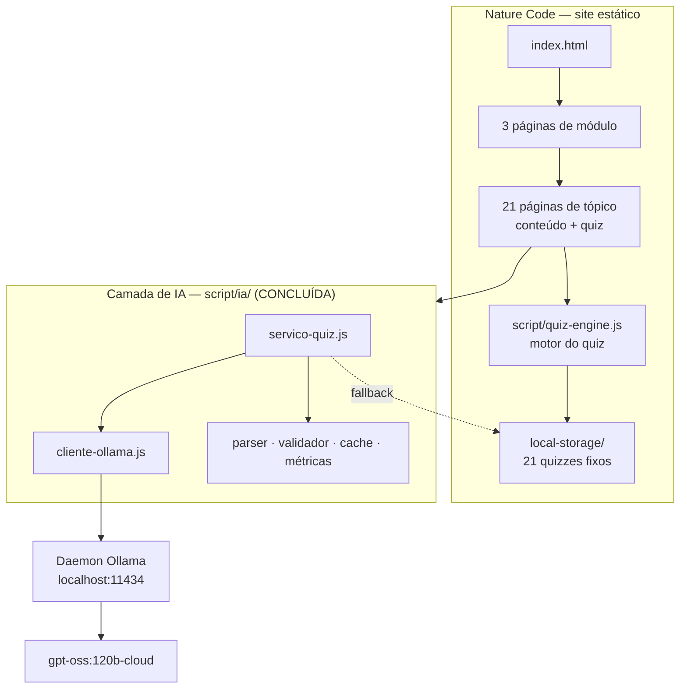
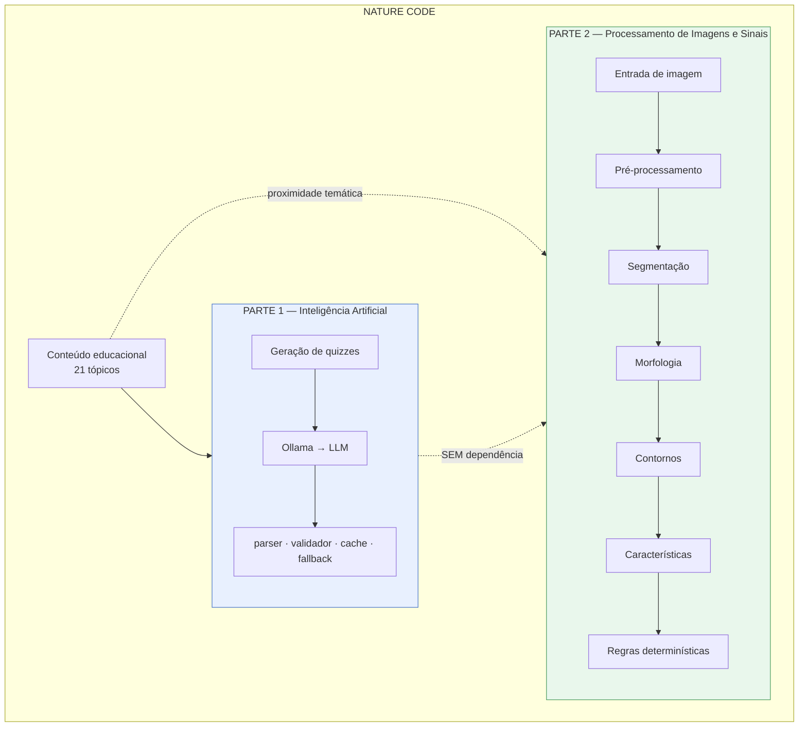
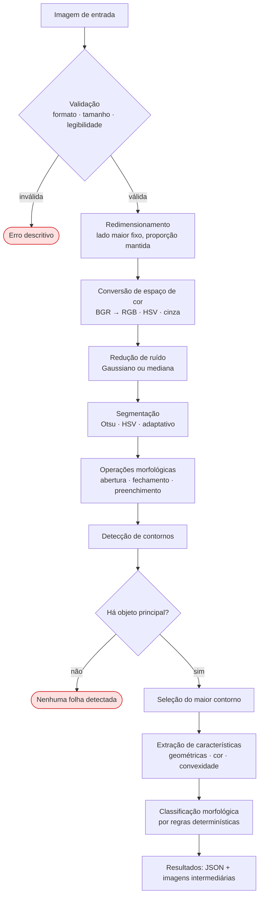

# Fase 0 — Auditoria e planejamento

## Análise Morfológica de Folhas por Processamento Digital de Imagens

> **Disciplina:** Processamento de Imagens e Sinais
> **Regra fundamental desta etapa: nenhuma Inteligência Artificial.** Nem rede neural, nem
> modelo pré-treinado, nem classificador aprendido, nem LLM interpretando imagem. Apenas
> algoritmos determinísticos sobre pixels.
>
> **Estado desta fase: auditoria e proposta.** Nenhum código funcional foi alterado.
> Nenhuma dependência foi instalada. Nenhum dataset foi baixado. Este é o único arquivo
> criado.

---

## 1. Objetivo da Fase 0

Antes de escrever uma linha de processamento de imagens, estabelecer com precisão:

1. o que existe hoje no repositório e em que estado;
2. onde a nova funcionalidade se encaixa sem ameaçar o que já funciona;
3. quais riscos reais precisam de decisão antes da implementação;
4. qual arquitetura, pipeline, estrutura de arquivos, dataset e estratégia de testes propor.

**Há uma decisão que não posso tomar sozinho** e que muda materialmente o trabalho: como um
módulo Python se conecta a um site 100% estático. Está isolada na §6, com recomendação.

---

## 2. Estado do repositório, verificado

| | Valor auditado |
|---|---|
| Branch atual | `main` |
| HEAD | `d9f5f808000f283ef7561dc77552100d94fb9e05` (`d9f5f80`) |
| Sincronia | `main` e `origin/main` apontam para o **mesmo commit** — tudo publicado |
| Remoto | `https://github.com/Cesar-Otavio/nature-code-IA-e-processamento-de-imagens.git` |
| Branch anterior | `feat/quiz-ia` — **inteiramente contida em `main`** (`git log main..feat/quiz-ia` vazio) |
| Árvore de trabalho | Limpa, exceto dois `.zip` não versionados |

### Tags existentes — todas preservadas

| Tag | Commit | Marca |
|---|---|---|
| `fase-5-completa` | `8a85e29` | Piloto da IA concluído |
| `pronto-para-apresentacao` | `c6a2b81` | Fase 6 preparada |
| `entrega-final` | `738f6b8` | Consolidação dos resultados da Fase 6 |
| `entrega-final-documentada` | `d9f5f80` | Documentação final + créditos da equipe |

**Nenhuma tag será movida.** Novas tags só serão criadas mediante solicitação explícita.

### Regressão — linha de base medida agora

```
testar-camada-ia       67 passaram, 0 falharam
testar-integracao      46 passaram, 0 falharam
testar-diagnostico     82 passaram, 0 falharam
testar-benchmark       61 passaram, 0 falharam
```

**256 / 256 asserções, 0 falhas.** Este é o número que toda fase seguinte deve preservar.

---

## 3. Inventário auditado

| Área | O que foi examinado | Achado |
|---|---|---|
| **Árvore de arquivos** | Raiz, `pages/`, `script/`, `scripts/`, `css/`, `docs/`, `dados/`, `local-storage/`, `ferramentas/`, `images/` | 13 diretórios de topo, ~220 arquivos versionados |
| **HTML** | 27 arquivos: `index.html`, 3 módulos, 21 tópicos, `modulos.html`, `diagnostico.html` | Estrutura uniforme e previsível |
| **CSS** | 9 arquivos em `css/` e `css/reutilizaveis/` | Nenhum CSS específico de plantas — o módulo usa `topics.css` compartilhado |
| **JavaScript** | 52 arquivos: motor do quiz, 9 da camada de IA, 21 quizzes fixos, efeitos visuais, 12 scripts Node | Sem framework, sem build, sem `node_modules` |
| **Módulo de IA** | `script/ia/` — 2.170 linhas em 9 arquivos | Concluído, testado, **não será tocado** |
| **Documentação** | 13 arquivos em `docs/`, 2 JSONs de benchmark, 9 de piloto | ~30.000 palavras já escritas |
| **Testes** | 4 suítes Node, 256 asserções | Todas passando |
| **Git** | Branches, tags, remoto, histórico de 37 commits | Íntegro e publicado |
| **README raiz** | 82 linhas | **Desatualizado** — ver §10, risco R4 |
| **`requirements.txt`** | — | **Não existe** |
| **Python no projeto** | Busca por `*.py` | **Nenhum arquivo Python existe hoje** |
| **Backend** | Busca por `express`, `flask`, `listen(` | **Nenhum. O site é 100% estático** |
| **`.gitignore`** | — | **Não existe** — ver risco R2 |

### Ambiente de desenvolvimento verificado

| | Resultado |
|---|---|
| Python | **3.14.3** |
| pip | 25.3 |
| `venv` | Disponível |
| NumPy | **2.4.4 já instalado** |
| OpenCV | Não instalado |
| Wheel de `opencv-python` para 3.14 | **Disponível** — `opencv_python-5.0.0.93-cp37-abi3-win_amd64.whl` (verificado por `pip install --dry-run`, sem instalar) |

A tag `cp37-abi3` significa ABI estável: o pacote funciona em Python 3.14 sem compilação.
**O risco de toolchain, que eu esperava encontrar, não se confirmou.**

---

## 4. Arquitetura atual



**Características que restringem o novo módulo:**

1. **Sem backend.** Tudo roda no navegador; o site é servido por `python -m http.server 8000`.
2. **Sem etapa de build.** Scripts clássicos com globais; nenhum bundler, nenhum npm.
3. **A camada de IA é autocontida** em `script/ia/` e acoplada ao site por **um único ponto**:
   as 10 linhas de `<script>` no fim de cada página de tópico, mais 10 linhas em
   `quiz-engine.js`. É o modelo de integração de menor risco já validado no projeto — e é
   o modelo que proponho repetir.

---

## 5. Módulo Reino das Plantas — onde integrar

### Páginas existentes

| Arquivo | Papel |
|---|---|
| `pages/modulos/plantas.html` | Índice do módulo — 5 cartões, 100 linhas |
| `pages/modulos/topicos/topicos-plantas/reino-plantae.html` | Tópico, 189 linhas |
| `.../briofitas.html` · `.../pteridofitas.html` · `.../gimnospermas.html` · `.../angiospermas.html` | Tópicos |

Cada página de tópico tem a mesma anatomia: cabeçalho → `.content` (teoria) →
`.quiz-container` (quiz) → bloco de `<script>`.

### Achado relevante, e honesto

**O conteúdo de plantas do site quase não trata de morfologia foliar.** Contagem de menções
a folha/limbo/nervura por página:

| Página | Menções |
|---|---:|
| `gimnospermas.html` | 3 |
| `pteridofitas.html` | 3 |
| `angiospermas.html` | 2 |
| `reino-plantae.html` | 1 |
| `briofitas.html` | 1 |

Os conceitos-chave extraídos para a base de conhecimento confirmam: ciclo haplonte-diplonte,
habitat, produção de esporos, flores e frutos. **Morfologia de folha não é um tópico
existente.**

**Consequência para o planejamento:** a nova funcionalidade se liga ao módulo Plantas por
**proximidade temática**, não por ancoragem em conteúdo já escrito. Isso é aceitável e
deve ser dito com todas as letras na documentação — a alternativa seria escrever conteúdo
didático novo sobre morfologia foliar, o que amplia o escopo e não foi pedido.

### Precedente arquitetural: a página de diagnóstico

`ferramentas/diagnostico.html` é uma página **fora do fluxo do site**, com CSS próprio
embutido, que não é alcançada por nenhum link das páginas de conteúdo. Ela demonstrou que é
possível acrescentar uma ferramenta completa ao projeto **sem tocar em nenhuma página
existente**. É o precedente que proponho seguir.

---

## 6. ⚠️ Decisão que precisa da sua escolha

**O problema:** a entrega exige `requirements.txt`, logo o processamento é em **Python com
OpenCV**. Mas o Nature Code é um site **estático** — não há backend, e Python não roda no
navegador. As duas coisas não se conectam sozinhas.

Três caminhos possíveis. Nenhum é obviamente certo, e a escolha muda o que será construído
nas Fases 8 e 9.

### Opção A — Python offline + galeria estática de resultados

O pipeline roda no terminal, processa imagens do dataset e grava resultados (JSON + PNGs
intermediários) em `processamento-imagens/resultados/`. Uma página nova do site lê esses
arquivos e exibe a análise já feita.

| | |
|---|---|
| ✅ | Mantém o site 100% estático, sem servidor novo. Zero risco para IA e quizzes |
| ✅ | Publicável no GitHub Pages junto com o resto |
| ✅ | Menor esforço, maior previsibilidade |
| ❌ | **O usuário não envia a própria imagem** — vê resultados pré-processados |
| ❌ | O enunciado diz *"o usuário deverá poder fornecer uma imagem"*; esta opção atende só parcialmente |

### Opção B — Backend local mínimo (Flask ou FastAPI) ⭐ recomendada

Um servidor Python local recebe o upload, executa o pipeline e devolve JSON + imagens. A
página do site faz `fetch` para ele.

| | |
|---|---|
| ✅ | **Atende o enunciado por inteiro:** upload real, processamento real, resultado na hora |
| ✅ | Arquiteturalmente **simétrico ao módulo de IA**, que também depende de um daemon local (`localhost:11434`). O projeto já assume "serviço local em execução" |
| ✅ | O mesmo pipeline serve à CLI e à web — um código, duas portas de entrada |
| ⚠️ | Acrescenta uma dependência de execução (`uvicorn`/`flask run`) e uma porta |
| ⚠️ | Exige tratar CORS, como já foi preciso com o Ollama |

### Opção C — Reimplementar em JavaScript no navegador

Canvas e `ImageData`, sem Python.

| | |
|---|---|
| ✅ | Site continua sozinho, sem servidor |
| ❌ | **`requirements.txt` perde sentido** — e é exigência formal da entrega |
| ❌ | Reimplementar Otsu, morfologia e contornos à mão é trabalho alto e frágil |
| ❌ | A disciplina espera ferramental clássico de PDI |

> ### Recomendação: **Opção B**, com a CLI da Opção A mantida
>
> O pipeline nasce como biblioteca Python testável, com **duas portas de entrada**: a CLI
> (`python pipeline.py imagem.jpg`), que é o que será testado e demonstrado com segurança, e
> uma API local fina por cima dela, que dá o upload interativo.
>
> Assim a demonstração tem **plano A e plano B naturais**: se o servidor não subir na
> apresentação, a CLI e os resultados já gravados continuam disponíveis.
>
> **Preciso da sua confirmação antes da Fase 1.**

---

## 7. Arquitetura proposta



### A separação, em regras verificáveis

| Regra | Como será verificada |
|---|---|
| O processamento **não importa** nada da camada de IA | Teste que varre `processamento-imagens/` por `ollama`, `llm`, `prompt`, `config-ia` |
| A IA **não recebe** imagem | A camada de IA não ganha nenhum arquivo novo |
| Nenhum modelo de IA é usado no PDI | Teste que varre por `torch`, `tensorflow`, `keras`, `sklearn`, `yolo`, `cnn`, `dnn`, `cv2.dnn` |
| O `requirements.txt` não contém biblioteca de IA | Conferência automatizada da lista |

**Proponho que essas quatro verificações sejam testes automatizados**, não promessas de
documentação. É o mesmo princípio que a Fase 6 da IA adotou ao comparar hashes de prompt em
vez de afirmar que os prompts eram iguais.

---

## 8. Pipeline proposto



> **Este pipeline é uma hipótese de trabalho, não uma decisão.** Cada etapa será testada
> contra o dataset antes de entrar na versão definitiva, e **etapas que não se mostrarem
> úteis serão removidas**. A lição registrada na Fase 5 da IA vale aqui: medir antes de
> afirmar, e comparar uma variável por vez.

### Características candidatas

Divididas por confiança esperada. A decisão sobre cada uma sai da Fase 6, com dados.

| Grupo | Características | Expectativa |
|---|---|---|
| **Geométricas primárias** | área, perímetro, largura, altura, bounding box, centroide | Alta — dependem só do contorno |
| **Adimensionais derivadas** | aspect ratio, circularidade, compacidade, extensão, solidez | Alta — **as mais úteis**, por serem invariantes a escala |
| **Convexidade** | área do convex hull, solidez, defeitos de convexidade | Média — sensível a ruído de borda |
| **Orientação** | ângulo do eixo principal, elipse ajustada | Média — indefinida em formas quase circulares |
| **Cor** | média e mediana em RGB/HSV, proporção de pixels verdes | Média — depende de iluminação, **não** de espécie |
| **Histogramas** | intensidade, HSV | A definir — úteis para visualizar, discutíveis como métrica |
| **Textura** | ainda a justificar | **Só entra se houver justificativa** |

**Regra que adoto:** nenhuma métrica entra por ser fácil de calcular. Cada uma será
documentada com definição, fórmula, implementação, interpretação, unidade e limitações — e
descartada se não sustentar essas seis linhas.

---

## 9. Estrutura de arquivos proposta

```
nature-code/
│
├── processamento-imagens/              ← MÓDULO NOVO, isolado
│   ├── README.md                       Como usar o módulo sozinho
│   ├── src/
│   │   ├── __init__.py
│   │   ├── io_imagem.py                Leitura, validação, escrita
│   │   ├── preprocessing.py            Redimensionar, espaços de cor, ruído
│   │   ├── segmentation.py             Otsu, HSV, adaptativo
│   │   ├── morphology.py               Abertura, fechamento, preenchimento
│   │   ├── contours.py                 Detecção e seleção do objeto principal
│   │   ├── features.py                 Extração de características
│   │   ├── classification.py           Regras determinísticas
│   │   ├── pipeline.py                 Orquestrador + CLI
│   │   └── utils.py                    Apoio (logs, tempos, caminhos)
│   ├── tests/
│   │   ├── test_preprocessing.py
│   │   ├── test_segmentation.py
│   │   ├── test_morphology.py
│   │   ├── test_contours.py
│   │   ├── test_features.py
│   │   ├── test_classification.py
│   │   ├── test_pipeline.py
│   │   └── test_isolamento.py          ← garante ZERO IA no módulo
│   ├── exemplos/                       Poucas imagens de teste, versionadas
│   ├── resultados/                     Saídas geradas (fora do Git)
│   └── dataset/
│       └── README.md                   Como baixar; o dataset NÃO vai para o Git
│
├── docs/processamento-imagens/
│   ├── 00-PLANEJAMENTO.md              ← este arquivo
│   ├── 01-DATASET.md
│   ├── 02-PRE-PROCESSAMENTO.md
│   ├── 03-SEGMENTACAO.md
│   ├── 04-MORFOLOGIA.md
│   ├── 05-CARACTERISTICAS.md
│   ├── 06-INTEGRACAO.md
│   ├── 07-TESTES.md
│   └── 08-RESULTADOS.md
│
├── ferramentas/
│   └── analise-folha.html              Página da funcionalidade (Fase 9)
│
├── requirements.txt                    Fase 8, só com o que for usado
└── .gitignore                          ← NÃO EXISTE HOJE. Necessário (risco R2)
```

### Desvios em relação à estrutura sugerida no enunciado, com motivo

| Sugerido | Proposto | Por quê |
|---|---|---|
| `src/utils.py` genérico | `io_imagem.py` + `utils.py` | Leitura e validação são responsabilidade própria, e é onde ficam os erros de entrada |
| — | `tests/test_isolamento.py` | Transforma "não usamos IA" em verificação executável |
| `docs/.../DATASET.md` | `docs/.../01-DATASET.md` | Mantém a numeração do restante, como já se faz em `docs/` |
| Página do módulo Plantas | `ferramentas/analise-folha.html` | Segue o precedente da página de diagnóstico: **zero alteração** nas páginas existentes na primeira integração |

---

## 10. Riscos identificados

| # | Risco | Gravidade | Mitigação proposta |
|---|---|---|---|
| **R1** | **Python não roda em site estático.** Conflito arquitetural real entre a exigência de `requirements.txt` e o site sem backend | 🔴 Alta | Decisão da §6 — **aguarda sua escolha** |
| **R2** | **Não existe `.gitignore`.** `venv/`, `__pycache__/`, dataset e `resultados/` entrariam no Git por acidente | 🔴 Alta | Criar `.gitignore` na Fase 3, antes de qualquer `git add` de Python |
| **R3** | **Repositório já pesa muito.** 120 MB em `images/` (76 MB só no vídeo de fundo), `.git` com 121 MB | 🟠 Média | **Dataset nunca versionado.** Só link + instruções + poucas amostras em `exemplos/` |
| **R4** | **README raiz desatualizado.** 82 linhas, sem integrantes, sem IA, sem PDI — e é a porta de entrada da entrega | 🟠 Média | Reescrita completa na fase final, conforme §27 do enunciado |
| **R5** | **Conteúdo de plantas quase não trata de folha** (§5) | 🟠 Média | Declarar a ligação como temática, não como ancoragem em conteúdo |
| **R6** | **Segmentação clássica depende de fundo contrastante.** Folha sobre folhagem verde é caso de falha previsível | 🟠 Média | Escolher dataset de fundo uniforme; **documentar a limitação em vez de escondê-la** |
| **R7** | **Limiares arbitrários na classificação.** O erro registrado na Fase 5 da IA — medir onde o fenômeno não ocorre — tem análogo aqui | 🟠 Média | Derivar limiares da distribuição observada no dataset e registrar a amostra |
| **R8** | **Regressão no site existente** | 🟡 Baixa | Módulo isolado; 256 asserções rodadas ao fim de cada fase |
| **R9** | **Python 3.14 muito recente** | 🟢 Resolvido | Wheel `abi3` de `opencv-python` verificada como disponível |
| **R10** | **Dataset com licença incompatível** com redistribuição | 🟡 Baixa | Verificar licença na Fase 2 **antes** de usar; nunca redistribuir |
| **R11** | Dois `.zip` de 124 MB soltos na raiz, não versionados | 🟢 Baixa | Entram no `.gitignore` do R2 |

---

## 11. Arquivos que NÃO devem ser tocados

| Caminho | Razão |
|---|---|
| `script/ia/` (9 arquivos) | Camada de IA concluída, testada e documentada |
| `script/quiz-engine.js` | Motor original; já tem a única alteração autorizada (+10/−2) |
| `local-storage/` (21 arquivos) | Quizzes fixos — último nível do fallback |
| `dados/base-conhecimento.js` | Base da geração por IA |
| `pages/modulos/topicos/` (21 HTMLs) | Integração da IA já validada |
| `scripts/testar-*.js` | As 256 asserções da linha de base |
| `docs/dados-piloto/` · `docs/dados-benchmark/` | Evidência experimental bruta |
| `docs/00-*` … `docs/06c-*` | Registro histórico das fases da IA |
| `css/` · `images/` | Site original |

**Poderão ser alterados**, nas fases indicadas: `README.md` (fase final),
`docs/DOCUMENTACAO-FINAL-NATURE-CODE.md` (fase final, para representar os dois módulos),
`index.html` (só se houver decisão de criar link para a nova página).

---

## 12. Estratégia de dataset

### Critérios de seleção, derivados do pipeline

| Critério | Por quê |
|---|---|
| **Fundo uniforme e contrastante** | Segmentação clássica sem IA depende disso (risco R6) |
| **Uma folha por imagem** | O pipeline seleciona o maior contorno |
| Espécies identificadas | Permite agrupar características por classe |
| Volume moderado (centenas a milhares) | Suficiente para distribuições, leve para manusear |
| Licença clara | Exigência de rastreabilidade acadêmica |
| Origem pública e citável | A entrega exige o link |

### Candidatos a investigar na Fase 2

> **Todos marcados como a verificar.** Nenhum foi acessado, baixado ou confirmado nesta
> fase. URL, licença, volume e estrutura serão verificados na Fase 2 e registrados em
> `01-DATASET.md`. **Não registro aqui nenhuma URL que eu não tenha conferido.**

| Candidato | Por que é candidato | A verificar |
|---|---|---|
| **Flavia Leaf Dataset** | Clássico da literatura de folhas; fundo branco uniforme, folha única centralizada — perfil quase ideal para segmentação clássica | URL atual, licença, volume |
| **Swedish Leaf Dataset** | Espécies bem balanceadas, fundo uniforme | Disponibilidade, condições de uso |
| **Leafsnap** | Grande, com subconjunto de laboratório em fundo branco | Tamanho, licença, se o subconjunto é separável |
| **PlantVillage** | Muito usado e acessível, fundo uniforme | **Ressalva:** é orientado a doenças, não a morfologia — pode não servir ao objetivo |
| **MalayaKew (MK) Leaf** | Folhas isoladas em fundo escuro | Disponibilidade pública |

**Plano de contingência:** se nenhum candidato tiver licença compatível ou continuar
acessível, a alternativa é montar um conjunto próprio pequeno — folhas fotografadas sobre
papel branco pelos integrantes — com procedimento documentado. Menor volume, mas origem e
licença completamente rastreáveis.

### Política de versionamento do dataset

1. **O dataset não entra no Git.** O repositório já tem 120 MB de imagens (R3).
2. `processamento-imagens/dataset/` recebe **apenas** um `README.md` com link e instruções.
3. `processamento-imagens/exemplos/` recebe **poucas** imagens (proposta: 5 a 10), apenas se
   a licença permitir, para os testes rodarem sem download.
4. O subconjunto de avaliação será identificado por **lista de nomes de arquivo** versionada,
   não pelas imagens em si — assim o experimento é reproduzível sem redistribuir nada.

---

## 13. Estratégia de testes

### Ferramenta

**`pytest`**, por ser o padrão do ecossistema Python. As suítes Node existentes continuam
como estão — **os dois conjuntos são independentes e nenhum substitui o outro**.

### Níveis

| Nível | Alvo | Exemplos |
|---|---|---|
| **Unitário** | Cada módulo isolado | Redimensionamento preserva proporção; Otsu devolve máscara binária; abertura remove ruído isolado; circularidade de um círculo sintético ≈ 1,0 |
| **Integração** | Pipeline completo | Imagem válida percorre todas as etapas e produz JSON com as chaves esperadas |
| **Robustez** | Entradas problemáticas | Arquivo inexistente · não-imagem · corrompido · 4000×3000 · 20×20 · folha deslocada · fundo claro · fundo escuro · ruidosa · múltiplos objetos · sem folha · JPG/PNG/BMP |
| **Isolamento** | A regra da disciplina | Varredura do módulo por importação de biblioteca de IA — **falha o teste se encontrar** |
| **Regressão** | O que já existia | As 256 asserções Node ao fim de cada fase |

### Casos sintéticos, uma técnica que o projeto já usa

Vários testes não precisam de dataset: um **círculo preto desenhado com NumPy** tem área,
perímetro e circularidade **conhecidos analiticamente**. Isso permite verificar as fórmulas
contra a matemática, não contra a expectativa de quem escreveu o código — o mesmo princípio
dos contextos `vm` com DOM dublado nas suítes de IA.

### Métricas objetivas de avaliação (Fase 10)

| Métrica | Como medir |
|---|---|
| Taxa de segmentação bem-sucedida | Inspeção visual de N imagens, critério declarado antes |
| Causas de falha | Agrupadas por categoria, com contagem |
| Tempo médio por imagem | Medido, não estimado |
| Distribuição de cada característica | Média, mediana, desvio, mínimo, máximo |
| Estabilidade dos limiares | Quantas imagens ficam perto da fronteira de classificação |

**Compromisso:** falhas serão reportadas com número. A documentação da IA registra um erro
de método cometido e corrigido; o mesmo padrão vale aqui.

---

## 14. Roadmap

| Fase | Entrega | Documento | Critério de conclusão |
|---|---|---|---|
| **0** ✅ | Auditoria e planejamento | `00-PLANEJAMENTO.md` | Este documento — **aguarda decisão da §6** |
| **1** | Definição formal do problema | — | Entrada, saída, escopo, restrições, casos válidos e inválidos |
| **2** | Dataset selecionado e documentado | `01-DATASET.md` | Link verificado, licença conferida, amostra baixada |
| **3** | Pré-processamento | `02-PRE-PROCESSAMENTO.md` | Etapas comparadas; as inúteis removidas; `.gitignore` criado |
| **4** | Segmentação | `03-SEGMENTACAO.md` | ≥3 métodos comparados no dataset, com taxa medida |
| **5** | Morfologia | `04-MORFOLOGIA.md` | Cada operação justificada por antes/depois |
| **6** | Contornos e características | `05-CARACTERISTICAS.md` | Cada métrica com as 6 linhas obrigatórias |
| **7** | Classificação por regras | (em `05`) | Limiares derivados da distribuição observada |
| **8** | Pipeline completo + `requirements.txt` | — | CLI funcionando ponta a ponta |
| **9** | Integração com o Nature Code | `06-INTEGRACAO.md` | Página nova; **256/256 preservadas** |
| **10** | Testes e avaliação | `07-TESTES.md` · `08-RESULTADOS.md` | Suíte pytest + métricas do dataset |
| **11** | Documentação final | `DOCUMENTACAO-FINAL-PROCESSAMENTO-IMAGENS.md` + README raiz | Checklist da §15 completa |
| **12** | Material de apresentação | `docs/apresentacao/` | Slides, falas, divisão, demo, perguntas |

**Regra de trabalho:** ao fim de cada fase — revisar o diff, rodar os testes relevantes,
atualizar a documentação, fazer um commit descritivo, **mostrar resultados e parar**.

---

## 15. Checklist das cinco exigências formais

Para conferência antes da entrega. Nenhuma está pronta ainda — é o estado esperado na Fase 0.

| # | Exigência | Onde ficará | Estado |
|---|---|---|---|
| 1 | Nome completo dos seis integrantes | `README.md` raiz | ⬜ Pendente (README desatualizado — R4) |
| 2 | Descrição detalhada do projeto com o pipeline de PDI, etapa por etapa | `README.md` + `DOCUMENTACAO-FINAL-PROCESSAMENTO-IMAGENS.md` | ⬜ Pendente |
| 3 | Descrição da integração com a disciplina de IA, com o pipeline completo | `README.md` + `06-INTEGRACAO.md` | ⬜ Pendente |
| 4 | `requirements.txt` | Raiz do repositório | ⬜ Pendente (Fase 8, só com o que for usado) |
| 5 | Link do dataset utilizado | `README.md` + `01-DATASET.md` | ⬜ Pendente (Fase 2) |

---

## 16. O que **não** foi feito nesta fase

Registro explícito, para não haver dúvida sobre o escopo:

- ❌ Nenhum código funcional alterado
- ❌ Nenhuma dependência instalada — a verificação do OpenCV usou `--dry-run`
- ❌ Nenhum dataset baixado ou acessado
- ❌ `requirements.txt` não criado
- ❌ `README.md` da raiz não modificado
- ❌ Nenhum arquivo Python criado
- ❌ Nenhum `git add`, nenhum commit, nenhuma tag
- ✅ Único arquivo criado: **este documento**

---

## 17. O que preciso de você para iniciar a Fase 1

1. **A decisão da §6** — Opção A, B (recomendada) ou C. É o que define a Fase 9 e o formato
   da demonstração.
2. **Confirmação da estrutura da §9**, ou os ajustes que preferir.
3. **Confirmação da política de dataset da §12** — em especial, que o dataset **não** será
   versionado no Git.

Com essas três respostas, a Fase 1 começa pela definição formal do problema, e a Fase 2 pela
verificação dos candidatos a dataset.

---

*Fase 0 concluída em 19 de setembro de 2026, sobre o commit `d9f5f80` (tag
`entrega-final-documentada`), com as 256 asserções da etapa de IA verificadas e passando.*
