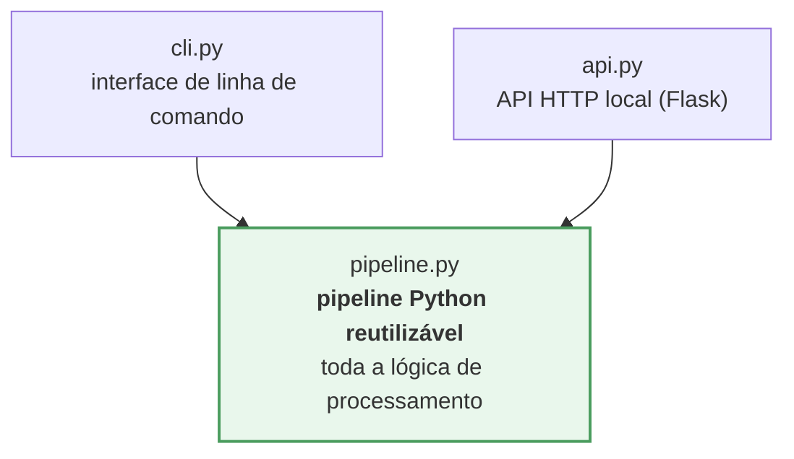
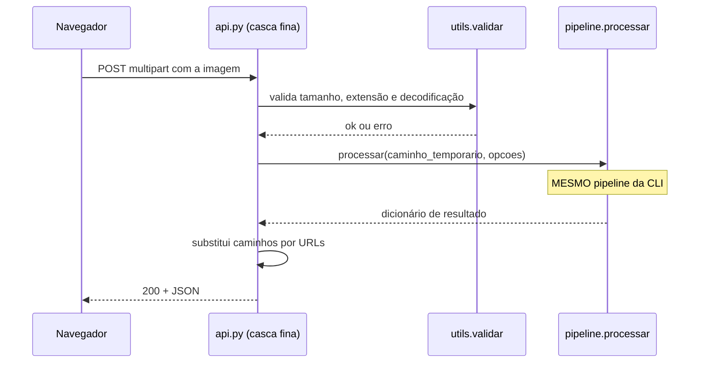
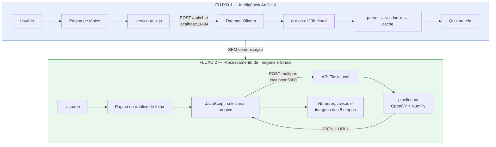

# Fase 1 — Definição formal do problema e contrato do pipeline

> **Estado desta fase: especificação.** Nenhuma linha de Python foi escrita, nenhuma
> dependência instalada, nenhum dataset baixado, nenhum HTML/CSS/JS tocado.
> Arquivos criados: este documento e `.gitignore`.
>
> Este documento é o **contrato** que as fases seguintes devem cumprir. Onde um valor
> numérico ainda não pode ser justificado, ele está marcado como **a definir** — e será
> derivado de medição, não de opinião.

---

## Índice

| | Seção |
|---|---|
| 1 | [Decisões herdadas e confirmadas](#1-decisões-herdadas-e-confirmadas) |
| 2 | [Definição formal do problema](#2-definição-formal-do-problema) |
| 3 | [O que este módulo explicitamente não faz](#3-o-que-este-módulo-explicitamente-não-faz) |
| 4 | [Contrato de entrada](#4-contrato-de-entrada) |
| 5 | [Contrato de saída](#5-contrato-de-saída) |
| 6 | [Unidades](#6-unidades) |
| 7 | [Características candidatas, classificadas](#7-características-candidatas-classificadas) |
| 8 | [Fórmulas](#8-fórmulas) |
| 9 | [Invariâncias](#9-invariâncias) |
| 10 | [Classificação morfológica — objetivo, sem limiares](#10-classificação-morfológica--objetivo-sem-limiares) |
| 11 | [Casos de erro, aviso e resultado parcial](#11-casos-de-erro-aviso-e-resultado-parcial) |
| 12 | [Resultados intermediários](#12-resultados-intermediários) |
| 13 | [Desenho conceitual da CLI](#13-desenho-conceitual-da-cli) |
| 14 | [Desenho conceitual da API](#14-desenho-conceitual-da-api) |
| 15 | [Interação com o site](#15-interação-com-o-site) |
| 16 | [Segurança da API local](#16-segurança-da-api-local) |
| 17 | [Critérios de escolha do dataset](#17-critérios-de-escolha-do-dataset) |
| 18 | [Matriz de testes](#18-matriz-de-testes) |
| 19 | [Testes sintéticos](#19-testes-sintéticos) |
| 20 | [Critérios de sucesso do módulo](#20-critérios-de-sucesso-do-módulo) |
| 21 | [Riscos atualizados](#21-riscos-atualizados) |
| 22 | [Ligação temática com o Nature Code](#22-ligação-temática-com-o-nature-code) |
| 23 | [O que não foi feito nesta fase](#23-o-que-não-foi-feito-nesta-fase) |

---

## 1. Decisões herdadas e confirmadas

### Arquitetura — Opção B aprovada



**Regra estrutural obrigatória:** a lógica de processamento vive no pipeline. `cli.py` e
`api.py` são **cascas finas** — recebem entrada, chamam `pipeline.processar()`, serializam a
saída. Nenhuma decisão de processamento pode existir dentro deles.

Essa regra terá verificação automatizada (§18, nível ISOLAMENTO): os módulos `cli.py` e
`api.py` não podem importar `cv2` nem `numpy` diretamente.

### Framework: Flask

API local pequena, reprodução simples, adequada à demonstração acadêmica. **Não será
instalado nesta fase.**

### Estrutura de arquivos aprovada

```
processamento-imagens/
├── README.md
├── src/
│   ├── __init__.py
│   ├── preprocessing.py     Redimensionamento, espaços de cor, redução de ruído
│   ├── segmentation.py      Otsu, HSV, limiarização adaptativa
│   ├── morphology.py        Abertura, fechamento, preenchimento
│   ├── contours.py          Detecção e seleção do objeto principal
│   ├── features.py          Extração de características
│   ├── classification.py    Regras determinísticas
│   ├── pipeline.py          Orquestrador — ÚNICA fonte da lógica
│   ├── api.py               Casca fina: Flask
│   ├── cli.py               Casca fina: linha de comando
│   └── utils.py             Validação de entrada, E/S, logs, tempos
├── tests/
│   ├── test_preprocessing.py · test_segmentation.py · test_morphology.py
│   ├── test_features.py · test_pipeline.py · test_robustez.py
│   └── test_isolamento.py
├── exemplos/
├── resultados/
└── dataset/
    └── README.md
```

**Ajuste em relação à Fase 0:** `io_imagem.py` foi absorvido por `utils.py`, e `api.py` e
`cli.py` foram acrescentados conforme a decisão de arquitetura.

### Renumeração dos documentos

A Fase 0 propôs uma sequência; a decisão desta fase estabeleceu outra. **A sequência oficial
é a aprovada agora:**

| Nº | Documento | Fase |
|---|---|---|
| 00 | `00-PLANEJAMENTO.md` | 0 — auditoria ✅ |
| 01 | `01-DEFINICAO-PROBLEMA.md` | 1 — este documento ✅ |
| 02 | `02-DATASET.md` | 2 |
| 03 | `03-PRE-PROCESSAMENTO.md` | 3 |
| 04 | `04-SEGMENTACAO.md` | 4 |
| 05 | `05-MORFOLOGIA.md` | 5 |
| 06 | `06-CARACTERISTICAS.md` | 6 e 7 |
| 07 | `07-PIPELINE.md` | 8 |
| 08 | `08-INTEGRACAO.md` | 9 |
| 09 | `09-TESTES.md` | 10 |
| 10 | `10-RESULTADOS.md` | 10 |

O roadmap da §14 do `00-PLANEJAMENTO.md` usa a numeração antiga. **O documento histórico não
foi reescrito** — esta tabela é a referência válida.

### `.gitignore` criado

Cobre ambiente Python, artefatos de teste, dataset, compactados, resultados temporários e
arquivos de sistema. **Verificado:** nenhum dos 220 arquivos versionados passou a ser
ignorado, e os dois pacotes `.zip` de 124 MB saíram do controle do Git.

Duas exceções deliberadas, protegidas com `!`:

- `processamento-imagens/dataset/README.md`, `manifesto.csv` e `amostras.txt` — documentação
  e rastreabilidade do dataset **são versionadas**;
- `processamento-imagens/resultados/evidencias/` — os resultados escolhidos como evidência
  acadêmica **são versionados**; o restante de `resultados/` não.

---

## 2. Definição formal do problema

> **Análise morfológica de uma folha de planta utilizando processamento digital clássico de
> imagens.**

### Formulação

Dada uma imagem digital $I$ contendo preferencialmente uma folha em primeiro plano sobre um
fundo contrastante, o módulo deve:

1. **separar** a região da folha do fundo, produzindo uma máscara binária $M$;
2. **extrair** o contorno $C$ do objeto principal a partir de $M$;
3. **calcular** um conjunto de descritores geométricos e de cor sobre $C$ e sobre a região
   por ele delimitada;
4. **registrar** representações visuais de cada etapa;
5. **classificar**, por regras determinísticas, propriedades de forma simples — *quando e se*
   essas regras se mostrarem defensáveis após a análise do dataset.

Todo o processamento é **determinístico**: a mesma imagem com os mesmos parâmetros produz
exatamente o mesmo resultado. Não há aprendizado, não há pesos, não há aleatoriedade.

### Natureza do método

| | |
|---|---|
| **Paradigma** | Processamento digital de imagens clássico |
| **Base** | Álgebra sobre matrizes de pixels, espaços de cor, estatística de histograma, morfologia matemática, geometria de contornos |
| **Decisão** | Regras explícitas, escritas por pessoas, com limiares justificados |
| **Reprodutibilidade** | Total — função pura da entrada e dos parâmetros |

---

## 3. O que este módulo explicitamente **não** faz

Esta seção é tão importante quanto a anterior. As promessas abaixo **não** serão feitas em
nenhum lugar do projeto — nem no código, nem na documentação, nem nos slides.

| ❌ Não faz | Por quê |
|---|---|
| **Reconhecimento de espécie** | Exigiria base taxonômica validada e método estatístico. Descritores geométricos de uma folha não determinam espécie |
| **Diagnóstico de doença** | Exigiria validação fitopatológica. Afirmar isso seria indevido |
| **Identificação botânica automática** | Mesmo motivo |
| **Classificação taxonômica** | Mesmo motivo |
| **Qualquer uso de IA** | Regra da disciplina: sem rede neural, sem modelo pré-treinado, sem aprendizado de máquina, sem LLM interpretando imagem, sem API externa de visão |

**O que faz:** análise geométrica e visual de uma folha, com números verificáveis e
imagens intermediárias que mostram como cada número foi obtido.

### Vocabulário obrigatório

| ❌ Não dizer | ✅ Dizer |
|---|---|
| "a IA analisa a folha" | "o pipeline de processamento analisa a folha" |
| "o modelo classifica" | "a regra determinística classifica" |
| "treinamos" / "aprendeu" | "definimos o limiar" / "a regra foi calibrada sobre o dataset" |
| "identifica a espécie" | "descreve a forma" |
| "detecta doença" | — (não se diz; está fora do escopo) |
| "predição" | "cálculo" / "medição" |

---

## 4. Contrato de entrada

### Formatos

| Formato | Situação | Motivo |
|---|---|---|
| **JPEG** (`.jpg`, `.jpeg`) | ✅ Aceito | Formato dominante em datasets de folhas e em fotos de celular |
| **PNG** (`.png`) | ✅ Aceito | Sem perdas; comum em datasets segmentados |
| **BMP** (`.bmp`) | ✅ Aceito | Sem perdas; aparece em datasets clássicos de folhas |
| TIFF, WEBP | ⬜ A avaliar na Fase 2 | Só entram se o dataset escolhido os utilizar |
| GIF, SVG, PDF, vídeo | ❌ Recusado | Animação, vetor ou documento — não são imagem raster única |

**A extensão nunca é a única validação.** O arquivo é aceito apenas se **decodificar como
imagem**. Um `.jpg` que não decodifica é recusado como corrompido (§11, `E003`).

### Níveis de entrada

#### 🟢 Entrada IDEAL — o pipeline foi projetado para este caso

| Condição | Justificativa |
|---|---|
| Exatamente **uma** folha em primeiro plano | A seleção do objeto principal escolhe o maior contorno; um segundo objeto de área comparável torna a escolha ambígua |
| **Fundo uniforme e contrastante** (papel branco, fundo preto, superfície lisa) | Segmentação clássica separa por intensidade ou cor. Sem contraste, não há o que limiarizar |
| Folha **inteira** e **inteiramente dentro** do quadro | Área e perímetro de objeto cortado são medidas de um objeto diferente do real |
| Iluminação **razoavelmente uniforme**, sem sombra dura nem reflexo especular | Sombra é limiarizada como objeto; reflexo, como fundo |
| Folha aproximadamente **plana** e de frente | Curvatura e perspectiva alteram a projeção e, portanto, todas as medidas |
| Sem sobreposição de outros objetos | Régua, mão ou etiqueta tocando a folha fundem-se a ela na máscara |
| Resolução **acima do mínimo** (a definir na Fase 3) | Descritores de contorno degradam com poucos pixels |

#### 🟡 Entrada ACEITÁVEL — processa, com aviso

| Condição | Consequência |
|---|---|
| Fundo com leve textura ou gradiente suave | Máscara mais ruidosa; a morfologia tende a corrigir |
| Pequena sombra projetada | Pode inflar a área; gera aviso `A003` |
| Folha deslocada do centro, mas inteira | Sem efeito — as medidas não dependem de posição |
| Folha rotacionada em qualquer ângulo | Sem efeito sobre descritores invariantes a rotação (§9) |
| Pecíolo (cabinho) presente | Afeta perímetro e solidez; é uma característica real da folha, não um defeito — mas precisa ser **documentado**, porque parte da literatura remove o pecíolo |
| Pequenas perfurações ou danos na borda | Afetam perímetro e solidez de forma mensurável |
| Resolução muito alta (> 3000 px) | Redimensionada antes do processamento |

#### 🟠 Entrada PROBLEMÁTICA — processa, mas o resultado é pouco confiável

| Condição | Consequência |
|---|---|
| Fundo com contraste fraco (folha verde sobre folhagem) | Segmentação provavelmente falha; aviso `A003` |
| Várias folhas de tamanho semelhante | O maior contorno é escolhido; aviso `A002`; o resultado descreve **uma** delas |
| Folha tocando a borda do quadro | Área e perímetro subestimados; aviso `A001` |
| Sombra severa ou reflexo especular forte | Máscara distorcida; avisos `A003`/`A005` |
| Imagem muito escura ou muito clara | Histograma comprimido; limiarização instável; avisos `A004`/`A005` |
| Folha ocupando menos de uma fração mínima da imagem | Poucos pixels úteis; aviso `A007` |
| Folha ocupando quase todo o quadro | Provável corte nas bordas; avisos `A001`/`A008` |

> **Compromisso:** entrada problemática **não** é recusada em silêncio nem processada como
> se estivesse tudo bem. Ela produz resultado **com aviso nomeado**, e o aviso viaja junto
> com o número.

#### 🔴 Entrada INVÁLIDA — erro fatal, sem resultado

| Condição | Código |
|---|---|
| Arquivo não existe | `E001` |
| Extensão não suportada | `E002` |
| Arquivo não decodifica como imagem | `E003` |
| Imagem vazia ou com dimensão zero | `E004` |
| Resolução abaixo do mínimo | `E005` |
| Arquivo acima do tamanho máximo | `E006` |
| Nenhum objeto detectado após segmentação | `E007` |

### Limites numéricos

| Limite | Valor | Estado |
|---|---|---|
| Resolução mínima | — | **A definir na Fase 3**, medindo a degradação dos descritores em imagens progressivamente reduzidas |
| Tamanho máximo de arquivo | — | **A definir na Fase 8**, ao dimensionar a API |
| Lado maior após redimensionamento | — | **A definir na Fase 3**, comparando custo de tempo × estabilidade das medidas |
| Fração mínima da imagem ocupada pelo objeto | — | **A definir na Fase 4**, a partir da distribuição observada |

**Nenhum valor será fixado sem justificativa medida.** É a mesma disciplina que a etapa de
IA adotou ao definir `numPredict: 4500` por medição, e não por estimativa.

---

## 5. Contrato de saída

Estrutura única, produzida pelo pipeline e usada **igualmente** pela CLI e pela API.

```json
{
  "status": "sucesso | sucesso_com_avisos | erro",
  "versao_pipeline": "0.1.0",
  "timestamp_utc": "2026-09-19T14:32:10Z",

  "entrada": {
    "arquivo": "folha-001.jpg",
    "formato": "JPEG",
    "largura_original_px": 1600,
    "altura_original_px": 1200,
    "bytes": 384512
  },

  "processamento": {
    "largura_processada_px": 1024,
    "altura_processada_px": 768,
    "fator_escala": 0.64,
    "espaco_de_cor": "HSV",
    "metodo_reducao_ruido": "gaussiano",
    "metodo_segmentacao": "otsu",
    "operacoes_morfologicas": ["abertura", "fechamento"],
    "tempo_total_ms": 180,
    "tempo_por_etapa_ms": {
      "leitura": 12, "redimensionamento": 4, "conversao": 3,
      "ruido": 9, "segmentacao": 21, "morfologia": 18,
      "contornos": 7, "caracteristicas": 6
    }
  },

  "objeto": {
    "detectado": true,
    "contornos_encontrados": 3,
    "fracao_da_area_da_imagem": 0.42,
    "toca_borda": false
  },

  "caracteristicas": {
    "geometricas": {
      "area_px2": 145320,
      "perimetro_px": 1842.5,
      "largura_px": 410,
      "altura_px": 720,
      "bounding_box": { "x": 307, "y": 24, "largura": 410, "altura": 720 },
      "bounding_box_rotacionada": {
        "centro_px": [512, 384], "largura_px": 398, "altura_px": 716,
        "angulo_graus": 87.3
      },
      "centroide_px": { "x": 511, "y": 390 },
      "area_convex_hull_px2": 151200
    },
    "adimensionais": {
      "aspect_ratio": 0.569,
      "aspect_ratio_rotacionado": 0.556,
      "circularidade": 0.538,
      "solidez": 0.961,
      "extent": 0.492
    },
    "orientacao": {
      "angulo_graus": 87.3,
      "confiavel": true
    },
    "cor": {
      "media_rgb": [86, 124, 61],
      "media_hsv": [46, 128, 124],
      "mediana_rgb": [84, 126, 58],
      "proporcao_pixels_verdes": 0.88
    }
  },

  "classificacao": {
    "forma": null,
    "metodo": "regras_deterministicas",
    "versao_regras": null,
    "observacao": "não habilitada nesta versão — ver 06-CARACTERISTICAS.md"
  },

  "avisos": [
    { "codigo": "A006", "mensagem": "Baixa proporção de pixels verdes na região segmentada." }
  ],

  "erro": null,

  "imagens_intermediarias": {
    "original":     "resultados/folha-001/00-original.png",
    "redimensionada":"resultados/folha-001/01-redimensionada.png",
    "espaco_cor":   "resultados/folha-001/02-espaco-cor.png",
    "suavizada":    "resultados/folha-001/03-suavizada.png",
    "mascara":      "resultados/folha-001/04-mascara.png",
    "mascara_morf": "resultados/folha-001/05-mascara-morfologia.png",
    "contorno":     "resultados/folha-001/06-contorno.png",
    "final":        "resultados/folha-001/07-final.png"
  }
}
```

### Regras do contrato

1. **Estrutura estável.** As chaves existem sempre. Valor indisponível é `null`, nunca chave
   ausente — assim consumidores não precisam testar existência.
2. **`status` tem três valores**, e só três. `sucesso_com_avisos` existe para que "funcionou"
   e "funcionou perfeitamente" não sejam confundidos.
3. **Em `erro`, `caracteristicas` é `null`** e `erro` traz `{codigo, mensagem}`.
4. **`avisos` é sempre uma lista**, possivelmente vazia.
5. **Toda característica declara sua unidade no nome** — `_px`, `_px2`, `_graus`, ou nenhum
   sufixo para adimensionais.
6. **`processamento` registra o que foi de fato aplicado.** Se o método de segmentação mudar
   entre versões, o JSON antigo continua dizendo qual foi usado — rastreabilidade.
7. **Tempos por etapa** permitem discutir custo computacional com número, não com impressão.
8. **A mesma estrutura serve CLI e API.** A API pode substituir caminhos de arquivo por URLs,
   e nada mais muda.

---

## 6. Unidades

**Não há objeto de referência de tamanho conhecido nas imagens.** Sem calibração física, é
impossível converter pixel em milímetro: o mesmo objeto fotografado de mais perto ocupa mais
pixels.

> **Regra absoluta: nenhuma medida será expressa em cm ou mm.** Fazer isso exigiria uma
> régua, moeda ou marcador de dimensão conhecida no enquadramento — o que o dataset não
> garante e o usuário não fornece.

| Grandeza | Unidade | Notação |
|---|---|---|
| Área | pixels ao quadrado | `area_px2` |
| Perímetro | pixels | `perimetro_px` |
| Largura, altura | pixels | `largura_px` |
| Centroide | pixels (coordenada) | `centroide_px` |
| Ângulo | graus | `angulo_graus` |
| Tempo | milissegundos | `tempo_total_ms` |
| **Aspect ratio, circularidade, solidez, extent, proporção de verde** | **adimensional** | sem sufixo |
| Cor | níveis inteiros do canal (0–255) | `media_rgb` |

As grandezas adimensionais são **as comparáveis entre imagens**, justamente por não
dependerem de escala. É o que as torna as mais valiosas do conjunto (§9).

---

## 7. Características candidatas, classificadas

Análise técnica de cada candidata, com a classificação pedida.

### 🟩 ESSENCIAL — sem elas não há análise morfológica

| Característica | Por que é essencial |
|---|---|
| **Área** | Base de circularidade, solidez e extent. É a medida primária da região |
| **Perímetro** | Base da circularidade. Descreve o comprimento da borda — e é sensível a recortes e serrilhas, que são informação morfológica real |
| **Bounding box** | Base de largura, altura, aspect ratio e extent |
| **Largura e altura** | Dimensões diretas; necessárias para o aspect ratio |
| **Aspect ratio** | **O descritor de forma mais direto:** separa folha alongada de folha larga. Adimensional |
| **Circularidade** | Mede quanto a forma se aproxima de um círculo. Adimensional e clássico na literatura |
| **Convex hull + Solidez** | Solidez distingue borda lisa de borda recortada/lobada — informação morfológica que nenhum outro descritor da lista captura |
| **Extent** | Quanto do retângulo envolvente a folha de fato preenche |
| **Centroide** | Necessário para anotar a imagem final e para calcular orientação |

### 🟦 ÚTIL — agregam valor, com ressalva conhecida

| Característica | Valor | Ressalva |
|---|---|---|
| **Orientação** | Ângulo do eixo principal; permite normalizar a folha para visualização | **Indefinida** em formas quase circulares. Precisa de campo `confiavel` |
| **Bounding box rotacionada** | Fornece um aspect ratio **invariante a rotação** — superior ao da caixa reta | Custo adicional pequeno |
| **Proporção de pixels verdes** | Sinal de sanidade: "isto se parece com uma folha viva?" Alimenta o aviso `A006` | **Não é indicador de espécie nem de saúde.** Folha seca, avermelhada ou variegada reduz o valor legitimamente |
| **Cor média (RGB e HSV)** | Descritor visual simples; HSV separa matiz de iluminação melhor que RGB | Fortemente dependente de iluminação e balanço de branco |

### 🟨 EXPERIMENTAL — entram só se a Fase 6 justificar

| Característica | Hipótese | Risco |
|---|---|---|
| **Defeitos de convexidade** | Contar e medir reentrâncias poderia descrever borda lobada ou serrilhada quantitativamente | Muito sensível a ruído da máscara; pode contar artefato como lóbulo |
| **Histograma de intensidade** | Útil para **visualizar** distribuição e justificar a limiarização nos slides | Como *característica*, é um vetor — difícil de comparar sem reduzir a estatísticas |
| **Histograma HSV** | Idem, com separação de matiz | Idem |
| **Número de componentes conectados** | Diagnóstico da qualidade da máscara → alimenta o aviso `A010` | É métrica **do processamento**, não da folha. Fica em `objeto`, não em `caracteristicas` |
| **Mediana de cor** | Mais robusta a outliers que a média | Provavelmente redundante com a média; só se justifica se a média se mostrar instável |

### 🟥 DESCARTAR INICIALMENTE — com motivo

| Característica | Por que descartar |
|---|---|
| **Compacidade** | Na definição padrão, $\text{compacidade} = P^2/(4\pi A)$, que é **exatamente o inverso da circularidade**. Reportar as duas é apresentar o mesmo número duas vezes e sugerir uma riqueza que não existe. **Mantém-se apenas a circularidade** |
| **Textura** | O enunciado a admite "se justificável". Não há justificativa formulada: sem hipótese sobre o que a textura da folha revelaria no escopo geométrico, uma matriz de coocorrência seria número sem pergunta. **Reavaliar na Fase 6, apenas se surgir pergunta concreta** |
| **Bordas (Canny) como característica** | Canny é excelente **ferramenta** — para segmentação e para visualização. Mas "quantidade de pixels de borda" não é descritor morfológico interpretável: varia com limiar, ruído e resolução. **Usar como ferramenta, não reportar como número** |

> **Princípio adotado:** nenhuma métrica entra por ser fácil de calcular. Cada uma que entrar
> terá, na Fase 6, as seis linhas obrigatórias — definição, fórmula, implementação,
> interpretação, unidade e limitações. Métrica que não sustente essas seis linhas é removida.

---

## 8. Fórmulas

Definições conferidas e notação explícita. $A$ = área do contorno, $P$ = perímetro do
contorno, $w$ e $h$ = largura e altura da caixa envolvente.

### Aspect ratio

$$\text{AR} = \frac{w}{h}$$

Adimensional. $\text{AR} < 1$ indica forma mais alta que larga; $> 1$, mais larga que alta;
$\approx 1$, aproximadamente quadrada no envelope.

**Duas variantes serão calculadas:**

| Variante | Caixa | Invariante a rotação? |
|---|---|---|
| `aspect_ratio` | Caixa reta, alinhada aos eixos | ❌ **Não** |
| `aspect_ratio_rotacionado` | Caixa de área mínima | ✅ **Sim** |

A segunda é a que descreve a forma; a primeira descreve o enquadramento. Reportar as duas
deixa a diferença visível — e é um bom material de discussão na apresentação.

### Circularidade

$$\text{Circularidade} = \frac{4\pi A}{P^{2}}$$

Adimensional, com máximo teórico **1,0** para o círculo perfeito, decrescendo conforme a
forma se alonga ou a borda se torna irregular.

> **⚠️ Advertência de digitalização, e ela importa.** Em imagem discreta, o perímetro medido
> ao longo da cadeia de pixels **superestima** o perímetro geométrico real — a borda em
> "escada" é mais longa que a curva suave que aproxima. Como $P$ está ao quadrado no
> denominador, a circularidade medida de um círculo rasterizado fica **sistematicamente
> abaixo de 1,0**, e o desvio **cresce quando o raio diminui**.
>
> Consequências práticas, que a Fase 6 deve tratar:
> 1. os testes sintéticos precisam de **tolerância calibrada empiricamente**, não de
>    comparação com 1,0 exato;
> 2. comparar circularidade entre imagens de resoluções muito diferentes exige cautela;
> 3. o método de cálculo do perímetro (com ou sem aproximação poligonal) deve ser
>    **registrado no JSON**, porque muda o número.

### Solidez

$$\text{Solidez} = \frac{A}{A_{\text{hull}}}$$

Adimensional, no intervalo $(0, 1]$. Vale 1,0 para forma convexa. Quanto mais recortada,
lobada ou serrilhada a borda, menor o valor — **é o descritor que captura recorte de borda**.

### Extent

$$\text{Extent} = \frac{A}{w \cdot h}$$

Adimensional, em $(0, 1]$. Fração da caixa envolvente efetivamente ocupada. Um retângulo
perfeitamente alinhado dá 1,0; um círculo dá $\pi/4 \approx 0{,}785$; uma folha lanceolada,
bem menos.

Calculado sobre a **caixa reta**, portanto **sensível a rotação** — o que precisa constar da
interpretação.

### Centroide

A partir dos momentos de imagem $M_{ij}$:

$$c_x = \frac{M_{10}}{M_{00}}, \qquad c_y = \frac{M_{01}}{M_{00}}$$

com $M_{00} = A$. Indefinido se $A = 0$ — condição que não ocorre, pois um contorno de área
nula não é selecionado como objeto principal.

### Orientação

Ângulo do eixo principal, pelos momentos centrais de segunda ordem:

$$\theta = \frac{1}{2}\arctan\!\left(\frac{2\mu_{11}}{\mu_{20} - \mu_{02}}\right)$$

Em graus. **Indefinido quando $\mu_{20} \approx \mu_{02}$ e $\mu_{11} \approx 0$** — isto é,
em formas aproximadamente circulares, onde não existe eixo dominante. Daí o campo
`orientacao.confiavel`.

### Proporção de pixels verdes

$$\text{Verde} = \frac{|\{p \in M : H(p) \in [H_{\min}, H_{\max}] \wedge S(p) \ge S_{\min} \wedge V(p) \ge V_{\min}\}|}{|M|}$$

onde $M$ é a máscara do objeto e $H, S, V$ os canais de matiz, saturação e valor.

Os limites $H_{\min}, H_{\max}, S_{\min}, V_{\min}$ são **a definir na Fase 4**, a partir da
distribuição de matiz observada no dataset. **Não serão chutados.**

### Fórmulas conferidas

Cada definição acima foi verificada quanto a: intervalo de valores, valor para formas de
referência (círculo, quadrado), comportamento nos extremos e condições de indefinição. As
condições de indefinição estão explicitadas — não escondidas em divisão por zero.

---

## 9. Invariâncias

Determina quais características são comparáveis entre imagens diferentes. **É a seção que
justifica a escolha das características.**

| Característica | Escala | Rotação | Translação | Iluminação | Resolução |
|---|:---:|:---:|:---:|:---:|:---:|
| Área (px²) | ❌ | ✅ | ✅ | ⚠️ | ❌ |
| Perímetro (px) | ❌ | ✅ | ✅ | ⚠️ | ❌ |
| Largura, altura (px) | ❌ | ❌ | ✅ | ⚠️ | ❌ |
| Centroide (px) | ❌ | ❌ | ❌ | ⚠️ | ❌ |
| Área do convex hull (px²) | ❌ | ✅ | ✅ | ⚠️ | ❌ |
| **Aspect ratio** (caixa reta) | ✅ | ❌ | ✅ | ⚠️ | ✅ |
| **Aspect ratio rotacionado** | ✅ | ✅ | ✅ | ⚠️ | ✅ |
| **Circularidade** | ✅ | ✅ | ✅ | ⚠️ | ⚠️ |
| **Solidez** | ✅ | ✅ | ✅ | ⚠️ | ⚠️ |
| **Extent** (caixa reta) | ✅ | ❌ | ✅ | ⚠️ | ✅ |
| Orientação (graus) | ✅ | ❌ | ✅ | ⚠️ | ✅ |
| Cor média / mediana | ✅ | ✅ | ✅ | ❌ | ✅ |
| Proporção de verde | ✅ | ✅ | ✅ | ❌ | ✅ |

**Legenda:** ✅ invariante · ⚠️ aproximadamente invariante ou indiretamente afetado ·
❌ depende

### Leitura das colunas

**Escala.** Área, perímetro e dimensões escalam com o tamanho na imagem: a mesma folha
fotografada de mais perto tem área maior em px². **Descritores adimensionais são os únicos
comparáveis entre imagens** — e é exatamente por isso que aspect ratio, circularidade,
solidez e extent concentram o valor analítico do conjunto.

**Rotação.** A caixa reta gira com a folha, então largura, altura, aspect ratio reto e extent
mudam com a rotação. Já área, perímetro, circularidade e solidez não mudam — dependem só da
forma da região. **É esta linha que motiva calcular também o aspect ratio rotacionado.**

**Translação.** Só o centroide depende da posição, por definição. Todo o restante é
invariante — por isso "folha deslocada" está em entrada ACEITÁVEL, sem aviso.

**Iluminação.** Marcada ⚠️ nos descritores geométricos por um motivo indireto e importante:
a iluminação não altera a geometria, mas **altera a segmentação**, e a máscara resultante
define toda a geometria. Sombra incorporada à máscara aumenta a área medida. Já cor média e
proporção de verde são ❌ — dependem diretamente da luz e do balanço de branco.

**Resolução.** Medidas em pixels escalam com a resolução. Circularidade e solidez são ⚠️, e
não ✅, por causa da advertência da §8: em baixa resolução o perímetro digital se afasta mais
do perímetro geométrico, e a circularidade cai. **Uma consequência de projeto decorre daí:**
todas as imagens devem ser redimensionadas para um lado maior comum antes do processamento,
para que os descritores sejam comparáveis entre si.

---

## 10. Classificação morfológica — objetivo, sem limiares

### Objetivo

Atribuir à folha um rótulo de forma simples e verificável, do tipo:

- **alongada**
- **aproximadamente oval**
- **aproximadamente arredondada**

### Condições que a classificação precisa satisfazer

1. **Totalmente determinística** — regras `if`/`elif` explícitas, sem aprendizado.
2. **Limiares derivados de dados** — da distribuição observada no dataset (Fase 6), e não de
   valores escolhidos por conveniência.
3. **Documentada** — cada limiar com o motivo e a amostra que o originou.
4. **Terminologia correta** — chama-se regra, heurística ou classificação determinística.
   **Nunca "modelo" nem "IA".**
5. **Honesta quanto à fronteira** — casos próximos ao limiar devem gerar aviso, não uma
   certeza fabricada.

### Por que nenhum limiar é fixado agora

Fixar `aspect_ratio > 2 → alongada` nesta fase seria repetir, em outra disciplina,
**exatamente o erro metodológico registrado na Fase 5 da etapa de IA**: naquele caso, uma
regra de prompt foi avaliada em um tópico onde o defeito-alvo tinha taxa-base zero, e a
conclusão foi tirada de um experimento que não podia produzi-la.

O análogo aqui seria calibrar limiares antes de conhecer a distribuição real das folhas —
gerando uma classificação que parece funcionar porque nunca foi confrontada.

**A classificação só será habilitada se a distribuição observada mostrar separação
defensável.** Se as folhas do dataset se concentrarem numa faixa estreita de aspect ratio,
classificá-las em três grupos seria inventar uma distinção que os dados não sustentam — e,
nesse caso, o campo `classificacao.forma` permanece `null`, com a razão registrada.

**Essa possibilidade é um resultado aceitável, não uma falha.**

---

## 11. Casos de erro, aviso e resultado parcial

### Três níveis de severidade

| Nível | Significado | `status` | Há características? |
|---|---|---|---|
| 🔴 **Erro fatal** | Impossível produzir resultado | `erro` | ❌ `null` |
| 🟠 **Aviso** | Resultado produzido, confiabilidade reduzida | `sucesso_com_avisos` | ✅ completas |
| 🟡 **Resultado parcial** | Resultado produzido, característica específica indisponível | `sucesso_com_avisos` | ✅ com campos `null` |

### Erros fatais

| Código | Situação | Mensagem ao usuário |
|---|---|---|
| `E001` | Arquivo não encontrado | "Arquivo não encontrado: {caminho}" |
| `E002` | Extensão não suportada | "Formato não suportado. Aceitos: JPG, PNG, BMP." |
| `E003` | Não decodifica como imagem | "O arquivo não pôde ser lido como imagem. Pode estar corrompido." |
| `E004` | Imagem vazia ou dimensão zero | "A imagem está vazia." |
| `E005` | Resolução abaixo do mínimo | "Resolução muito baixa: {l}×{a}. Mínimo: {min}×{min}." |
| `E006` | Arquivo acima do tamanho máximo | "Arquivo muito grande: {mb} MB. Máximo: {max} MB." |
| `E007` | Nenhum objeto detectado | "Nenhuma folha foi detectada. Verifique o contraste com o fundo." |

### Avisos

| Código | Situação | O que fica comprometido |
|---|---|---|
| `A001` | Objeto toca a borda do quadro | Área e perímetro **subestimados** — a folha pode estar cortada |
| `A002` | Múltiplos objetos grandes | O resultado descreve **apenas o maior** |
| `A003` | Baixo contraste entre objeto e fundo | Máscara imprecisa; **todas** as medidas geométricas |
| `A004` | Imagem muito escura | Limiarização instável |
| `A005` | Imagem muito clara / reflexo especular | Limiarização instável; possível perda de parte do objeto |
| `A006` | Baixa proporção de pixels verdes | Pode não ser uma folha — **ou** ser folha seca/avermelhada, o que é legítimo |
| `A007` | Objeto ocupa fração pequena da imagem | Poucos pixels; descritores de contorno degradados |
| `A008` | Objeto ocupa quase toda a imagem | Provável corte; frequentemente acompanha `A001` |
| `A009` | Resolução baixa (acima do mínimo) | Circularidade subestimada (§8) |
| `A010` | Máscara fragmentada após morfologia | Segmentação de baixa qualidade |

### Resultado parcial

| Situação | Campo afetado | Comportamento |
|---|---|---|
| Forma quase circular | `orientacao.angulo_graus` | `null`, com `confiavel: false` |
| Máscara sem pixels válidos para cor | `cor.*` | `null` + aviso |
| Convex hull degenerado | `solidez` | `null` + aviso |

### Princípio de tratamento

> **Nenhum erro passa em silêncio, e nenhum resultado duvidoso é apresentado como certo.**
>
> É o mesmo princípio que rege o validador da camada de IA: ou a saída é aceita com o motivo
> registrado, ou é recusada com o motivo registrado. Nunca aceita sem exame.

**Mensagens ao usuário nunca contêm stack trace.** O rastreamento técnico vai para o log; o
usuário recebe código e mensagem em português, acionável.

---

## 12. Resultados intermediários

Oito representações, uma por etapa. Servem a **quatro** propósitos: depuração,
documentação, demonstração e ensino da disciplina.

| # | Nome | Conteúdo | Por que existe |
|---|---|---|---|
| 0 | `00-original.png` | Imagem de entrada, sem alteração | Referência; mostra a condição real |
| 1 | `01-redimensionada.png` | Após redimensionamento | Torna visível a normalização de escala |
| 2 | `02-espaco-cor.png` | Canal/espaço usado na segmentação | **A etapa mais didática:** mostra por que aquele espaço foi escolhido |
| 3 | `03-suavizada.png` | Após redução de ruído | Permite ver o efeito do filtro |
| 4 | `04-mascara.png` | Máscara binária logo após limiarização | Mostra o resultado **cru**, com todo o ruído |
| 5 | `05-mascara-morfologia.png` | Máscara após operações morfológicas | **Comparada com a 4, justifica a morfologia com evidência visual** |
| 6 | `06-contorno.png` | Contorno principal sobre a imagem | Mostra o que foi de fato medido |
| 7 | `07-final.png` | Anotada: contorno, caixa, centroide e números | Imagem de resultado, para tela e slides |

> A dupla **04 → 05** é o par mais valioso da sequência. É ela que transforma "aplicamos
> abertura e fechamento" em "veja o que a abertura e o fechamento fizeram" — prova visual em
> vez de afirmação.

**Geração é opcional**, controlada por parâmetro: útil para estudo e demonstração,
desnecessária no processamento em lote do dataset.

---

## 13. Desenho conceitual da CLI

### ⚠️ Um problema técnico descoberto nesta fase

O enunciado sugere `python -m processamento_imagens.cli imagem.jpg`, mas o diretório aprovado
chama-se **`processamento-imagens`**, com hífen.

**Hífen não é caractere válido em identificador Python.** `import processamento-imagens` é
erro de sintaxe, e `python -m processamento-imagens.cli` não funciona. Isso precisa ser
resolvido antes da Fase 8.

| Opção | Invocação | Avaliação |
|---|---|---|
| **A** — renomear para `processamento_imagens/` | `python -m processamento_imagens.cli img.jpg` da raiz | Convenção Python correta; mas cria assimetria com `docs/processamento-imagens/` e altera a estrutura aprovada |
| **B** ⭐ — manter o hífen, executar de dentro | `cd processamento-imagens && python -m src.cli img.jpg` | **Preserva a estrutura aprovada.** `src` é identificador válido; `pytest` também roda naturalmente desse diretório |
| **C** — script direto | `python processamento-imagens/src/cli.py img.jpg` | Funciona, mas quebra imports entre módulos de `src/` sem manipular `sys.path` — gambiarra frágil |

**Recomendação: B.** Nada aprovado muda, e a consistência visual entre código e documentação
é preservada. **Decisão pendente de sua confirmação.**

### Interface proposta

```bash
cd processamento-imagens
python -m src.cli <imagem> [opções]
```

| Argumento | Tipo | Padrão | Função |
|---|---|---|---|
| `imagem` | posicional, obrigatório | — | Caminho da imagem a analisar |
| `--saida DIR` | opcional | `resultados/<nome-da-imagem>/` | Diretório dos resultados |
| `--sem-imagens` | flag | desligado | Não grava as intermediárias; só o JSON |
| `--json-apenas` | flag | desligado | Imprime o JSON em stdout e não grava nada |
| `--metodo-segmentacao` | opcional | a definir na Fase 4 | Força um método específico |
| `--verboso` | flag | desligado | Log detalhado de cada etapa em stderr |
| `--quieto` | flag | desligado | Suprime saída legível; mantém códigos de saída |

### Saída

**stdout** — resumo legível por humano:

```
Nature Code — Análise morfológica de folha
Imagem: exemplos/folha-001.jpg (1600x1200, JPEG)

  redimensionada .... 1024x768 (fator 0.64)
  segmentação ....... otsu
  morfologia ........ abertura, fechamento
  objeto ............ detectado (3 contornos, maior ocupa 42% da imagem)

Características
  área .............. 145320 px²
  perímetro ......... 1842.5 px
  aspect ratio ...... 0.569  (rotacionado: 0.556)
  circularidade ..... 0.538
  solidez ........... 0.961
  extent ............ 0.492

Avisos
  A006  Baixa proporção de pixels verdes na região segmentada.

Resultados em: resultados/folha-001/   (8 imagens + resultado.json)
Tempo: 180 ms
```

**stderr** — logs, avisos técnicos e rastreamento. Nunca se mistura com o JSON.

### Códigos de saída

| Código | Significado |
|---|---|
| `0` | Sucesso — **com ou sem avisos** |
| `1` | Erro de processamento (`E007`: nenhum objeto detectado) |
| `2` | Erro de entrada (`E001`–`E006`) |
| `3` | Erro interno inesperado |

Aviso **não** altera o código de saída: o processamento funcionou. A distinção fica no campo
`status` do JSON, onde ela é legível por programa.

### Regra estrutural

`cli.py` faz **apenas**: interpretar argumentos → chamar `pipeline.processar()` → formatar →
sair com o código correto. **Nenhuma operação de imagem.** Verificado por teste (§18).

---

## 14. Desenho conceitual da API

Casca fina de HTTP sobre o **mesmo** pipeline da CLI.

### Rotas

| Método | Rota | Função |
|---|---|---|
| `GET` | `/health` | Verificação de disponibilidade |
| `POST` | `/api/processar-folha` | Recebe imagem, devolve análise |
| `GET` | `/api/resultado/<id>/<etapa>.png` | Serve uma imagem intermediária |

### `GET /health`

```json
{ "status": "ok", "versao_pipeline": "0.1.0", "servico": "nature-code-pdi" }
```

Existe para a página do site saber, **antes de pedir upload**, se o serviço está no ar — e
mostrar instrução clara em vez de erro de rede. É o mesmo padrão da página de diagnóstico da
IA, que verifica o Ollama antes de tentar gerar.

### `POST /api/processar-folha`

| | |
|---|---|
| **Content-Type** | `multipart/form-data` |
| **Campo** | `imagem` (arquivo, obrigatório) |
| **Campos opcionais** | `gerar_imagens` (bool), `metodo_segmentacao` (string) |

**Fluxo obrigatório:**



**Resposta 200** — mesma estrutura da §5, com `imagens_intermediarias` contendo URLs em vez
de caminhos:

```json
"imagens_intermediarias": {
  "original": "/api/resultado/8f3a.../00-original.png"
}
```

**Respostas de erro:**

| HTTP | Quando | Corpo |
|---|---|---|
| `400` | Entrada inválida (`E002`–`E005`) | `{"status":"erro","erro":{"codigo":"E003","mensagem":"..."}}` |
| `413` | Arquivo acima do máximo (`E006`) | idem |
| `422` | Nenhum objeto detectado (`E007`) | idem |
| `500` | Erro interno | Mensagem genérica, **sem stack trace** |

### Regra estrutural

`api.py` faz **apenas**: receber, validar, chamar o pipeline, serializar. **Não importa `cv2`
nem `numpy`.** Se precisar de uma operação de imagem, ela pertence ao pipeline. Verificado
por teste.

---

## 15. Interação com o site

### Os dois fluxos, lado a lado



### A simetria arquitetural, que é um argumento forte

Os dois módulos têm **a mesma forma**: o navegador conversa com um **serviço local** por
HTTP, e o site continua estático. O Ollama ocupa a porta `11434`; a API de PDI ocupará outra.

| | Módulo de IA | Módulo de PDI |
|---|---|---|
| Serviço local | Daemon Ollama | API Flask |
| Porta | `11434` | a definir (proposta: `5000`) |
| Protocolo | HTTP + JSON | HTTP + JSON |
| Site | Estático | Estático |
| Se o serviço estiver fora do ar | Cascata → quiz fixo | Mensagem clara + instrução para iniciar |
| Verificação prévia | `/api/tags` | `/health` |

**Nenhum dos dois chama o outro.** A única coisa que compartilham é o navegador.

### Ausência de fallback, e por quê

O módulo de IA tem cascata porque **sempre existe um quiz a entregar** — o fixo. Aqui não há
análise pré-computada da imagem que o usuário acabou de escolher. Sem o serviço, o
comportamento correto é **dizer com clareza que o serviço não está no ar** e como iniciá-lo —
não fingir um resultado.

### Ponto de entrada no site

Conforme a Fase 0, a primeira integração seguirá o precedente da página de diagnóstico: uma
página nova em `ferramentas/`, **sem alterar nenhuma página existente**. Um link a partir do
módulo Plantas é decisão da Fase 9.

---

## 16. Segurança da API local

Mesmo local e acadêmica, a API recebe arquivo de fora e precisa de disciplina mínima.

| # | Medida | Detalhe |
|---|---|---|
| 1 | **Endereço restrito** | Vincular a `127.0.0.1`, **nunca** `0.0.0.0` — não expor à rede local |
| 2 | **Tamanho máximo** | `MAX_CONTENT_LENGTH` do Flask, rejeitando com `413` antes de ler o corpo inteiro. Valor a definir na Fase 8 |
| 3 | **Extensões permitidas** | Lista fechada: `.jpg`, `.jpeg`, `.png`, `.bmp` |
| 4 | **Validação por conteúdo** | A extensão é o primeiro filtro, **não o último**. O arquivo só é aceito se **decodificar como imagem** |
| 5 | **Nome de arquivo seguro** | `secure_filename()` do Werkzeug; o nome enviado **nunca** determina o caminho de gravação |
| 6 | **Identificador gerado** | Cada requisição recebe um UUID; o arquivo é gravado com esse nome, não com o do usuário |
| 7 | **Sem execução de conteúdo** | O arquivo é apenas decodificado como imagem. Nada é interpretado, importado ou executado |
| 8 | **Armazenamento temporário isolado** | Diretório dedicado, fora das pastas servidas estaticamente, coberto pelo `.gitignore` |
| 9 | **Limpeza** | Remoção por tempo de vida; na saída do processo, o diretório é esvaziado |
| 10 | **Erros sem stack trace** | `500` devolve mensagem genérica. O rastreamento vai para o log do servidor |
| 11 | **`debug=False`** | O modo de depuração do Flask expõe console interativo de execução de código. Desligado fora de desenvolvimento |
| 12 | **CORS restrito** | Permitir apenas as origens locais do site. **Risco conhecido:** o projeto já mediu que origem `file://` é rejeitada pelo Ollama com 403 — o mesmo tipo de problema ocorrerá aqui, e a página precisa ser servida por HTTP |
| 13 | **Sem persistência de dados do usuário** | Nada é guardado além do temporário |

**Nada disso é implementado nesta fase** — é o contrato que a Fase 8 deve cumprir.

---

## 17. Critérios de escolha do dataset

### Critérios, em ordem de prioridade

| # | Critério | Por que nesta posição |
|---|---|---|
| 1 | **Folhas isoladas** | Sem isolamento, não há objeto principal a selecionar |
| 2 | **Fundo uniforme ou contrastante** | Segmentação clássica separa por intensidade ou cor. É a condição que torna o projeto viável sem IA |
| 3 | **Uma folha por imagem** | O pipeline seleciona o maior contorno |
| 4 | **Licença e documentação claras** | Rastreabilidade acadêmica. Sem licença conhecida, não se usa |
| 5 | **URL estável** | A entrega exige o link, e ele precisa continuar funcionando |
| 6 | **Número razoável de imagens** | Suficiente para distribuições; não tão grande que inviabilize manuseio |
| 7 | **Formatos variados** | Permite testar o contrato de entrada com JPEG e PNG reais |
| 8 | **Variação suficiente** | Diferentes formas, tamanhos e condições — para medir robustez, não só sucesso |

### Para que o dataset será usado

| Uso | Fase |
|---|---|
| Desenvolver e comparar métodos de segmentação | 4 |
| Avaliar robustez do pipeline | 10 |
| Analisar a **distribuição** das características | 6 |
| Derivar limiares de classificação, se justificável | 7 |
| Medir tempo de processamento | 10 |

> **Registro explícito: o dataset NÃO será usado para treinar nada.** Não há treinamento, não
> há ajuste de pesos, não há divisão treino/teste no sentido de aprendizado de máquina. O
> conjunto de avaliação é um **subconjunto de imagens para medir o comportamento de um
> algoritmo determinístico** — o que é conceitualmente diferente.

### Política de versionamento — confirmada

| Item | Vai para o Git? |
|---|:---:|
| Documentação do dataset (`02-DATASET.md`, `dataset/README.md`) | ✅ |
| `manifesto.csv` — quais imagens participaram da avaliação | ✅ |
| Poucas imagens em `exemplos/`, **se a licença permitir** | ✅ |
| Resultados escolhidos como evidência (`resultados/evidencias/`) | ✅ |
| **O dataset completo** | ❌ **Nunca** |
| Compactados do dataset | ❌ |
| Resultados gerados em lote | ❌ |

O `manifesto.csv` é o que torna a avaliação **reproduzível sem redistribuir nada**: quem
baixar o dataset pela URL oficial pode reexecutar exatamente sobre as mesmas imagens.

---

## 18. Matriz de testes

Ferramenta: **`pytest`**. As 4 suítes Node existentes permanecem independentes.

### UNITÁRIOS — cada função isolada

| Alvo | Verificações |
|---|---|
| **Fórmulas** | Circularidade de círculo sintético dentro de tolerância; solidez de forma convexa ≈ 1,0; extent de retângulo alinhado ≈ 1,0; aspect ratio de quadrado ≈ 1,0 |
| **Validação** | Cada código `E001`–`E006` disparado por uma entrada que o provoca |
| **Utilitários** | Redimensionamento preserva proporção; conversões de cor preservam dimensões; nomes de arquivo sanitizados |
| **Pré-processamento** | Filtro reduz variância local; conversão RGB↔HSV é reversível dentro de tolerância |
| **Segmentação** | Saída é estritamente binária; máscara de imagem uniforme é degenerada e detectada |
| **Morfologia** | Abertura remove ruído isolado; fechamento preenche buraco pequeno; ambas preservam área dentro de tolerância |

### SINTÉTICOS — matemática sem dataset

Detalhados na §19.

### INTEGRAÇÃO — imagem → pipeline → resultado

| Verificação |
|---|
| Imagem válida percorre as 8 etapas e produz JSON com **todas** as chaves do contrato |
| Chaves obrigatórias presentes mesmo em `status: erro` |
| **Determinismo:** duas execuções sobre a mesma imagem produzem resultado idêntico |
| As 8 imagens intermediárias são geradas quando solicitado |
| `--sem-imagens` não grava imagem alguma |
| Códigos de saída da CLI correspondem ao `status` |

### ROBUSTEZ — as 13 entradas problemáticas

| # | Caso | Esperado |
|---|---|---|
| 1 | Arquivo inexistente | `E001`, saída 2 |
| 2 | Extensão não suportada | `E002`, saída 2 |
| 3 | Arquivo corrompido | `E003`, saída 2 |
| 4 | Imagem vazia | `E004`, saída 2 |
| 5 | Resolução muito alta | Redimensiona e processa |
| 6 | Resolução muito baixa | `E005`, saída 2 |
| 7 | Folha centralizada | Sucesso |
| 8 | Folha deslocada | Sucesso, **medidas equivalentes** às do caso 7 |
| 9 | Fundo claro | Sucesso |
| 10 | Fundo escuro | Sucesso |
| 11 | Imagem ruidosa | Sucesso, possivelmente com `A010` |
| 12 | Múltiplos objetos grandes | Sucesso com `A002` |
| 13 | Ausência de folha | `E007`, saída 1 |

O par **7 × 8** é especialmente informativo: verifica, na prática, a invariância a translação
prevista na §9.

### ISOLAMENTO — a regra da disciplina, executável

| # | Verificação | Falha se |
|---|---|---|
| 1 | Nenhum arquivo de `processamento-imagens/` importa biblioteca de IA | Encontrar `torch`, `tensorflow`, `keras`, `sklearn`, `ultralytics`, `transformers` |
| 2 | Nenhum arquivo usa o módulo de redes neurais do OpenCV | Encontrar `cv2.dnn` |
| 3 | Nenhum arquivo referencia a camada de IA do site | Encontrar `script/ia`, `ollama`, `llm`, `prompt-quiz`, `config-ia` |
| 4 | `requirements.txt` não lista biblioteca de IA | Encontrar qualquer uma da lista |
| 5 | **`cli.py` e `api.py` não importam `cv2` nem `numpy`** | Encontrar — prova que a lógica está no pipeline |
| 6 | A camada de IA do site não referencia o módulo de PDI | Encontrar em `script/ia/` |

Os itens 5 e 6 transformam as duas regras estruturais desta fase em verificação automática —
mesmo espírito da Fase 6 da IA, que comparava hashes em vez de afirmar igualdade.

### REGRESSÃO — o que já existia

```
node scripts/testar-camada-ia.js     →  67
node scripts/testar-integracao.js    →  46
node scripts/testar-diagnostico.js   →  82
node scripts/testar-benchmark.js     →  61
                                        ───
                                        256, 0 falhas
```

**Executado ao final de cada fase.** Qualquer queda é bloqueante.

---

## 19. Testes sintéticos

A ideia aprovada na Fase 0, especificada.

### Princípio

Formas geradas programaticamente com NumPy e OpenCV têm propriedades **conhecidas
analiticamente**. Isso permite verificar as fórmulas contra a matemática — e não contra a
expectativa de quem escreveu o código.

É a mesma estratégia dos contextos `vm` com DOM dublado nas suítes de IA: executar o código
real contra uma referência independente.

### Formas e valores esperados

| Forma | Parâmetros | Grandeza | Valor analítico |
|---|---|---|---|
| **Círculo** | raio $r$ | Área | $\pi r^2$ |
| | | Perímetro | $2\pi r$ |
| | | Circularidade | **1,0** |
| | | Aspect ratio | 1,0 |
| | | Solidez | 1,0 |
| | | Extent | $\pi/4 \approx 0{,}785$ |
| **Quadrado** | lado $L$ | Área | $L^2$ |
| | | Circularidade | $\pi/4 \approx 0{,}785$ |
| | | Aspect ratio | 1,0 |
| | | Extent | 1,0 |
| **Retângulo** | $w \times h$ | Aspect ratio | $w/h$ |
| | | Extent | 1,0 |
| | | Circularidade | $\dfrac{\pi w h}{(w+h)^2}$ |
| **Elipse** | semieixos $a, b$ | Área | $\pi a b$ |
| | | Aspect ratio | $a/b$ |
| | | Solidez | 1,0 (convexa) |
| **Anel** | externo $R$, interno $r$ | Área | $\pi(R^2 - r^2)$ |
| | | Solidez | $1 - r^2/R^2$ |

### Tolerância de rasterização — o ponto delicado

Uma forma desenhada em grade de pixels **não é** a forma matemática. Três efeitos:

1. **Área** — erro relativo pequeno, decrescente com o tamanho. Tolerância estreita é viável.
2. **Perímetro** — **superestimado** pela borda em escada. Este é o efeito dominante.
3. **Circularidade** — como $P$ está ao quadrado no denominador, herda o erro **amplificado**,
   ficando sistematicamente **abaixo** de 1,0 para círculos.

> **Compromisso metodológico.** As tolerâncias **não serão escolhidas até o teste passar**.
> Serão **medidas primeiro**: gerando círculos de vários raios, registrando o desvio
> observado em `09-TESTES.md`, e só então fixando o limite com a medição como justificativa.
>
> Escolher tolerância para caber no resultado é o mesmo vício de calibrar limiar sem olhar a
> distribuição — e o projeto já tem um erro desse tipo registrado, na Fase 5 da IA.

### O anel, um teste que vale por vários

O anel tem **solidez analítica conhecida e diferente de 1,0**, e é a única forma da lista com
buraco interno. Ele verifica três coisas ao mesmo tempo: o cálculo do convex hull, o
tratamento de contornos internos, e se a morfologia de fechamento está — indevidamente —
preenchendo o vazio.

---

## 20. Critérios de sucesso do módulo

Mensuráveis, verificáveis, **sem porcentagem inventada**.

### Critérios binários

| # | Critério | Como verificar |
|---|---|---|
| 1 | O pipeline não quebra com nenhuma entrada válida | Suíte de robustez, 13 casos |
| 2 | Toda entrada inválida produz erro **nomeado**, nunca exceção crua | Suíte de robustez |
| 3 | O processamento é **determinístico** | Duas execuções, resultado idêntico |
| 4 | Formas sintéticas ficam dentro da tolerância **previamente medida** | Suíte sintética |
| 5 | Nenhuma biblioteca de IA é importada | `test_isolamento.py` |
| 6 | `cli.py` e `api.py` não contêm lógica de processamento | `test_isolamento.py` |
| 7 | **As 256 asserções da etapa de IA continuam passando** | Suítes Node |
| 8 | O site anterior continua funcionando | Validação manual |
| 9 | O projeto é reproduzível em ambiente limpo | `venv` + `requirements.txt` |
| 10 | Toda característica reportada tem as 6 linhas de documentação | Revisão de `06-CARACTERISTICAS.md` |

### Critérios quantitativos — a serem fixados com dados

| # | Critério | Quando se define o alvo |
|---|---|---|
| 11 | Proporção do conjunto de avaliação segmentada adequadamente | **Fase 4**, após comparar os métodos. O alvo sai da medição |
| 12 | Tempo médio por imagem | **Fase 10**, medido |
| 13 | Consistência numérica das características | **Fase 6**, pela distribuição observada |

> **Nenhuma meta percentual é declarada agora.** Anunciar "95% de segmentação correta" antes
> de rodar o primeiro experimento seria inverter a ordem entre hipótese e resultado.
>
> O critério que **vale desde já** é de método: a proporção obtida será **medida e
> reportada**, seja qual for — e as falhas serão agrupadas por causa, com contagem.

---

## 21. Riscos atualizados

| # | Risco | Estado | Mitigação |
|---|---|---|---|
| **R1** | Python não roda em site estático | 🟢 **Resolvido** | Opção B aprovada: pipeline reutilizável + CLI + API Flask local |
| **R2** | Não existe `.gitignore` | 🟢 **Resolvido nesta fase** | `.gitignore` criado e verificado: nenhum dos 220 arquivos versionados atingido; os dois `.zip` de 124 MB agora ignorados |
| **R3** | Repositório já pesa 120 MB | 🟠 **Mitigado** | Dataset nunca versionado (§17); `resultados/` ignorado exceto `evidencias/` |
| **R4** | README raiz desatualizado | 🟠 Aberto | Reescrita na fase final |
| **R5** | Conteúdo de plantas quase não trata de folha | 🟠 **Mitigado** | Documentado como ligação temática (§22) — declarado, não escondido |
| **R6** | Segmentação clássica depende de contraste | 🟠 **Mitigado** | Critério nº 2 do dataset (§17); aviso `A003`; entrada problemática documentada (§4) |
| **R7** | Limiares arbitrários na classificação | 🟠 **Mitigado** | §10: nenhum limiar nesta fase; derivação da distribuição observada; `null` é resultado aceitável |
| **R8** | Regressão no site existente | 🟡 Controlado | 256 asserções ao fim de cada fase; módulo isolado |
| **R9** | Python 3.14 muito recente | 🟢 Resolvido | Wheel `abi3` de `opencv-python` verificada |
| **R10** | Licença de dataset incompatível | 🟡 Aberto | Verificação na Fase 2, **antes** de usar |
| **R11** | Zips soltos na raiz | 🟢 **Resolvido** | Cobertos pelo `.gitignore` |
| **R12** 🆕 | **Hífen no nome do diretório impede import como pacote Python** | 🟠 **Aberto — decisão pendente** | §13: três opções, recomendação B |
| **R13** 🆕 | **CORS na API local** | 🟡 Previsto | §16 medida 12. O projeto **já mediu** esse comportamento com o Ollama: origem `file://` → 403 |
| **R14** 🆕 | **Perímetro digital superestimado distorce a circularidade** | 🟠 Previsto | §8 advertência; §19 tolerância medida antes de fixada; método registrado no JSON |
| **R15** 🆕 | **Conflito de porta da API** | 🟡 Previsto | Porta configurável; `/health` permite detectar ocupação antes de usar |

### Riscos novos descobertos nesta fase

Três, e todos são técnicos e concretos:

**R12** — o mais imediato. Sem decisão, a Fase 8 tropeça em erro de sintaxe do Python.

**R14** — o mais sutil, e o mais interessante academicamente. A circularidade **não** vale 1,0
para um círculo desenhado em pixels, e o desvio depende do raio. Descobrir isso agora evita
duas armadilhas: testes sintéticos com tolerância inventada, e comparação indevida entre
imagens de resoluções diferentes.

**R13** — previsível justamente porque o projeto já pagou esse preço com o Ollama, e mediu:
`file://` → 403, `http://localhost:8000` → 204.

---

## 22. Ligação temática com o Nature Code

Registro honesto do achado da Fase 0.

### O que foi medido

Menções a folha, limbo, nervura ou fronde nas páginas do módulo Reino das Plantas:

| Página | Menções |
|---|---:|
| `gimnospermas.html` | 3 |
| `pteridofitas.html` | 3 |
| `angiospermas.html` | 2 |
| `reino-plantae.html` | 1 |
| `briofitas.html` | 1 |

E os conceitos-chave extraídos para a base de conhecimento: ciclo haplonte-diplonte, habitat,
produção de esporos, flores e frutos.

### Conclusão

**O Nature Code tem um módulo Reino das Plantas, mas seu conteúdo original trata pouco de
morfologia foliar.** A análise de folhas, portanto, **não deriva de um capítulo existente**.

A integração é **temática e educacional**: o módulo de PDI acrescenta uma ferramenta prática
ao tema Plantas, permitindo ao estudante observar quantitativamente uma estrutura vegetal que
o conteúdo textual menciona de passagem.

### Isso não é um erro

É uma característica da composição do trabalho: duas disciplinas convivendo sob a mesma
aplicação, com um ponto de contato temático, e **sem dependência técnica entre si**.

O que seria errado é **apresentar como se fosse outra coisa** — afirmar que a funcionalidade
aprofunda um capítulo existente de morfologia foliar, quando esse capítulo não existe.

**Duas linhas de continuidade possíveis**, ambas fora do escopo atual:

1. escrever conteúdo didático sobre morfologia foliar no módulo Plantas, dando à ferramenta
   uma base textual — amplia o escopo e não foi pedido;
2. manter a ferramenta como está e **declarar a natureza temática da ligação** — é o caminho
   adotado.

---

## 23. O que **não** foi feito nesta fase

| | |
|---|---|
| ❌ | Nenhuma biblioteca instalada |
| ❌ | Nenhum ambiente virtual criado |
| ❌ | Nenhum dataset baixado ou acessado |
| ❌ | Nenhum arquivo Python escrito |
| ❌ | Flask não implementado |
| ❌ | HTML, CSS e JavaScript não tocados |
| ❌ | Camada de IA não tocada |
| ❌ | `requirements.txt` não criado |
| ❌ | README raiz não modificado |
| ❌ | Nenhum `git add`, commit, push ou tag |
| ✅ | **Criados:** este documento e `.gitignore` |

---

## 24. Pendências para iniciar a Fase 2

1. **Decisão do R12** — invocação da CLI: opção A (renomear para `processamento_imagens/`),
   **B (recomendada:** manter o hífen, executar de dentro) ou C.
2. **Confirmação do contrato de saída** (§5) — é a estrutura que CLI, API e página do site
   consumirão; mudá-la depois custa caro.
3. **Confirmação da classificação das características** (§7), em especial o descarte inicial
   de **compacidade** (recíproca da circularidade), **textura** (sem hipótese formulada) e
   **bordas como número**.

Com essas três respostas, a Fase 2 começa pela verificação dos candidatos a dataset — URL,
licença, volume e estrutura —, registrada em `02-DATASET.md`.

---

*Fase 1 concluída em 19 de setembro de 2026, sobre o commit `d9f5f80`
(tag `entrega-final-documentada`), com as 256 asserções da etapa de IA verificadas e
passando.*
